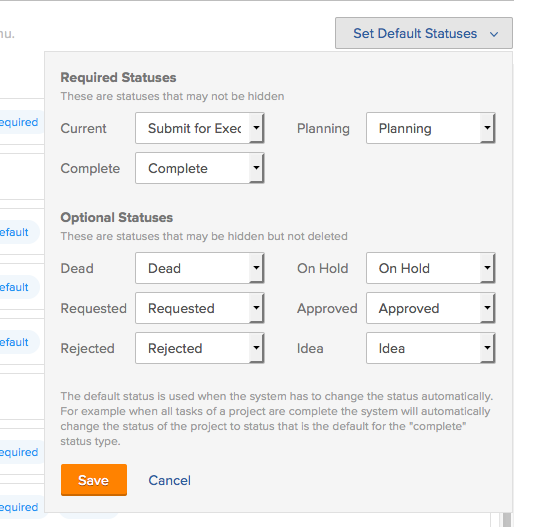
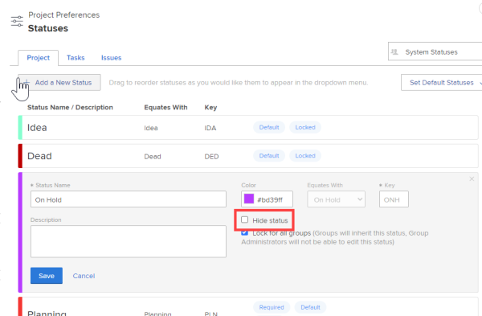
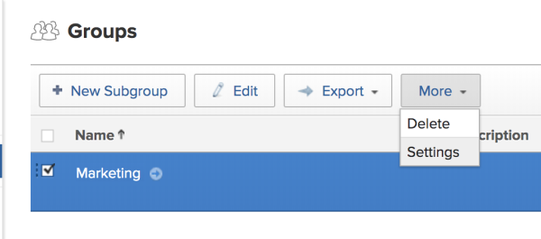
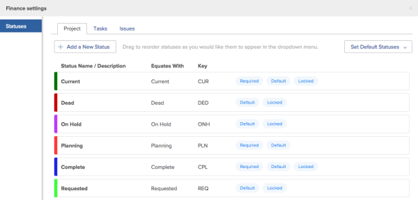

# Create and customize group statuses {#create-and-customize-group-statuses}

As a `Group Administrator`, you can create custom statuses for individual groups that you manage. This gives your group autonomy and helps to eliminate the need for dozens of company-wide custom statuses. (A `Workfront administrator` can also do this, for any group.)

You can also customize system statuses for a group if a `Workfront administrator` has configured them to allow customization.

Custom group statuses can't be displayed on a project when viewing the project in an agile view. Only default and custom system statuses are visible when viewing a project in an agile view. (For more information about customizing an agile view for a project, see [Create and customize Views](create-customize-views.md) in [Create and customize Views](create-customize-views.md).)   

## Create and customize a status for a single group {#create-and-customize-a-status-for-a-single-group}

1. Click the **Main Menu** icon  in the upper-right corner of `Workfront`, then click **Setup** .

1. Click **Groups** .

1. Select the group where you want to create or customize statuses.
1.  `In the left menu, click **Statuses** .` 

   The settings page for the group displays the list of available statuses.

   The `Workfront administrator` determines the statuses in this list, as described in [Create and customize system wide statuses](create-customize-statuses.md)

1. Do either or both of the following:
1.  `<li value="1"> 
If you are creating a new status, click <b>Add a New Status</b>.
 </li>` `<li value="2"> 
If you are editing an existing status, mouse over the status you want to edit, click the <b>Edit</b> option that displays to the far right 
 
You can edit only the statuses that the Workfront administrator has unlocked for customization by groups. Locked statuses can't be customized. 
 </li>` 

1.  Specify the following information:

<table style="width: 100%;mc-table-style: url('../../Resources/TableStyles/TableStyle-List-options-in-steps.css');" class="TableStyle-TableStyle-List-options-in-steps" cellspacing="0"> 
 <col class="TableStyle-TableStyle-List-options-in-steps-Column-Column1"> 
 <col class="TableStyle-TableStyle-List-options-in-steps-Column-Column2"> 
 <tbody> 
  <tr class="TableStyle-TableStyle-List-options-in-steps-Body-LightGray"> 
   <td class="TableStyle-TableStyle-List-options-in-steps-BodyE-Column1-LightGray">Status Name</td> 
   <td class="TableStyle-TableStyle-List-options-in-steps-BodyD-Column2-LightGray"> 
Type a name for the new status. This is a required field.
 
When you create a status name, be aware that other groups can create a status with the same name. We recommend using a unique name to avoid confusion when selecting statuses in Workfront.
 </td> 
  </tr> 
  <tr class="TableStyle-TableStyle-List-options-in-steps-Body-MediumGray"> 
   <td class="TableStyle-TableStyle-List-options-in-steps-BodyE-Column1-MediumGray">Description</td> 
   <td class="TableStyle-TableStyle-List-options-in-steps-BodyD-Column2-MediumGray">(Optional) Provide a description of the status.</td> 
  </tr> 
  <tr class="TableStyle-TableStyle-List-options-in-steps-Body-LightGray"> 
   <td class="TableStyle-TableStyle-List-options-in-steps-BodyE-Column1-LightGray">Color</td> 
   <td class="TableStyle-TableStyle-List-options-in-steps-BodyD-Column2-LightGray">Customize the color of the status by clicking the color field and selecting a color from the swatch panel. You can also enter a hex number in the field. The status color displays in the upper-right corner of Workfront when a user views the object and in reports and charts that include the object.</td> 
  </tr> 
  <tr class="TableStyle-TableStyle-List-options-in-steps-Body-MediumGray"> 
   <td class="TableStyle-TableStyle-List-options-in-steps-BodyE-Column1-MediumGray">Equates With</td> 
   <td class="TableStyle-TableStyle-List-options-in-steps-BodyD-Column2-MediumGray"> 
Select one of the options from the list that best describes the function of your new status. Every status must equate with one of these options because this determines how the status functions.
 
For example, if the status name is Done, the option it equates with would be Complete. This option cannot be modified after the status is created.
 </td> 
  </tr> 
  <tr class="TableStyle-TableStyle-List-options-in-steps-Body-LightGray"> 
   <td class="TableStyle-TableStyle-List-options-in-steps-BodyE-Column1-LightGray">Key</td> 
   <td class="TableStyle-TableStyle-List-options-in-steps-BodyD-Column2-LightGray"> 
If you are modifying an existing status, this option cannot be changed.
 
If you are creating a new status, enter a code or abbreviation of your new status that is recognizable to your organization. This key can be used for reporting purposes and it must be unique across the Workfront site.
 
As a group administrator, you do not have visibility to all statuses in the Workfront system. If you attempt to specify a key that is already in use in the system, the field turns red.
 
You cannot change the key code for Planning, Current, and Complete statuses. This is important if you are building a report in text mode. 
 
This option cannot be modified after the status is created.
 </td> 
  </tr> 
  <tr class="TableStyle-TableStyle-List-options-in-steps-Body-MediumGray"> 
   <td class="TableStyle-TableStyle-List-options-in-steps-BodyE-Column1-MediumGray">Hide Status</td> 
   <td class="TableStyle-TableStyle-List-options-in-steps-BodyD-Column2-MediumGray">(Applies only to Project and Task statuses) Select this option if you want the status to remain hidden from users. By default, this option is disabled (when this option is disabled, all users in the group can access the status).</td> 
  </tr> 
  <tr class="TableStyle-TableStyle-List-options-in-steps-Body-LightGray"> 
   <td class="TableStyle-TableStyle-List-options-in-steps-BodyB-Column1-LightGray"><b>Issue Type</b> </td> 
   <td class="TableStyle-TableStyle-List-options-in-steps-BodyA-Column2-LightGray"> 
(Applies only to issue statuses) Select the issue type where you want this status to apply.
 </td> 
  </tr> 
 </tbody> 
</table>

1.  Click **Save**.

   The status is now available for all members of the group, and only on projects associated with the group.

1.   (Optional) Set the status as a default status for the group.

   The system chooses statuses for objects from the statuses where this option is selecteed.

   For example, a task can be configured to automatically change to Complete when the percent complete reaches 100%. If you create a custom status that equates with Complete and you set that custom status as a default status, `Workfront` changes the status of a finished task to the new default status.

   To set the new group status as a default status for the group:

    
    
    1. Click the **Set Default Statuses** drop-down menu.
    1.  In the drop-down menu next to the status where you want to set the default status, select the default status you want to set.
    
    
           
    

    
    1. Click **Save**.  
       The status is now available as a default status for all members of the group. The status is available only on projects associated with that group.
    
    
    

1.  Associate the custom status with the project where you want to use it.

   You associate the status with the project by associating the group where the status resides with the project. Users can use the custom status only if the group where the status resides is associated with the project.

   >[!NOTE]
   >
   >If you edit the project group, the project status will reload and could change.

1.  `<li value="1">Go to the project where you want to use the custom status. </li>` `<li value="2">Click <b>Edit Project</b>. The Edit Project dialog box is displayed.</li>` `<li value="3">In the <b>Overview</b> section, in the <b>Group</b> field, select the group that the custom status is associated with.</li>` `<li value="4">Click <b>Save Changes</b>.</li>` 

## Create a custom status for multiple groups {#create-a-custom-status-for-multiple-groups}

You can create a custom status for multiple groups by creating a system-wide status, then hiding that status from any groups the status does not apply to. 

1.  Create a system-wide status as described in [Create and customize group statuses](#).
1.  Click **Project Preferences** > **Statuses**. 

1. Select the tab of the object type (**Project**, **Task**, or **Issue**) you want to associate with the status.

1. In the menu in the upper-right corner, begin typing the name of the group.
1. Mouse over the status you want to hide from that group, then click **Edit**.
1.  Select **Hide Status** to hide the custom status from all users in that group.

   

1.  Click **Save**.

   The status is dimmed and no longer visible to all users in that group. 

1. Repeat steps 5 through Step 8 to hide the custom status from any other groups the status does not apply to.

## Delete a status {#delete-a-status}

As a `Group Administrator`, you can delete any status that either you created or that the `Workfront administrator` has enabled you to delete. (You cannot delete any status that is marked as Required or Locked.)

To delete a status:

1. Click **Setup** near the upper-right corner of `Workfront` on the Global Navigation Bar.Click the **Main Menu** icon  in the upper-right corner of `Workfront`, then click **Setup** .

1. In the left panel, click **Groups**.
1. Select a group.
1.  Click **More** > **Settings**.

      

   The settings page for the group is displayed with a list of available statuses.

   

1.  Mouse over the status you want to delete, then click **Delete**.

   The dialog box is displayed.

1.   In the **Delete Status** box that displays, in the **Set all projects currently with this status to** field, select a status. 

   Projects that were using the status that you are deleting are set to the status you select.  
   Statuses are available in the drop-down list only if they equate with the same status as the status you are deleting.

   For example, if you are deleting a status that equates with Current, only statuses that also equate with Current are available to select. 

1.  Click **Delete Status**. 

