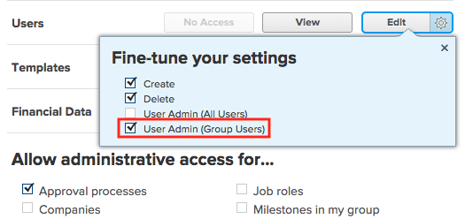
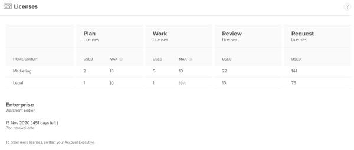

# Group Administrators {#group-administrators}

The highlighted information on this page refers to functionality not yet generally available. It is available only in the Preview Sandbox environment.

When you are the `Workfront administrator` for a large company with many departments, you might not want to manage all the groups in each department yourself. Instead, you can create one group for each department and assign each group a `Group Administrator`. The `Group Administrator` can then manage the needs of the group, such as user membership, layout templates, custom data, projects, and templates, separate from other groups in the system.

For information about creating and managing groups, see [Create and manage groups](create-manage-groups.md).

## About designating `Group Administrators` {#about-designating-group-administrators}

Every group must have at least one `Group Administrator`. When you are adding users to a group you create, you can designate one or more of them with this role. For instructions, see the section [Create and manage groups](create-manage-groups.md#creating-a-group) in the article [Create and manage groups](create-manage-groups.md).

Before designating users as `Group Administrators` we recommend that you do the following:

* Capture the current number of `Workfront administrators` in your system.
* Capture the number of groups you have in your system.
*  Determine whether you can change the access level of some of the `Workfront administrators` and designate them as `Group Administrators` instead.  

  For more information about the capabilities of `Group Administrators`, see [Capabilities of Group Administrators](#capabilities-of-group-owners).

*  Determine whether you want `Group Administrators` to be able to log in as other users, or to reset passwords for users in the groups they administer. Additional access is needed to perform these tasks, as explained in [Access needed for Group Administrators](#access).
* For better user management, consider assigning groups instead of users to the following objects: 
    
    
    * Layout Templates
    * Schedules
    * Timesheet Profiles
    
    

## Access needed for `Group Administrators` {#access-needed-for-group-administrators}

A user must have the following access to be designated as a `Group Administrator`:

*  A Planner license  

*  Edit access to users

  This access is not mandatory, but we recommend it if you want the `Group Administrator` to perform the following tasks:

    
    
    * Log in as other users in the groups they manage.
    * Reset the password of another user in the groups they manage.
    
    
  A `Group Administrator` without Edit access to users can edit only users they create. For instructions on granting this access, see the section [Grant access to edit users](grant-access-other-users.md#access-to-edit) in the article [Grant access to users](grant-access-other-users.md).

*  Administrative access to Timesheets & hours

  This access is not mandatory, but we recommend it if you want the `Group Administrator` to assign Timesheet Profiles to users in their groups. For instructions on granting this access, see [Assign users administrative access](assign-users-administrative-access.md).

## Capabilities of `Group Administrators` {#capabilities-of-group-administrators}

`Group Administrators` carry out many tasks to manage the settings and users in their groups. Some of these are the same as abilities afforded to a `Workfront administrator`.

* Create, edit and delete subgroups within the groups they manage. See [About creating a subgroup and managing group memberships](#create-subgroups-and-manage-users) in this article.
*  Add users to groups and subgroups when editing existing ones. See [About creating a subgroup and managing group memberships](#create-subgroups-and-manage-users) in this article.

  `Workfront administrators` can override the changes to group membership made by a `Group Administrator`.

* Associate users with groups and subgroups they manage when editing user profiles for users they can edit. See [About editing information in a user's profile](#edit-user-email-addresses) in this article.
* Enroll users that are members of the groups they manage in `the new Workfront experience`. See [About enrolling a user in the new Workfront experience](#about2) in this article.

*  Reset passwords for users that are members of the groups they manage. See [About resetting a user's password](#reset-passwords) in this article.
*  Log in as users that are members of the groups they manage. See [About logging in as another user](#log-in-as) in this article.
* View available licenses. See [About viewing available licenses](#view-available-licenses) in this article.
* Create Layout Templates in the Setup area of `Workfront`, and associate them with users, groups, teams, and job roles. See [About creating Layout Templates](#create-layout-template) in this article.

*  Create Timesheet Profiles, associate them with users and groups they manage, and manually generate timesheets. See [About creating a timesheet profile](#create-timesheet-profiles) in this article.
* Create and edit group-level statuses. See [About creating and editing group-level statuses](#create-edit-group-level-statuses) in this article.
* Create and edit approval processes for groups they manage. See [About creating and editing group-level statuses](#create-edit-group-level-statuses) in this article.
*  Create Schedules and associate them with a group they manage. See [About creating a schedule](#create-schedules) in this article.
* Restore from the recycle bin a project that is associated with a group they manage, along with any tasks, issues, or documents associated with the project. See [About recovering deleted items](#recover-deleted-items) in this article.

### About creating a subgroup and managing group memberships {#about-creating-a-subgroup-and-managing-group-memberships}

As a `Workfront administrator`, a `Group Administrator`, or a user with a Planner license and administrative access to users, you can create subgroups within the groups you administer. You can add any users for whom your have Edit access to your groups and subgroups. For instructions, see section [Create and manage groups](create-manage-groups.md#create) in the article [Create and manage groups](create-manage-groups.md).

You can also add users to groups and subgroups by editing their profiles. For instructions, see [Edit a user's profile](edit-a-users-profile.md).

### About creating and editing group-level statuses {#about-creating-and-editing-group-level-statuses}

`Workfront administrators` can create system-level statuses.

`Group Administrators` can create and edit group-level statuses.

Group-level statuses are only visible to users who belong to those groups.

For more information about creating or editing group-level statuses, see [Create and customize group statuses](create-customize-group-statuses.md).

### About creating and editing group-level approval processes {#about-creating-and-editing-group-level-approval-processes}

Both `Workfront administrators` and users with administrative access to approval processes can create approval processes for use throughout the system and for any groups.

`Group Administrators` can create and edit approval processes for the groups they manage.

For more information, see [Create and edit approval processes](create-approval-processes.md).

### About creating Layout Templates {#about-creating-layout-templates}

`Workfront administrators` can create Layout Templates for use throughout the system.

`Group Administrators` can create group-level Layout Templates and associate them with the groups they manage or the users that they can edit.

`Group Administrators` cannot assign Layout Templates to job roles or teams.

For more information about creating Layout Templates, see [Create and manage Layout Templates](create-and-manage-layout-templates.md).

`Group Administrators` and users with a Plan license who can edit other users can add system-level and group-level Layout Templates to the users they can manage when editing their profile.

### About creating a timesheet profile {#about-creating-a-timesheet-profile}

Only `Workfront administrators` can create system-level timesheet profiles.

<![CDATA[ ]]> `Group Administrators` can add system-level and group-level timesheet profiles to the users they manage when editing their profile. 

Users with a Plan license who can edit other users can add only system-level timesheet profiles to other users. 

<![CDATA[ ]]> `Group Administrators` can create group-level timesheet profiles, associate them with users and groups they manage, and manually generate timesheets.

For more information about creating Timesheet Profiles, see [Create Timesheet Profiles](create-timesheet-profiles.md).

### About creating a schedule {#about-creating-a-schedule}

Only `Workfront administrators` can create system-level schedules and indicate a default schedule. 

<![CDATA[ ]]> `Group Administrators` can create and edit only schedules associated with the groups they manage. They cannot edit system-level schedules, and they cannot designate a schedule as the default schedule for the system.

For more information about creating schedules, see [Create schedules](create-schedules.md).

<![CDATA[ ]]> `Group Administrators` and users with a Plan license who can edit other users can add a system-level or a group-level schedule to another user when they are editing that user's profile. 

### About recovering deleted items {#about-recovering-deleted-items}

`Group Administrators` can recover deleted items for users who belong to the groups that they manage.

The following configuration must exist before a `Group Administrator` can recover deleted items:

* The item deleted is associated with a project.  

  >[!IMPORTANT] {type="important"}
  >
  >Documents that are uploaded to the Documents area in the Global Navigation Bar and not associated with a project cannot be recovered.&nbsp;

* The project to which the deleted item originated is in a group managed by the `Group Administrator`.

`Group Administrators` can restore a project&nbsp;or any tasks, issues, and documents associated with the project from the Recycle Bin.   
For more information about restoring items in `Workfront` from the Recycle Bin, see [Restore deleted items](restore-deleted-items.md).

### About resetting a user's password {#about-resetting-a-users-password}

<![CDATA[ ]]> `Group Administrators` can reset passwords for users they can edit that are in the groups they manage.  
For more information about resetting a user's password, see [Edit a user's profile](edit-a-users-profile.md).  

>[!NOTE]
>
>`Group Administrators` can reset only `Workfront` passwords. If you have integrated `Workfront` with an SSO solution, `Group Administrators` might not be able to reset passwords for other users. Those permissions are configured in your SSO system rather than in `Workfront`.

The following configuration must exist before `Group Administrators` can restore the password of another user: 

* The user who needs a password restored is in a group managed by the `Group Administrator`.   
  When this configuration exists, the `Group Administrator` can see the Reset Password link when they edit the user's profile.

* The `Group Administrator` has the User Admin (Group Users) permission enabled in their access level. This setting is disabled by default, so it must be enabled. For more information, see [Create or modify access levels](create-modify-access-levels.md).  
  

>[!NOTE]
>
>A `Group Administrator` cannot reset the password of a `Workfront administrator`.

### About logging in as another user {#about-logging-in-as-another-user}

<![CDATA[ ]]> `Group Administrators` can log in as other users that are members of the groups they manage. For more information about logging in to `Workfront` as another user, see [Log in as another user](log-in-as-another-user.md).  

>[!NOTE]
>
>`Group Administrators` cannot log in as a system administrator.&nbsp;

The following configuration must exist before `Group Administrators` can log in as another user: 

* The user that the `Group Administrator` is logging in as must be in a group they manage.
* The `Group Administrator` has the User Admin (Group Users) permission enabled in their access level. This setting is disabled by default, so it must be enabled.  
  

### About viewing available licenses {#about-viewing-available-licenses}

`Group Administrators` can view the number of licenses available for the groups they manage. For more information, see [Manage available licenses in your system](manage-available-licenses-in-your-system.html.md).

### About enrolling a user in `the new Workfront experience` {#about-enrolling-a-user-in-the-new-workfront-experience}

`Group Administrators` can enroll users of the groups they manage in `the new Workfront experience`. They can also unenroll users to allow them to return to `Workfront Classic`.

For more information, see [Enroll users in the new Workfront experience](enroll-users-new-workfront-experience.md).

### About editing information in a user's profile {#about-editing-information-in-a-users-profile}

<![CDATA[ ]]> `Group Administrators` can update the following fields in another user's profile if they have the User Admin (Group Users) permission enabled in their Access Level and the user is a member of a group they manage: 

*  Email Address 
*  Access Level

  >[!NOTE]
  >
  >The access level does need to be equal to or lower than the access of the `Group Administrator`.

*  Reports To&#42; 
*  Direct Reports&#42;
*  Primary Role 
*   Other Roles 

  &#42;These fields appear only when the user is assigned to a Company.

For more information about editing a user's profile, see [Edit a user's profile](edit-a-users-profile.md).
