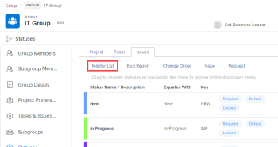
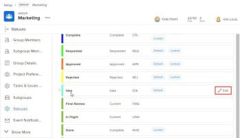
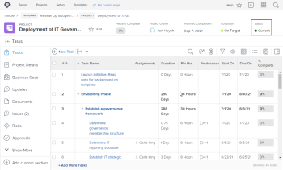
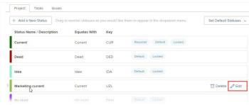
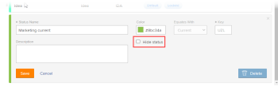

# Create or edit a group status

As a *group administrator*, you can create custom statuses for a group that you manage. This helps to eliminate the need for dozens of company-wide custom statuses and allows more autonomy in your group hierarchies.

You can also edit a system-level status for a group you manage if a *Workfront administrator* has unlocked the status. For more information, see [Locking or unlocking a custom system-level status](../../../administration-and-setup/customize-workfront/creating-custom-status-and-priority-labels/lock-or-unlock-a-custom-system-level-status.md).

If there are any groups above your group, their administrators can also do these things for your group. The same is true for *Workfront administrators* (for any group).

>[!NOTE]
>
>Custom group statuses can't be displayed on a project when viewing the project in an agile view. Only default and custom locked statuses are visible when viewing a project in an agile view. For information about customizing an agile view for a project, see the section [Create or customize an Agile view](../../../reports-and-dashboards/reports/reporting-elements/views-overview.md#customizing-an-agile-view) in the article [Views overview in Adobe Workfront](../../../reports-and-dashboards/reports/reporting-elements/views-overview.md).

For general information about statuses, see [Statuses overview](../../../administration-and-setup/customize-workfront/creating-custom-status-and-priority-labels/statuses-overview.md).

## Access requirements

You must have the following to perform the steps in this article:

<table cellspacing="0"> 
 <col> 
 <col> 
 <tbody> 
  <tr> 
   <td role="rowheader"><em>Workfront</em> plan*</td> 
   <td> 
Any
 </td> 
  </tr> 
  <tr> 
   <td role="rowheader"><em>Adobe Workfront</em> license*</td> 
   <td> 
<em>Plan</em> 
 
You must be a <em>group administrator</em> of the group or a <em>Workfront administrator</em>. For more information, see <a href="../../../administration-and-setup/manage-groups/group-roles/group-administrators.md" class="MCXref xref">Group administrators</a> and <a href="../../../administration-and-setup/add-users/configure-and-grant-access/grant-a-user-full-administrative-access.md" class="MCXref xref">Grant a user full administrative access</a>.
 </td> 
  </tr> 
 </tbody> 
</table>

&#42;If you need to find out what plan or license type you have, contact your *Workfront administrator*.

## Create or edit a status for a group

<ol> 
 <li value="1">Click the Main Menu icon  in the upper-right corner of <em>Adobe Workfront</em>, then click Setup .</li> <draft-comment>
  <li value="2" data-mc-conditions="QuicksilverOrClassic.Quicksilver">In the left panel, click Groups.</li>
 </draft-comment>
 <li value="2" data-mc-conditions="QuicksilverOrClassic.Quicksilver">In the left panel, click Groups.</li> 
 <li value="3"> <draft-comment>
   <MadCap:conditionalText data-mc-conditions="QuicksilverOrClassic.Quicksilver">
    Click the name of
   </MadCap:conditionalText>
  </draft-comment><MadCap:conditionalText data-mc-conditions="QuicksilverOrClassic.Quicksilver">
   Click the name of
  </MadCap:conditionalText> the group where you want to create or customize statuses.</li> 
 <li value="4"> 

   <draft-comment>
    In the left panel, click Statuses.
   </draft-comment>In the left panel, click Statuses. 
 
  
 
   
If the group you are viewing is a top-level group, the list that displays includes the following:
 
   <ul> 
    <li>System-level locked statuses.</li> 
    <li>Custom statuses already created for the group.</li> 
   </ul> 
   
In addition, if the group you are viewing is a subgroup, the list also includes:
 
   <ul> 
    <li>Locked statuses belonging to the groups above the subgroup.</li> 
    <li> 
Unlocked statuses that belonged to the groups above the subgroup when it was created.
 
After a subgroup is created, unlocked statuses that are created in the groups above it are not included in the subgroup’s status list. However, if someone locks one of them later, it is then included in the subgroup’s status list. For more information, see <a href="../../../administration-and-setup/manage-groups/manage-group-statuses/how-groups-inherit-statuses.md" class="MCXref xref">How groups inherit statuses</a>.
 </li> 
   </ul> 
  
 </li> 
 <li value="5">Select the tab of the object type (Project, Tasks, or Issues) that you want to associate with the status.</li> 
 <li value="6"> 
(Conditional) If the status is an issue status, make sure that Master List is selected.
 <draft-comment>
   
  

  </draft-comment>
  
 
For information about customizing the other issue types (Bug Report, Change Order, Issue, Request), see <a href="../../../administration-and-setup/set-up-workfront/configure-system-defaults/customize-default-issue-types.md" class="MCXref xref">Customize default issue types</a>.
 </li> 
 <li value="7"> 
(Conditional) To create a new status, click Add a New Status.
 
Or
 
To edit an existing status, mouse over the status you want to edit, then click the Edit option that displays to the far right.
 <draft-comment>
   
  

  </draft-comment>
  
 <note type="note"> 
   <ul> 
    <li>You can edit a status for your group only if:
     <ul>
      <li>You manage the group that the status was created for</li>
      <li>A <em>Workfront administrator</em> unlocked the status at the system level</li>
      <li>A <em>group administrator</em> of a group above your group unlocked the status</li>
     </ul></li> 
    <li>When you are editing an existing status, you can change only its name, description, and color.</li> 
    <li> 
When you edit a locked status, your changes affect all subgroups that inherited the status from your group.
 
Conversely, editing an unlocked status does not affect the subgroups that inherited the status from your group. 
 </li> 
   </ul> 
  </note> </li> 
 <li value="8"> 
Specify the following information.
 
If you are editing a status, only the first 3 settings can be changed.
 
  <table cellspacing="0"> 
   <col> 
   <col> 
   <tbody> 
    <tr> 
     <td role="rowheader">Status Name</td> 
     <td> 
Type a name for the status. This is a required field.
 
When you create a status name, be aware that others in the system can create a status with the same name. We recommend using a unique name to avoid confusion when selecting statuses in <em>Workfront</em>.
 </td> 
    </tr> 
    <tr> 
     <td role="rowheader">Description</td> 
     <td>(Optional) Type a description of the status. This communicates its purpose to those who use it.</td> 
    </tr> 
    <tr> 
     <td role="rowheader">Color</td> 
     <td> 
Customize the color of the status by clicking the color field and selecting a color from the swatch panel. You can also enter a hex number in the field.
 
The status color displays in the upper-right corner of <em>Workfront</em> when a user views the object.
 <draft-comment>
       
  

      </draft-comment>
  
 </td> 
    </tr> 
    <tr> 
     <td role="rowheader">Equates With</td> 
     <td> 
Select one of the options from the list that best describes the function of the status. For example, if the status name is Done, the option it equates with should be Complete.
 
Every status must equate with one of these options because this determines how the status functions.
 
This option cannot be modified after the status is created.
 </td> 
    </tr> 
    <tr> 
     <td role="rowheader">Key</td> 
     <td> 
If you are creating a new status, type a code or abbreviation for the status or use the one generated for you. This key must be unique in <em>Workfront</em> because it can be used for reporting purposes. If you attempt to specify a key that is already in use in the system, the field turns red.
 
It might be useful to use an abbreviation that is recognizable to those who will use it.
 
This option cannot be modified after the status is created.
 
You cannot change the key code for Planning, Current, and Complete statuses. This is important if you are building a report in text mode. 
 </td> 
    </tr> 
    <tr> 
     <td role="rowheader">Hide Status</td> 
     <td> 
(Project and Task statuses only)
 
Enable this option if you want the status hidden from users. When it is disabled (the default setting), all <draft-comment>
        <MadCap:conditionalText data-mc-conditions="SnippetConditions-wf-groups.groups">
         subgroups below the group
        </MadCap:conditionalText>
       </draft-comment><MadCap:conditionalText data-mc-conditions="SnippetConditions-wf-groups.groups">
        subgroups below the group
       </MadCap:conditionalText> can use the status.
 <note type="tip">
       You can hide an Issue status by disabling all 4 issue types (Bug Report, Change Order, Issue, Request).
      </note> </td> 
    </tr> 
    <tr> 
     <td role="rowheader">Lock for all groups</td> 
     <td> <draft-comment>
       
If you leave this option enabled, the users in your group and its subgroups can see and use the status and <em>group administrators</em> cannot customize it for lower subgroups.

      </draft-comment>
If you leave this option enabled, the users in your group and its subgroups can see and use the status and <em>group administrators</em> cannot customize it for lower subgroups.
 <draft-comment>
       
When this option is disabled, <em>group administrators</em> can customize the status for lower subgroups.

      </draft-comment>
When this option is disabled, <em>group administrators</em> can customize the status for lower subgroups.
 <draft-comment>
       
For more information about locking statuses, see <a href="../../../administration-and-setup/manage-groups/manage-group-statuses/lock-or-unlock-a-custom-group-status.md" class="MCXref xref">Locking or unlocking a custom group status</a>.

      </draft-comment>
For more information about locking statuses, see <a href="../../../administration-and-setup/manage-groups/manage-group-statuses/lock-or-unlock-a-custom-group-status.md" class="MCXref xref">Locking or unlocking a custom group status</a>.
 </td> 
    </tr> <draft-comment>
     <tr data-mc-conditions="QuicksilverOrClassic.Draft mode"> 
      <td role="rowheader">Users can select this status only if required fields on the object are completed </td> 
      <td> 
(Applies only if you selected Tasks in Step 3) Assures that users can select this status for an object only if all required fields on the object are completed. 
 <draft-comment>
        
This story is on the back burner

       </draft-comment>
This story is on the back burner
 </td> 
     </tr>
    </draft-comment>
    <tr data-mc-conditions="QuicksilverOrClassic.Draft mode"> 
     <td role="rowheader">Users can select this status only if required fields on the object are completed </td> 
     <td> 
(Applies only if you selected Tasks in Step 3) Assures that users can select this status for an object only if all required fields on the object are completed. 
 
This story is on the back burner
 </td> 
    </tr> 
   </tbody> 
  </table> </li> 
 <li value="9"> 
Click Save.
 
The status is now available for all projects associated with your group or subgroup. If you locked it, it is available for use by any lower subgroups.
 
You can configure the status to be a default status for the group. For more information, see <a href="../../../administration-and-setup/manage-groups/manage-group-statuses/use-custom-statuses-as-default-statuses-group.md" class="MCXref xref">Use a custom status as a default status for a group</a>.
 </li> 
</ol>

## Create a custom status for multiple groups

If you are a *Workfront administrator*, you can create a custom status for multiple groups by creating a system-wide status, then hiding that status from any groups that don’t need it.

If you are a *group administrator* (or a *Workfront administrator*), you can create a custom status for multiple subgroups within a group hierarchy you manage by creating a status for a higher level group, then hiding that status from any lower subgroups that don’t need it.

<ol> 
 <li value="1"> 
 If you are a <em>Workfront administrator</em>, create a system-wide unlocked status as described in <a href="../../../administration-and-setup/customize-workfront/creating-custom-status-and-priority-labels/create-or-edit-a-status.md" class="MCXref xref">Create or edit a status</a>.
 
Or
 
If you are a <em>group administrator</em> (or <em>Workfront administrator</em>), create an unlocked group status as described in <a href="#" class="MCXref xref" xrefformat="{para}">Create or edit a group status</a>.
 </li> 
 <li value="2"> 
In the box in the upper-right corner, delete System Statuses, begin typing the name of a group where you want to hide the status, then click the name when it appears.
 </li> 
 <li value="3"> 
Hover over the status you want to hide from the group, then click Edit when it appears.
 
  
 </li> 
 <li value="4"> 
Enable the Hide Status option that appears. 
 
  
 </li> 
 <li value="5"> 
Click Save.
 
The status is dimmed and no longer visible to all users in that group.
 </li> 
 <li value="6">Repeat steps 5 through Step 8 to hide the custom status from any other groups who don't need it.</li> 
</ol>

