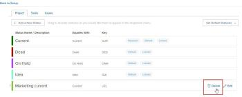

# Delete a group status {#delete-a-group-status}

As a *`group administrator`*, you can delete a status for a group that you manage if it is not configured as a required or locked status on the system level or for a higher group in the hierarchy.

## Access requirements {#access-requirements}

You must have the following to perform the steps in this article:

<table style="width: 100%;margin-left: 0;margin-right: auto;mc-table-style: url('../../../Resources/TableStyles/TableStyle-List-options-in-steps.css');" class="TableStyle-TableStyle-List-options-in-steps" cellspacing="0"> 
 <col class="TableStyle-TableStyle-List-options-in-steps-Column-Column1"> 
 <col class="TableStyle-TableStyle-List-options-in-steps-Column-Column2"> 
 <tbody> 
  <tr class="TableStyle-TableStyle-List-options-in-steps-Body-LightGray"> 
   <td class="TableStyle-TableStyle-List-options-in-steps-BodyE-Column1-LightGray" role="rowheader">Workfront plan*</td> 
   <td class="TableStyle-TableStyle-List-options-in-steps-BodyD-Column2-LightGray"> 
Any
 </td> 
  </tr> 
  <tr class="TableStyle-TableStyle-List-options-in-steps-Body-MediumGray"> 
   <td class="TableStyle-TableStyle-List-options-in-steps-BodyB-Column1-MediumGray" role="rowheader">Adobe Workfront license*</td> 
   <td class="TableStyle-TableStyle-List-options-in-steps-BodyA-Column2-MediumGray"> 
Plan 
 
You must be a group administrator of the group or a Workfront administrator. For more information, see <a href="group-administrators.md" class="MCXref xref">Group administrators</a> and <a href="grant-a-user-full-administrative-access.md" class="MCXref xref">Grant a user full administrative access</a>.
 </td> 
  </tr> 
 </tbody> 
</table>

&#42;If you need to find out what plan or license type you have, contact your *`Workfront administrator`*.

## Delete a group status {#delete-a-group-status-1}

1. Click the `Main Menu` icon  in the upper-right corner of *`Adobe Workfront`*, then click `Setup` .

1. In the left panel, click `Groups`.
1.  `<MadCap:conditionalText data-mc-conditions="QuicksilverOrClassic.Quicksilver"> Click the name of the top-level group</MadCap:conditionalText>`.
1. In the left panel click `Statuses`.
1.  In the list of statuses that displays, hover over the status you want to delete, then click `Delete` when it appears to the far right.

   

1.   In the box that displays, select a status to designate a replacement status for objects (projects, tasks, issues, and approval processes) that were using the status that you are deleting.

   Only statuses that equate with the status you are deleting are available. For example, if you are deleting a status that equates with Current, you can see only statuses that equate with Current.

   Also, the statuses that display depend on whether the status you are deleting is unlocked or locked:

    
    
    *  `If it's unlocked`: Non-hidden locked and unlocked statuses are available.
    
    
      Along with the statuses that were created for the subgroup, statuses inherited from system-level and upper level groups are included.
    
    *  `If it's locked`: One of the following is true:
    
        
        
        * If there are other locked, non-hidden statuses, only those are available.
        *  If there is no locked non-hidden status, the default *`Workfront`* status is available, even if it’s hidden or unlocked.
        
        
          For information about the default *`Workfront`* statuses, see [Access the list of system project statuses](project-statuses.md), [Access the list of system task statuses](task-statuses.md), and the information about the 4 required issue statuses in [Issue statuses](issue-statuses.md).
        
        
        
    
    
    

1.   Click `Delete Status`.

    
    
    * If the deleted status was the default status for that type in the group, the replacement status takes its place.
    * If the deleted status was set as the default project status in project preferences, the preference is now set to the replacement status.
    
    

## When a group is deleted {#when-a-group-is-deleted}

When a group is deleted and replaced by another group, any unique statuses that the deleted group had are added to the statuses of the replacement group. For more information, see [Custom statuses in a group that is moved or deleted](custom-statuses-in-group-moved-or-deleted.md).
