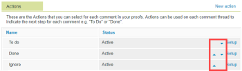

# Configure *`proof`* settings for your organization {#configure-proof-settings-for-your-organization}

As an *`Adobe Workfront administrator`* or *`Workfront Proof administrator`*, you can customize the default *`proof`* settings for your organization. These settings include default sharing options, branding, and more.

## Access requirements {#access-requirements}

You must have the following:

<table style="width: 100%;margin-left: 0;margin-right: auto;mc-table-style: url('../../../Resources/TableStyles/TableStyle-List-options-in-steps.css');" class="TableStyle-TableStyle-List-options-in-steps" cellspacing="0"> 
 <col class="TableStyle-TableStyle-List-options-in-steps-Column-Column1"> 
 <col class="TableStyle-TableStyle-List-options-in-steps-Column-Column2"> 
 <tbody> 
  <tr class="TableStyle-TableStyle-List-options-in-steps-Body-LightGray"> 
   <td class="TableStyle-TableStyle-List-options-in-steps-BodyE-Column1-LightGray" role="rowheader"><a href="https://www.workfront.com/plans" target="_blank">Adobe Workfront plan</a> </td> 
   <td class="TableStyle-TableStyle-List-options-in-steps-BodyD-Column2-LightGray"> 
Any
 </td> 
  </tr> 
  <tr class="TableStyle-TableStyle-List-options-in-steps-Body-MediumGray"> 
   <td class="TableStyle-TableStyle-List-options-in-steps-BodyE-Column1-MediumGray" role="rowheader"><a href="wf-licenses.md" class="MCXref xref">Adobe Workfront licenses overview</a>*</td> 
   <td class="TableStyle-TableStyle-List-options-in-steps-BodyD-Column2-MediumGray"> 
Work or higher
 </td> 
  </tr> 
  <tr class="TableStyle-TableStyle-List-options-in-steps-Body-LightGray"> 
   <td class="TableStyle-TableStyle-List-options-in-steps-BodyB-Column1-LightGray" role="rowheader">Access configurations</td> 
   <td class="TableStyle-TableStyle-List-options-in-steps-BodyA-Column2-LightGray"> 
You must have Administrator selected in your Proof Permission Profile. For more information, see <a href="configure-a-users-proofing-access.md" class="MCXref xref">Configure a user's proofing access</a>.
 </td> 
  </tr> 
 </tbody> 
</table>

&#42;To find out what plan, license type, or access you have, contact your *`Workfront administrator`*.

## Configure actions {#configure-actions}

For information about using actions in the *`proofing`* viewer, see [Use actions on comments](use-actions-on-comments-in-viewer.md).

You can configure actions for your organization in the following ways:

* [Add or rename an action](#adding-or-renaming-an-action) 
* [Deactivate or reactivate an action](#deactivating-or-activating-an-action) 
* [Reorder actions](#reordering-actions) 

### Add or rename an action {#add-or-rename-an-action}

1.  `<MadCap:conditionalText data-mc-conditions="QuicksilverOrClassic.Quicksilver"> From  Workfront, click the Main Menu  , then click Proofing   to access  Workfront Proof.</MadCap:conditionalText>` 
1. Click `Settings` >  `Account settings` in the upper-right corner of the *`Workfront Proof`* interface, then click the `Settings` tab.

1. Do either of the following: 
    
    
    * To create a new action, in the `Actions` section, click  `New action`.
    
    
      There is no limit to the number of actions you can set up in your account.
    
    * To rename an existing action, click `Setup` next to the action.
    
    
1. Type a name for the action, then click `Save`.
1. Click `Save.`

### Deactivate or reactivate an action {#deactivate-or-reactivate-an-action}

1.  `<MadCap:conditionalText data-mc-conditions="QuicksilverOrClassic.Quicksilver"> From  Workfront, click the Main Menu  , then click Proofing   to access  Workfront Proof.</MadCap:conditionalText>` 
1. Click `Settings` >  `Account settings` in the upper-right corner of the *`Workfront Proof`* interface, then click the `Settings` tab.

1. Click `Setup` next to the action you want to deactivate or reactivate.
1. Select `Activate` or `Deactivate`, then click `Save`.

### Reorder actions {#reorder-actions}

1.  `<MadCap:conditionalText data-mc-conditions="QuicksilverOrClassic.Quicksilver"> From  Workfront, click the Main Menu  , then click Proofing   to access  Workfront Proof.</MadCap:conditionalText>` 
1. Click `Settings` >  `Account settings` in the upper-right corner of the *`Workfront Proof`* interface, then click the `Settings` tab.

1.  Click the blue up and down arrows next to  `Setup`&nbsp;to reorder the actions.

   

## Configure custom devices for *`proofs`* {#configure-custom-devices-for-proofs}

You can add any custom devices to your system, allowing users to review interactive content and simulate how the content appears on a specific device.

For information about how users can select devices when reviewing interactive content, see [Change interactive proof resolution in the proofing viewer](view-interactive-content-as-it-appears-in-device.md)

To add a custom device:

1.  `<MadCap:conditionalText data-mc-conditions="QuicksilverOrClassic.Quicksilver"> From  Workfront, click the Main Menu  , then click Proofing   to access  Workfront Proof.</MadCap:conditionalText>` 
1. Click `Settings` >  `Account settings` in the upper-right corner of the *`Workfront Proof`* interface, then click the `Settings` tab.

1. In the `Custom Devices for *`proof`*s` section, click `Add new device`.

1.  In the `Add new device` box that appears, specify the following information:

<table style="width: 100%;mc-table-style: url('../../../Resources/TableStyles/TableStyle-List-options-in-steps.css');" class="TableStyle-TableStyle-List-options-in-steps" cellspacing="0"> 
 <col class="TableStyle-TableStyle-List-options-in-steps-Column-Column1" style="width: 231px;"> 
 <col class="TableStyle-TableStyle-List-options-in-steps-Column-Column2"> 
 <tbody> 
  <tr class="TableStyle-TableStyle-List-options-in-steps-Body-LightGray"> 
   <td class="TableStyle-TableStyle-List-options-in-steps-BodyE-Column1-LightGray" role="rowheader">Name</td> 
   <td class="TableStyle-TableStyle-List-options-in-steps-BodyD-Column2-LightGray">The name users see when selecting the device in the Desktop Proofing Viewer, as described in&nbsp;<a href="view-interactive-content-as-it-appears-in-device.md" class="MCXref xref">Change interactive proof resolution in the proofing viewer</a><a href="view-interactive-content-as-it-appears-in-device.md" class="MCXref xref">Change interactive proof resolution in the proofing viewer</a>.</td> 
  </tr> 
  <tr class="TableStyle-TableStyle-List-options-in-steps-Body-MediumGray"> 
   <td class="TableStyle-TableStyle-List-options-in-steps-BodyE-Column1-MediumGray" role="rowheader">Dimensions</td> 
   <td class="TableStyle-TableStyle-List-options-in-steps-BodyD-Column2-MediumGray">Specify the dimensions to use for this device. Users see the dimensions displayed below the device name.</td> 
  </tr> 
  <tr class="TableStyle-TableStyle-List-options-in-steps-Body-LightGray"> 
   <td class="TableStyle-TableStyle-List-options-in-steps-BodyE-Column1-LightGray" role="rowheader">Ratio</td> 
   <td class="TableStyle-TableStyle-List-options-in-steps-BodyD-Column2-LightGray">Specify the ratio for the device.</td> 
  </tr> 
  <tr class="TableStyle-TableStyle-List-options-in-steps-Body-MediumGray"> 
   <td class="TableStyle-TableStyle-List-options-in-steps-BodyE-Column1-MediumGray" role="rowheader">Type</td> 
   <td class="TableStyle-TableStyle-List-options-in-steps-BodyD-Column2-MediumGray">Select whether the device is a Mobile, Tablet, or Desktop.</td> 
  </tr> 
  <tr class="TableStyle-TableStyle-List-options-in-steps-Body-LightGray"> 
   <td class="TableStyle-TableStyle-List-options-in-steps-BodyE-Column1-LightGray" role="rowheader">User agent string</td> 
   <td class="TableStyle-TableStyle-List-options-in-steps-BodyD-Column2-LightGray">Enter the user agent for the device to&nbsp;provide information that makes our software run and display as designed for the device.
You can obtain the user agent by going to&nbsp;<a href="https://www.whatismybrowser.com/detect/what-is-my-user-agent">https://www.whatismybrowser.com/detect/what-is-my-user-agent</a>&nbsp;from the device.
</td> 
  </tr> 
  <tr class="TableStyle-TableStyle-List-options-in-steps-Body-MediumGray"> 
   <td class="TableStyle-TableStyle-List-options-in-steps-BodyB-Column1-MediumGray" role="rowheader">Disabled</td> 
   <td class="TableStyle-TableStyle-List-options-in-steps-BodyA-Column2-MediumGray">If this option is selected, the device is not available for users to select when reviewing interactive proofs.</td> 
  </tr> 
 </tbody> 
</table>

1. Click `Create`.

## Configure pop-up messages for *`proofs`* {#configure-pop-up-messages-for-proofs}

You can configure pop-up messages on *`proofs`* to communicate general information to all reviewers in your organization.

You can configure messages to appear in the following situations:

* `On load message`: Displays when the *`proof`* first opens. Useful for explaining to users how to review a *`proof`* or to provide a disclaimer or other legal text.

* `On decision message`: Displays when a user selects a decision on a *`proof`*. Useful for giving your users checklists for things such as brand or regulatory compliance. For information about decisions, see [Make decisions on a proof](make-decisions-on-proof.md).

* `Confirm button text`: The label that displays on the button in the On load pop-up message explained above.

To create pop-up messages for *`proofs`*:

1. Click `Edit` to the right of the message you want to customize.
1. Specify a message and include the appropriate formatting, then click `Save`.
1. (Optional) If you customized the On load message and you want to also customize the confirmation button label, click  `Edit` to the right of  `Confirm button text`, specify a label, then click  `Save`.&nbsp;

## Configure *`proof`* defaults {#configure-proof-defaults}

You can define global *`proof`* default settings that apply to all *`proof`*s created by users in your organization's account.

>[!NOTE]
>
>The visibility of these settings in your account depends on your plan level; requirements for each setting are specified below.

To modify the default settings for *`proof`*s:

1.  `<MadCap:conditionalText data-mc-conditions="QuicksilverOrClassic.Quicksilver"> From  Workfront, click the Main Menu  , then click Proofing   to access  Workfront Proof.</MadCap:conditionalText>` 
1. Click `Settings` >  `Account settings` in the upper-right corner of the *`Workfront Proof`* interface, then click the `Settings` tab.

1.  Continue with the following sections to learn about each available option in the `Proof Defaults` section:

    
    
    * [Deadline (+business days)](#deadline-business-days) 
    * [Copy owner from original proof](#copy-owner-from-original-proof) 
    * [Electronic signatures](#electronic-signatures) 
    * [Proof counter](#proof-counter) 
    * [Make folder mandatory](#make-folder-mandatory) 
    * [Disable proof email notifications](#disable-proof-email-notifications) 
    * [Right-to-left text support in comments](#right-to-left-text-support) 
    * [Login required](#login-required) 
    * [Comment deletion](#comment-deletion) 
    * [Web Proofing Viewer](#web-proofing-viewer) 
    * [Desktop Proofing Viewer](#desktop-proofing-viewer) 
    
    

### Deadline (+business days) {#deadline-business-days}

*`Workfront Proof`* applies this deadline to all new *`proofs`* in your account that do not have an Automated Workflow.

### Copy owner from original *`proof`* {#copy-owner-from-original-proof}

This setting is useful if you have different people creating different versions or copies of *`proofs`*. By default, it is set to Enabled, which means that the owner of the first version a *`proof`* is also the owner of all consecutive versions of the *`proof`*, regardless of who creates these versions.

If you disable this setting, the person who creates any new version of a *`proof`* becomes the owner of that version. This means that different versions of the same *`proof`* can have different owners.

This setting applies both to creating new *`proofs`* and copying *`proofs`*.

### Electronic signatures {#electronic-signatures}

This setting makes electronic signatures mandatory on all *`proofs`* created in your organization's account. When decision makers on the *`proof`* submit their decision, *`Workfront Proof`* prompts them to confirm the decision by entering their login credentials. This means that your users cannot share *`proofs`* with Guest reviewers who don't have *`Workfront Proof`* logins.

The electronic signatures message displays when *`Workfront Proof`* prompts reviewers to electronically sign their decision on a *`proof`*.

To learn more about&nbsp;electronic signatures, see [Understanding electronic signatures in Workfront Proof](electronic-sigs-in-wp.md).

### Proof counter {#proof-counter}

The Proof counter assigns a number to the *`proofs`* created in your account. It is unique to your account.

When a user creates new versions of a *`proof`*, the *`proof`* counter assigns the same number to every version.

You can specify the number from which the *`proof`* counter should count every time a user creates a *`proof`*.

>[!NOTE]
>
>Once you enable the counter and start creating *`proofs`*, you cannot change the start number.

### Make folder mandatory {#make-folder-mandatory}

This setting forces users to add their new *`proofs`* to folders. A *`proof`* creator can save a *`proof`* only after selecting the folder where they want to store it. This is helpful in keeping your *`proofs`* organized.

### Disable *`proof`* email notifications {#disable-proof-email-notifications}

This setting is most commonly used by companies who developed an integration with their own systems using our Public API. If enabled, your account does not send any emails, including the New *`proof`* emails and Email alerts. You can still see the Message and Share *`proof`* links options in the account, but they do not&nbsp;trigger any emails.

### Right-to-left text support in comments {#right-to-left-text-support-in-comments}

>[!IMPORTANT] {type="important"}
>
>This feature is no longer supported in the viewer and will be removed in the near future.

If your reviewers use languages with right-to-left text direction&nbsp;in their comments, you can enable this setting so that they are able change the text direction of a comment.&nbsp;

### Login required {#login-required}

Login required enhances the security of the *`proofs`* created in your account. If it is enabled, reviewers are required to log in using their email and password before they are allowed to view *`proofs`* created in your organization's account. This means that your users cannot share the *`proof`* with Guest reviewers.

### Comment deletion {#comment-deletion}

If you don't want your reviewers to be able to delete their own comments, you can disable this option in your account.

### *`Web Proofing Viewer`*  {#web-proofing-viewer}

The *`Web Proofing Viewer`* is available to use for video and static *`proofs`*.&nbsp;

You can choose whether the users in your organization use the *`Web Proofing Viewer`* or one of the other two available viewers. See [Differences between the Web Proofing Viewer and the Desktop Proofing Viewer overview](understand-differences-between-web-viewer.md) for more information.

To enable the *`Web Proofing Viewer`* for users in your system, select from the following options:

<table style="width: 100%;mc-table-style: url('../../../Resources/TableStyles/TableStyle-List-options-in-steps.css');" class="TableStyle-TableStyle-List-options-in-steps" cellspacing="0"> 
 <col class="TableStyle-TableStyle-List-options-in-steps-Column-Column1"> 
 <col class="TableStyle-TableStyle-List-options-in-steps-Column-Column2"> 
 <tbody> 
  <tr class="TableStyle-TableStyle-List-options-in-steps-Body-LightGray"> 
   <td class="TableStyle-TableStyle-List-options-in-steps-BodyE-Column1-LightGray" role="rowheader">Enabled and default</td> 
   <td class="TableStyle-TableStyle-List-options-in-steps-BodyD-Column2-LightGray">When this option is selected, the Web Proofing Viewer is the default viewer for all users in your system when reviewing video or static proofs. 
Users can individually opt out of using the Web Proofing Viewer,&nbsp;as described in <a href="configure-a-users-proofing-access.md" class="MCXref xref">Configure a user's proofing access</a>, in&nbsp;<a href="review-a-video-proof-in-proofing-viewer.md" class="MCXref xref">Review a video proof</a><a href="review-a-video-proof-in-proofing-viewer.md" class="MCXref xref">Review a video proof</a>. Also see <a href="review-a-static-proof.md" class="MCXref xref">Review a static proof</a>. This user setting is remembered the next time the user launches the viewer.
</td> 
  </tr> 
  <tr class="TableStyle-TableStyle-List-options-in-steps-Body-MediumGray"> 
   <td class="TableStyle-TableStyle-List-options-in-steps-BodyE-Column1-MediumGray" role="rowheader">Enabled and not default</td> 
   <td class="TableStyle-TableStyle-List-options-in-steps-BodyD-Column2-MediumGray"> 
When this option is selected, all video proofs are opened in the Legacy proofing viewer by default. You might not have access to this option because the Legacy proofing viewer is supported by Flash, which has been deprecated in most environments.
 
Users can individually opt into using the Web Proofing Viewer when reviewing video proofs, as described in <a href="review-a-video-proof-in-proofing-viewer.md" class="MCXref xref">Review a video proof</a> and in <a href="review-a-static-proof.md" class="MCXref xref">Review a static proof</a>. This user setting is remembered the next time the user launches the viewer.
 </td> 
  </tr> 
  <tr class="TableStyle-TableStyle-List-options-in-steps-Body-LightGray"> 
   <td class="TableStyle-TableStyle-List-options-in-steps-BodyB-Column1-LightGray" role="rowheader">Disable new viewer</td> 
   <td class="TableStyle-TableStyle-List-options-in-steps-BodyA-Column2-LightGray">When this option is selected, users cannot use&nbsp;the Web Proofing viewer.</td> 
  </tr> 
 </tbody> 
</table>

### Desktop Proofing Viewer {#desktop-proofing-viewer}

The *`Desktop Proofing Viewer`* is the recommended viewer for reviewing *`proofs`* containing interactive web content. It can also *`proof`* static and video content. For more information, see [Review an interactive proof](review-and-managing-interactive-proofs.md).

The settings below let you specify whether your users open interactive content in the *`Desktop Proofing Viewer`* or the *`Web Proofing Viewer`*:

<table style="width: 100%;mc-table-style: url('../../../Resources/TableStyles/TableStyle-List-options-in-steps.css');" class="TableStyle-TableStyle-List-options-in-steps" cellspacing="0"> 
 <col class="TableStyle-TableStyle-List-options-in-steps-Column-Column1" style="width: 230px;"> 
 <col class="TableStyle-TableStyle-List-options-in-steps-Column-Column2"> 
 <tbody> 
  <tr class="TableStyle-TableStyle-List-options-in-steps-Body-LightGray"> 
   <td class="TableStyle-TableStyle-List-options-in-steps-BodyE-Column1-LightGray" role="rowheader">Enabled for all interactive proofs</td> 
   <td class="TableStyle-TableStyle-List-options-in-steps-BodyD-Column2-LightGray">The Desktop Proofing Viewer opens every time a user launches an interactive proof. Users can proof interactive content bundled in a ZIP file, secure (https) and non-secure (http) websites, and websites with iFrame protection.</td> 
  </tr> 
  <tr class="TableStyle-TableStyle-List-options-in-steps-Body-MediumGray"> 
   <td class="TableStyle-TableStyle-List-options-in-steps-BodyE-Column1-MediumGray" role="rowheader">Enabled for external interactive proofs only</td> 
   <td class="TableStyle-TableStyle-List-options-in-steps-BodyD-Column2-MediumGray">With this configuration, designed for organizations that can't use the standalone Desktop Proofing Viewer, the Web Proofing Viewer launches when users open interactive proofs created from a bundled ZIP file; the Desktop Proofing viewer launches when users open an interactive proof created from a URL.
For information about these two types of interactive proofs, see the section <a href="interactive-content-proofs.md#about" class="MCXref xref">About creating proofs for interactive content</a> in the article <a href="interactive-content-proofs.md" class="MCXref xref">Interactive content proofs overview</a>.

Note: Internet Explorer is not supported for proofing interactive content in the Web Proofing Viewer.
</td> 
  </tr> 
  <tr class="TableStyle-TableStyle-List-options-in-steps-Body-LightGray"> 
   <td class="TableStyle-TableStyle-List-options-in-steps-BodyE-Column1-LightGray" role="rowheader">Enabled for all proofs</td> 
   <td class="TableStyle-TableStyle-List-options-in-steps-BodyD-Column2-LightGray">The Desktop Proofing Viewer launches when users open proofs of any kind.</td> 
  </tr> 
  <tr class="TableStyle-TableStyle-List-options-in-steps-Body-MediumGray"> 
   <td class="TableStyle-TableStyle-List-options-in-steps-BodyE-Column1-MediumGray" role="rowheader">Enabled and not default</td> 
   <td class="TableStyle-TableStyle-List-options-in-steps-BodyD-Column2-MediumGray">You might not have access to this option because the Legacy proofing viewer is supported by Flash, which has been deprecated in most environments.
The Legacy proofing viewer opens every time a user launches an interactive proof. From there, the user can launch the proof into the Desktop Proofing Viewer.
</td> 
  </tr> 
  <tr class="TableStyle-TableStyle-List-options-in-steps-Body-LightGray"> 
   <td class="TableStyle-TableStyle-List-options-in-steps-BodyB-Column1-LightGray" role="rowheader">Disabled</td> 
   <td class="TableStyle-TableStyle-List-options-in-steps-BodyA-Column2-LightGray">You might not have access to this option because the Legacy proofing viewer is supported by Flash, which has been deprecated in most environments.
All interactive proofs launch in the Legacy proofing viewer. Users do not have the option to use the Desktop Proofing Viewer.
</td> 
  </tr> 
 </tbody> 
</table>

## Configure sharing defaults {#configure-sharing-defaults}

You can specify who your organization's *`proofs`* can be shared with, what versions are available for reviewers, and when *`proofs`* with an Automated Workflow are visible to users who are associated with a given stage.

For more detailed information about sharing settings within *`Workfront Proof`*, see [Configure sharing settings for your users](configure-sharing-settings-users.md).&nbsp;
  

## Brand the *`Workfront Proof`* site {#brand-the-workfront-proof-site}

If you are using *`Workfront Proof`*, you can set up branding for the following areas of the site:

* The splash page that displays when the *`proof`* loads
* Log in and Log out screens
* Email notifications

For detailed information about how to brand the *`Workfront Proof`* site, see&nbsp; [Brand the Workfront Proof site](brand-wp-site.md).

## Configure advanced password settings {#configure-advanced-password-settings}

>[!IMPORTANT] {type="important"}
>
>This option is available only for Legacy Workfront plans. If you are on a Pro, Business or Enterprise *`Workfront`* plan, you can no longer configure advanced password settings.

Under `Advanced password settings`, you can enhance password security for your users.

1.  Click `Setup` to the right of the setting you want to configure:

<table style="width: 100%;mc-table-style: url('../../../Resources/TableStyles/TableStyle-List-options-in-steps.css');" class="TableStyle-TableStyle-List-options-in-steps" cellspacing="0"> 
 <col class="TableStyle-TableStyle-List-options-in-steps-Column-Column1"> 
 <col class="TableStyle-TableStyle-List-options-in-steps-Column-Column2"> 
 <tbody> 
  <tr class="TableStyle-TableStyle-List-options-in-steps-Body-LightGray"> 
   <td class="TableStyle-TableStyle-List-options-in-steps-BodyE-Column1-LightGray" role="rowheader">Minimum password length</td> 
   <td class="TableStyle-TableStyle-List-options-in-steps-BodyD-Column2-LightGray">The default Workfront Proof password length is six&nbsp;characters. You may want to increase the number, depending on your organization's policies.</td> 
  </tr> 
  <tr class="TableStyle-TableStyle-List-options-in-steps-Body-MediumGray"> 
   <td class="TableStyle-TableStyle-List-options-in-steps-BodyE-Column1-MediumGray" role="rowheader">Character mix </td> 
   <td class="TableStyle-TableStyle-List-options-in-steps-BodyD-Column2-MediumGray">You can force the users to use a mix of lowercase, uppercase, numbers, and symbols in their passwords. You decide how many characters the password should contain.</td> 
  </tr> 
  <tr class="TableStyle-TableStyle-List-options-in-steps-Body-LightGray"> 
   <td class="TableStyle-TableStyle-List-options-in-steps-BodyE-Column1-LightGray" role="rowheader">Maximum characters repetition </td> 
   <td class="TableStyle-TableStyle-List-options-in-steps-BodyD-Column2-LightGray">You can specify how many characters can repeat in each user's password.</td> 
  </tr> 
  <tr class="TableStyle-TableStyle-List-options-in-steps-Body-MediumGray"> 
   <td class="TableStyle-TableStyle-List-options-in-steps-BodyE-Column1-MediumGray" role="rowheader">Automatic password aging</td> 
   <td class="TableStyle-TableStyle-List-options-in-steps-BodyD-Column2-MediumGray">Forces users to regularly change their password. You decide how often they will do so.</td> 
  </tr> 
  <tr class="TableStyle-TableStyle-List-options-in-steps-Body-LightGray"> 
   <td class="TableStyle-TableStyle-List-options-in-steps-BodyE-Column1-LightGray" role="rowheader">Number of password repetitions not allowed </td> 
   <td class="TableStyle-TableStyle-List-options-in-steps-BodyD-Column2-LightGray">Configure the number of password repetitions not allowed in your account.</td> 
  </tr> 
  <tr class="TableStyle-TableStyle-List-options-in-steps-Body-MediumGray"> 
   <td class="TableStyle-TableStyle-List-options-in-steps-BodyE-Column1-MediumGray" role="rowheader">Profile lockout </td> 
   <td class="TableStyle-TableStyle-List-options-in-steps-BodyD-Column2-MediumGray">Locks your users out of the account after a number of unsuccessful login attempts that you specify. You also specify how long they should wait before they can access their account again.</td> 
  </tr> 
  <tr class="TableStyle-TableStyle-List-options-in-steps-Body-LightGray"> 
   <td class="TableStyle-TableStyle-List-options-in-steps-BodyE-Column1-LightGray" role="rowheader">Lock user if password not reset after 30 days</td> 
   <td class="TableStyle-TableStyle-List-options-in-steps-BodyD-Column2-LightGray">If your user doesn't change their initial password within 30 days from their profile activation, they are locked out of the account. 
Account Administrators can unlock (reactivate) users who get automatically locked by the system. This will give them additional seven&nbsp;days to change&nbsp;their password.
</td> 
  </tr> 
  <tr class="TableStyle-TableStyle-List-options-in-steps-Body-MediumGray"> 
   <td class="TableStyle-TableStyle-List-options-in-steps-BodyE-Column1-MediumGray" role="rowheader">Lock user account if inactive for 120 days</td> 
   <td class="TableStyle-TableStyle-List-options-in-steps-BodyD-Column2-MediumGray">If your user doesn't log into Workfront Proof or a Login-required proof for 120 days, they are locked out of the account.</td> 
  </tr> 
  <tr class="TableStyle-TableStyle-List-options-in-steps-Body-LightGray"> 
   <td class="TableStyle-TableStyle-List-options-in-steps-BodyB-Column1-LightGray" role="rowheader">Change password after first login </td> 
   <td class="TableStyle-TableStyle-List-options-in-steps-BodyA-Column2-LightGray">Requires users to change their temporary password after their first login.
Account Administrators can unlock (reactivate) users who are automatically locked out by the system.

or more password information, see <a href="log-in-change-password.md" class="MCXref xref">Logging in and changing your password and email for Workfront Proof</a>.
</td> 
  </tr> 
 </tbody> 
</table>

