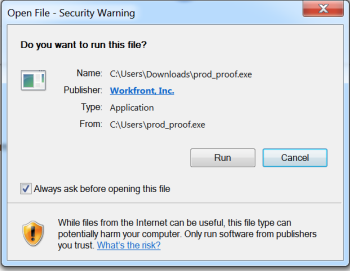

# Install the `Desktop Proofing Viewer` for your organization

The `Desktop Proofing Viewer`, which is designed primarily for `proofing` interactive content, is an application that must be installed on each user's local machine. As an `Adobe Workfront administrator` or `Workfront Proof administrator`, you can perform this installation.

## Access requirements

You must have the following:

<table cellspacing="0"> 
 <col> 
 <col> 
 <tbody> 
  <tr> 
   <td role="rowheader"><a href="https://www.workfront.com/plans" target="_blank">Adobe Workfront plan</a> </td> 
   <td> 
Any
 </td> 
  </tr> 
  <tr> 
   <td role="rowheader"><a href="../../../administration-and-setup/add-users/access-levels-and-object-permissions/wf-licenses.md" class="MCXref xref">Adobe Workfront licenses overview</a>*</td> 
   <td> 
Work or higher
 </td> 
  </tr> 
  <tr> 
   <td role="rowheader">Access configurations</td> 
   <td> 
You must have Administrator selected in your Proof Permission Profile. For more information, see <a href="../../../administration-and-setup/manage-workfront/configure-proofing/configure-a-users-proofing-access.md" class="MCXref xref">Configure a user's proofing access</a>.
 </td> 
  </tr> 
 </tbody> 
</table>

&#42;To find out what plan, license type, or access you have, contact your `Workfront administrator`.

## System Requirements

The `Desktop Proofing Viewer` is supported on the following operating systems:

* Windows 7 and later, 32-bit and 64-bit
* Mac OS X 10.9 and later, 64-bit

## Prerequisites

To enable users to use the `Desktop Proofing Viewer`, you must

* Configure the system to launch the `Desktop Proofing Viewer` as the default view for interactive `proofs` before installation.

## Configure the `Desktop Proofing Viewer` as the default for interactive `proofs`

After you install the `Desktop Proofing Viewer` for your organization, you can set it as the default viewer for interactive proofs.

<ol> 
 <li value="1"> From Workfront, click the Main Menu , then click Proofing to access Workfront Proof.   </li> 
 <li value="2">Click&nbsp;Account settings&nbsp;near the upper-right corner of Workfront Proof, then click the&nbsp;Settings&nbsp;tab.</li> 
 <li value="3"> 
Under&nbsp;Proof Defaults, at the end of the&nbsp;Desktop Proofing Viewer for Interactive proofing&nbsp;row, click&nbsp;Setup.
 
    
 </li> 
 <li value="4">Click&nbsp;Enabled and default, then click Save.</li> 
</ol>

## Installing the `Desktop Proofing Viewer` for Your Users

* [Installing the Desktop Proofing Viewer on Mac](#installing-on-mac) 
* [Installing the Desktop Proofing Viewer on Windows](#installing-dpv-windows)

### Installing the `Desktop Proofing Viewer` on Mac

<ol> 
 <li value="1"> On the user's machine, do one of the following to download the app:  
  <ul>
   <li>If you are using the Production environment, click&nbsp;<a href="https://cdn.proofhq.com/nativeviewer/desktop_viewer/Workfront+Proof.pkg">Mac Production Download for the Desktop Proofing Viewer.</a></li>
   <li> If you are using the Preview environment, click&nbsp;<a href="https://cdn.preview.proofhq.com/nativeviewer/desktop_viewer/Workfront+Proof+Preview.pkg">Mac Preview Download for the Desktop Proofing Viewer.</a></li>
  </ul></li> 
 <li value="2">Open the file you have just downloaded to start the installation.</li> 
 <li value="3"> 
In the installation box that appears, click&nbsp;Continue, then click Install.
 
  
 </li> 
 <li value="4"> 
Ensure that each user completes the installation by opening an interactive proof from the Documents area in Workfront.
 </li> 
</ol>

### Installing the `Desktop Proofing Viewer` on Windows

<ol> 
 <li value="1"> On the user's machine, do one of the following to download the app: 
  <ul>
   <li>In the Production environment, click&nbsp;<a href="https://cdn.proofhq.com/nativeviewer/desktop_viewer/Workfront+Proof.exe">Windows Production download for the Desktop Proofing Viewer.</a></li>
   <li>In the Preview environment, click&nbsp;<a href="https://cdn.preview.proofhq.com/nativeviewer/desktop_viewer/Workfront+Proof+Preview.exe">Windows Preview download for the Desktop Proofing Viewer</a>.</li>
  </ul></li> 
 <li value="2">Open the file you have just downloaded to start the installation.&nbsp;</li> 
 <li value="3"> 
In the security warning box that appears, click&nbsp;Run.
 
  
 
The Desktop Proofing Viewer installs and runs.&nbsp;
 </li> 
 <li value="4">(Conditional) If you install the application using Internet Explorer, refresh the launching page in the browser after the application installs.</li> 
 <li value="5"> 
Ensure that each user completes the installation by opening an interactive proof from the Documents area in Workfront.
 </li> 
</ol>

