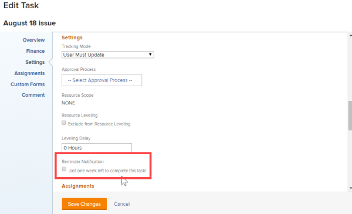

# Attach a reminder notification to an object {#attach-a-reminder-notification-to-an-object}

Reminder notifications can be associated with several different object types: Projects, Tasks, Issues, Timesheets, Templates, Template Tasks, and Recurring Timesheet Profiles.

Before you can attach reminder notifications to an object, a `Workfront administrator` must create the notification, as described in&nbsp; [Set up reminder notifications](set-up-reminder-notifications.md).&nbsp;

The steps to attach a reminder `notifications`&nbsp;are the same, regardless of the object type that you are attaching them to.  

To attach reminder notifications to an object:

1. Go to the object where you want to attach the reminder notification.
1. Click the Edit icon near the upper-right corner of `Workfront`. `<MadCap:conditionalText data-mc-conditions="QuicksilverOrClassic.Quicksilver"> </MadCap:conditionalText>`

1. In the left panel of the Edit box that appears, click **Settings**. 
1. Under **Reminder Notification**, select the notifications that you want to attach to the object. 

   In this example, the object being edited is a task:

   

   If the `Workfront administrator` has created multiple reminder notifications, you can attach multiple notifications to a single object.

1.  Click **Save Changes**.

   If you need help testing the delivery of a reminder notification, see your `Workfront administrator`.

