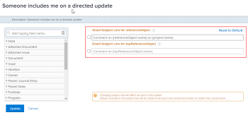
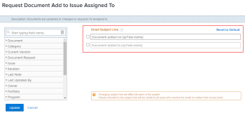

# Customize email subjects for event notifications {#customize-email-subjects-for-event-notifications}

You can customize the subject line of the emails triggered by event notifications:

Changing the subject lines affects all the users in the system, regardless of the recipient’s access level. Users see all the objects and fields included in the email subject.

Some event notifications have multiple subject lines, which means that those event notifications can have multiple email subjects based on their functionality.

>[!IMPORTANT] {type="important"}
>
>Be careful when deleting default fields for cases when the subject lines refer to multiple objects. Following is the list of event notifications that contain such subject lines:
>
>
>
>* Someone includes me on a directed update
>* Someone includes my team on a directed update
>* Work Item Comment to Thread Participants
>* Work Item Comment to Work Item Assignee
>
>

## Access requirements {#access-requirements}

You must have the following access to perform the steps in this article:

<table style="width: 100%;margin-left: 0;margin-right: auto;mc-table-style: url('../../../Resources/TableStyles/TableStyle-List-options-in-steps.css');" class="TableStyle-TableStyle-List-options-in-steps" cellspacing="0"> 
 <col class="TableStyle-TableStyle-List-options-in-steps-Column-Column1"> 
 </col> 
 <col class="TableStyle-TableStyle-List-options-in-steps-Column-Column2"> 
 </col> 
 <tbody> 
  <tr class="TableStyle-TableStyle-List-options-in-steps-Body-LightGray"> 
   <td class="TableStyle-TableStyle-List-options-in-steps-BodyE-Column1-LightGray" role="rowheader">Adobe Workfront plan*</td> 
   <td class="TableStyle-TableStyle-List-options-in-steps-BodyD-Column2-LightGray"> 
Any
 </td> 
  </tr> 
  <tr class="TableStyle-TableStyle-List-options-in-steps-Body-MediumGray"> 
   <td class="TableStyle-TableStyle-List-options-in-steps-BodyE-Column1-MediumGray" role="rowheader">Adobe Workfront license*</td> 
   <td class="TableStyle-TableStyle-List-options-in-steps-BodyD-Column2-MediumGray"> 
Plan 
 </td> 
  </tr> 
  <tr class="TableStyle-TableStyle-List-options-in-steps-Body-LightGray"> 
   <td class="TableStyle-TableStyle-List-options-in-steps-BodyB-Column1-LightGray" role="rowheader">Access level configurations*</td> 
   <td class="TableStyle-TableStyle-List-options-in-steps-BodyA-Column2-LightGray"> 
Planner or higher, with administrative access to reminder notifications
 
For information about giving a Plan user administrative access, see <a href="grant-users-admin-access-certain-areas.md" class="MCXref xref">Grant users administrative access to certain areas</a>.
 </td> 
  </tr> 
 </tbody> 
</table>

&#42;To find out what plan, license type, or access you have, contact your *`Workfront administrator`*.

## Customize email subject lines for event notifications {#customize-email-subject-lines-for-event-notifications}

1. Click the `Main Menu` icon  in the upper-right corner of *`Adobe Workfront`*, then click `Setup` .

1. In the left panel, click `Email` > `Notifications`.

1.  Click the `Event Notifications` tab.
1.  Click the name of the event notification you want to customize to open the `Event Notification` box.
1.  In the `Email Subject Line` box, change the text and fields, including custom fields, in the email subject.

   The names of the fields added must match the camel case syntax of our database structure. For more information about how our objects and their fields are named in the *`Workfront`* database, see the [Adobe Workfront API](workfront-api.md).

1. Click `Update` to save the new subject lines for your emails.

## Customize email subject lines for multi-object emails {#customize-email-subject-lines-for-multi-object-emails}

Some event notifications have multiple subject lines, depending on which objects they trigger.

For example, “Someone includes me on a directed update” has two different subjects lines: first is for tasks, issues, template tasks and documents (also known as a “referenceObject”) and the second one is for objects that allow users to make comments, like portfolio, program, and so on (also known as a “topReferenceObject”).

If a user is included in a conversation on the task, issue, template task, or document,&nbsp;an email will generate with the first subject line. The subject line contains “referenceObject:name” and the system defines the object and displays the appropriate name in the subject field. The email subject line&nbsp;would look similar to this: "Comment on Task 123 on Project ABC."&nbsp;

If added to a project conversation an email with the second subject will generate. Here the subject line contains “topReferenceObject:name” and again *`Workfront`* identifies which object was referenced and will return that object name instead of “topReferenceObject:name” in the subject. The email subject line would look similar to this: "Comment on Project ABC."

To edit the email subject lines and add additional fields to either subject lines, see [Customize email subject lines for event notifications](#customizing-subjects) in this article.

## Customize email subject lines for multi-action emails {#customize-email-subject-lines-for-multi-action-emails}

Some event notifications&nbsp;also have multiple email subjects to outline the different actions which are taken on the objects.

For example, requesting a document to be added to an issue is an event that can trigger two different emails: one for when the document is added, and one for when the document is edited.&nbsp;

To edit the email subject lines and add additional fields to either subject lines, see [Customize email subject lines for event notifications](#customizing-subjects) in this article.  

