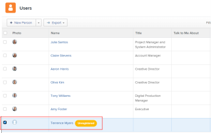
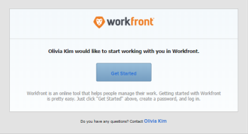

# Manage email invitations to new users

As an *Adobe Workfront administrator*, you can add users to *Workfront* and notify them that they have been added, by using email invitations.

The email invitation allows new users to follow a link where they can choose a password for their *Workfront* account. They can then finish setting up their account.

To ensure the security of the new accounts, we recommend that you use email invitations for your new users, so they can choose their own password. Alternatively, you can also select a password for a new user when creating their account. For more information about adding new users to *Workfront*, see [Add users](../../../administration-and-setup/add-users/create-and-manage-users/add-users.md).

You can configure the new user emails for:

* Any new user added to *Workfront*
* Users added to *Workfront* with a Requestor license

All new users see the same email when an email invitation is sent.

For information about receiving email invitations, see [Receive email invitations and create a password for Adobe Workfront](../../../workfront-basics/manage-your-account-and-profile/managing-your-workfront-account/receive-email-invitations.md).

* [Generate email invitations](#generating-email-invitations) 
* [Configure email invitations](#configuring-email-invitations)

## Access requirements

You must have the following access to perform the steps in this article:

<table cellspacing="0"> 
 <col> 
 <col> 
 <tbody> 
  <tr> 
   <td role="rowheader"><em>Adobe Workfront</em> plan</td> 
   <td> 
Any
 </td> 
  </tr> 
  <tr> 
   <td role="rowheader"><em>Adobe Workfront</em> license</td> 
   <td> 
Plan
 </td> 
  </tr> 
  <tr> 
   <td role="rowheader">Access level configurations</td> 
   <td> 
System administrator
 </td> 
  </tr> 
 </tbody> 
</table>

## Generate email invitations

Email invitations are generated in the following scenarios:

<ul> 
 <li> 
 When you create a new user and you select the Send an invite email to this person on the New User form. For more information about creating new users, see <a href="../../../administration-and-setup/add-users/create-and-manage-users/add-users.md" class="MCXref xref">Add users</a>.
 </li> 
 <li> 
When you import multiple new users and you select the Send invite emails to these people option. For more information about importing several new users, see <a href="../../../administration-and-setup/add-users/create-and-manage-users/import-users.md" class="MCXref xref">Import users</a>.
 </li> 
 <li> 
After the users are created, you can manually generate the invitations to users who have not yet registered their account with <em>Workfront</em>, and they have not established a <em>Workfront</em> password. Users who have an account created but have not yet registered their account are marked as Unregistered in <em>Workfront</em>.
 <note type="note">
    If you deselect the 
   Send an email invite to this person&nbsp;box when you create the user, the email invitation cannot be generated manually. Resending the email invitations manually is only possible for users who have been sent the original email invitation when their account was created. For more information about creating new users, see 
   <a href="../../../administration-and-setup/add-users/create-and-manage-users/add-users.md" class="MCXref xref">Add users</a>.
  </note> </li> 
</ul>

To manually generate email invitations to existing unregistered users:

<ol> <draft-comment>
  <li value="1" data-mc-conditions="QuicksilverOrClassic.Quicksilver"> 
Click the Main Menu icon  in the upper-right corner of <em>Adobe Workfront</em>, then click Users . 
 </li>
 </draft-comment>
 <li value="1" data-mc-conditions="QuicksilverOrClassic.Quicksilver"> 
Click the Main Menu icon  in the upper-right corner of <em>Adobe Workfront</em>, then click Users . 
 </li> 
 <li value="2"> 
Select the user who shows the Unregistered label <draft-comment>
    <MadCap:conditionalText data-mc-conditions="QuicksilverOrClassic.Quicksilver">
     after
    </MadCap:conditionalText>
   </draft-comment><MadCap:conditionalText data-mc-conditions="QuicksilverOrClassic.Quicksilver">
    after
   </MadCap:conditionalText> their name.
 <draft-comment>
   
  

  </draft-comment>
  
 </li> 
 <li value="3"> 
Click the More icon , then click <b>Remind user to register</b>.
 
An email invitation is sent to the new user with a new link they can use to create their <em>Workfront</em> password.
 </li> 
</ol>

## Configure email invitations

As a *Workfront administrator*, you can configure the message you include with the email invitations for new users.

<ol data-mc-continue="false"> <draft-comment>
  <li value="1" data-mc-conditions="QuicksilverOrClassic.Quicksilver">Click the Main Menu icon  in the upper-right corner of <em>Adobe Workfront</em>, then click Setup .</li>
 </draft-comment>
 <li value="1" data-mc-conditions="QuicksilverOrClassic.Quicksilver">Click the Main Menu icon  in the upper-right corner of <em>Adobe Workfront</em>, then click Setup .</li> 
 <li value="2">In the list on the left, click Email > Invitations.</li> 
 <li value="3"> 
In the General Options section, make any of the following modifications:
 
  <table cellspacing="0"> 
   <col> 
   <col> 
   <tbody> 
    <tr> 
     <td role="rowheader">Deactivate invitation links after ... days </td> 
     <td> 
Choose the amount of time after which the email invitations no longer contain a valid link to <em>Workfront</em>. The default amount of days is 45.
 </td> 
    </tr> 
    <tr> 
     <td role="rowheader">Include a message and/ or term of service </td> 
     <td> 
Select this option if you want to modify the email invitation for all new users added to <em>Workfront</em>. This does not include users with a Requestor license.
 
      <ul> 
       <li>Message: If you select to modify the email invitation for all new users, specify&nbsp;the text that you want to include in your email invitations as the email body.</li> 
       <li>Terms and Conditions: If you select to modify the email invitation for all new users, specify the text that you want to include in your email invitations as the terms and conditions. </li> 
       <li>Include a message and/or term of service for helpdesk users:&nbsp;Select this option if you want to modify the email invitation for all new users added to <em>Workfront</em>&nbsp;that have a Requestor license.</li> 
       <li>Message: If you select to modify the email invitation for all new users with a Requestor license, specify the text that you want to include in your email invitations as the email body.</li> 
       <li>Terms and Conditions: If you select to modify the email invitation for all new users with a Requestor license, specify&nbsp;the text that you want to include in your email invitations as the terms and conditions. </li> 
       <li> 
In the Invitation Preview section, you can see a preview of your email invitation. If you selected to include a customized message in your email invitation, the customized message shows in this area.
 <draft-comment>
         
  

        </draft-comment>
  
 </li> 
      </ul> </td> 
    </tr> 
   </tbody> 
  </table> </li> 
 <li value="4">Click Save.</li> 
</ol>

