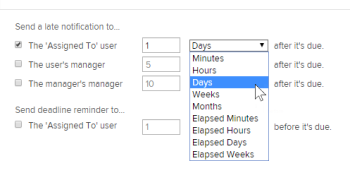

# Set up automatic reminders {#set-up-automatic-reminders}

As an *`Adobe Workfront administrator`*, you can set up automatic reminders to trigger email notifications when all tasks or issues are&nbsp;due, late, or near the planned completion date. After you configure these settings, users cannot disable automatic reminders.

For late notifications, the email is sent nightly until the task or issue is completed.

An automatic reminder can be sent to one or more of the following:

* The users assigned to a task or issue
* The user's immediate manager
* The manager of the immediate manager

>[!NOTE]
>
>You cannot change the content or the subject line of the email triggered by an automatic reminder.

## Access requirements {#access-requirements}

You must have the following access to perform the steps in this article:

<table style="width: 100%;margin-left: 0;margin-right: auto;mc-table-style: url('../../../Resources/TableStyles/TableStyle-List-options-in-steps.css');" class="TableStyle-TableStyle-List-options-in-steps" cellspacing="0"> 
 <col class="TableStyle-TableStyle-List-options-in-steps-Column-Column1"> 
 <col class="TableStyle-TableStyle-List-options-in-steps-Column-Column2"> 
 <tbody> 
  <tr class="TableStyle-TableStyle-List-options-in-steps-Body-LightGray"> 
   <td class="TableStyle-TableStyle-List-options-in-steps-BodyE-Column1-LightGray" role="rowheader">Adobe Workfront plan</td> 
   <td class="TableStyle-TableStyle-List-options-in-steps-BodyD-Column2-LightGray"> 
Any
 </td> 
  </tr> 
  <tr class="TableStyle-TableStyle-List-options-in-steps-Body-MediumGray"> 
   <td class="TableStyle-TableStyle-List-options-in-steps-BodyE-Column1-MediumGray" role="rowheader">Adobe Workfront license</td> 
   <td class="TableStyle-TableStyle-List-options-in-steps-BodyD-Column2-MediumGray"> 
Plan
 </td> 
  </tr> 
  <tr class="TableStyle-TableStyle-List-options-in-steps-Body-LightGray"> 
   <td class="TableStyle-TableStyle-List-options-in-steps-BodyB-Column1-LightGray" role="rowheader">Access level configurations</td> 
   <td class="TableStyle-TableStyle-List-options-in-steps-BodyA-Column2-LightGray"> 
System administrator
 </td> 
  </tr> 
 </tbody> 
</table>

## Set up automatic reminders {#set-up-automatic-reminders-1}

1. Click the `Main Menu` icon  in the upper-right corner of *`Adobe Workfront`*, then click `Setup` .

1. Click `Email` > `Automatic Reminders`.

1.  In the `Send a late notification to` area, select any of the following options:

1.  Select the time&nbsp;for the automatic reminder to send by selecting the amount of time before or after the due date of the work item.

   The time is calculated from the Planned Completion Date of the task or issue.  

   Specify the number of minutes, hours, days, weeks, or months to add time to the Planned Completion Date of the tasks or issues. Select `Elapsed Minutes`, `Elapsed Hours`, `Elapsed Days`, or `Elapsed Weeks` to add time that includes any weekends,&nbsp;holidays, and non-working hours as indicated in your schedule.  

   For example, if a task is assigned on Friday and&nbsp;has a duration of 3 elapsed days, the task completion date is set for Monday (assuming that Saturday and Sunday is a weekend). If the task has a duration of 3 days (not elapsed), the&nbsp;task completion date is set for Wednesday.  

   

1. Click `Save`.

## Receive automatic reminders {#receive-automatic-reminders}

If you are the designated entity in an Automatic Reminder notification, you receive an email when the specified deadline is met. For late notifications, the email is sent nightly until the task or issue is completed.

Tasks with certain dependency types may deliver after the specified start date, even though they are past due. For example, if a task has a predecessor with a Finish-Start (fs) dependency, it won't be included in the email, even if it's passed the specified start date, because you can't start the task until the predecessor is complete.

For more information about receiving Automatic Reminders emails, see the [Automatic reminders](wf-notifications.md#automatic-reminders) section in [Adobe Workfront notifications](wf-notifications.md).

## Send automatic reminders {#send-automatic-reminders}

Automatic reminders are sent as soon as the time selected by the *`Workfront administrator`* is met.

If you want to trigger sending the automatic reminder emails manually, you can do so by using Diagnostics. For more information about accessing and using Diagnostics in *`Workfront`*, see [Use Diagnostics to trigger automated processes](use-diagnostics-to-trigger-automated-processes.md).
