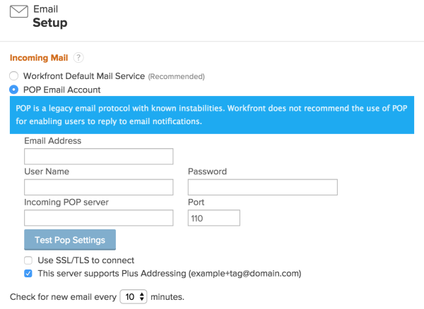
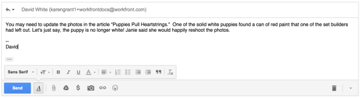

# Use a POP email account to comment on work items {#use-a-pop-email-account-to-comment-on-work-items}

This functionality will be removed with the 20.3 release. See [Email Spoofing & POP Reply](email-spoofing-pop-reply-message.md) for more information. As a `Workfront administrator`, you can configure `Workfront` to allow users to use a POP email account to comment on `Workfront` objects.

For more information about replying to comments via email, see [Allow users to reply to email notifications](allow-users-reply-to-email-notifications.md).

>[!IMPORTANT] {type="important"}
>
>Although POP users can reply to emails sent from `Workfront`, we strongly encourage the use of the default mail service. For information about this service, see [Comment on work items using Workfront default email service](comment-work-items-wf-default-email-service.md).

## Integrate `Workfront` with a POP email account {#integrate-workfront-with-a-pop-email-account}

If your organization uses POP for email delivery, you must configure `Workfront` to allow your POP users to respond to email notifications sent from `Workfront`.

>[!IMPORTANT] {type="important"}
>
>We strongly advise users to create a POP email address that is solely dedicated to replying to `Workfront` email. Using a personal POP username can cause severe issues with your system.  
>Plus addressing (such as yourname+organization@organization.com) is not supported for users commenting on `Workfront` objects via email.

* [Prerequisites](#prerequisites) 
* [Set up a POP account in Workfront](#setting-up-a-pop-account-in-workfront) 

### Prerequisites {#prerequisites}

The following prerequisites are required in order to set up a POP account in `Workfront`:

*  A unique POP account is associated with&nbsp;this setup.&nbsp; 
*  The POP account is not linked to a `Workfront` user account. 
*  The POP account email address is solely dedicated for the purpose of responding to `Workfront` emails.   

  >[!NOTE]
  >
  >Using a personal POP username can cause severe issues.

Some customized POP configurations have been known to not work correctly with `Workfront` in supporting this functionality. Contact your email `Workfront administrator` to understand why a POP account might not correctly support this feature in `Workfront`. 

### Set up a POP account in `Workfront` {#set-up-a-pop-account-in-workfront}

In order to integrate POP with `Workfront`, you need to set up the POP account to handle incoming communication from `Workfront`.&nbsp;

1. Click the **Main Menu** icon  in the upper-right corner of `Workfront`, then click **Setup** .

1.  Click&nbsp;**Email >**&nbsp;**Setup.  
   **
1.  In the **Email Setup** page that appears, under **Incoming Mail**, select **POP Email Account`.`**  

   

1.  Specify the following information:

<table style="width: 100%;margin-left: 0;margin-right: auto;mc-table-style: url('../../../Resources/TableStyles/TableStyle-List-options-in-steps.css');" class="TableStyle-TableStyle-List-options-in-steps" cellspacing="0"> 
 <col class="TableStyle-TableStyle-List-options-in-steps-Column-Column1" style="width: 188px;"> 
 <col class="TableStyle-TableStyle-List-options-in-steps-Column-Column2"> 
 <tbody> 
  <tr class="TableStyle-TableStyle-List-options-in-steps-Body-LightGray"> 
   <td class="TableStyle-TableStyle-List-options-in-steps-BodyE-Column1-LightGray">Email address</td> 
   <td class="TableStyle-TableStyle-List-options-in-steps-BodyD-Column2-LightGray"> 
The email address&nbsp;of the POP account you are using.
 
Warning: </b>"><b>Warning: </b>You should not use a personal email address as the POP username. Instead, you should create a new email address that is solely dedicated for this purpose. Using a personal POP username can cause severe issues.
 </td> 
  </tr> 
  <tr class="TableStyle-TableStyle-List-options-in-steps-Body-MediumGray"> 
   <td class="TableStyle-TableStyle-List-options-in-steps-BodyE-Column1-MediumGray">User name</td> 
   <td class="TableStyle-TableStyle-List-options-in-steps-BodyD-Column2-MediumGray">The user name that&nbsp;Workfront uses&nbsp;to access the POP&nbsp;server.&nbsp;This is the user name of the POP&nbsp;account as specified by your email administrator</td> 
  </tr> 
  <tr class="TableStyle-TableStyle-List-options-in-steps-Body-LightGray"> 
   <td class="TableStyle-TableStyle-List-options-in-steps-BodyE-Column1-LightGray">Password</td> 
   <td class="TableStyle-TableStyle-List-options-in-steps-BodyD-Column2-LightGray">The password that&nbsp;Workfront uses&nbsp;to access the POP&nbsp;server.&nbsp;This is the password&nbsp;of the POP&nbsp;account as specified by your email administrator.</td> 
  </tr> 
  <tr class="TableStyle-TableStyle-List-options-in-steps-Body-MediumGray"> 
   <td class="TableStyle-TableStyle-List-options-in-steps-BodyE-Column1-MediumGray">Incoming POP server</td> 
   <td class="TableStyle-TableStyle-List-options-in-steps-BodyD-Column2-MediumGray">The URL of the incoming POP server. For example, for Gmail, this is pop.gmail.com.</td> 
  </tr> 
  <tr class="TableStyle-TableStyle-List-options-in-steps-Body-LightGray"> 
   <td class="TableStyle-TableStyle-List-options-in-steps-BodyE-Column1-LightGray">Port</td> 
   <td class="TableStyle-TableStyle-List-options-in-steps-BodyD-Column2-LightGray">The port Workfront&nbsp;uses when connecting to the POP server. When using an unsecured&nbsp;connection, use Port 110.  When using a secure connection, use port 995 (you must select <b>Use SSL/TSL to connect</b> when using port 995).</td> 
  </tr> 
  <tr class="TableStyle-TableStyle-List-options-in-steps-Body-MediumGray"> 
   <td class="TableStyle-TableStyle-List-options-in-steps-BodyE-Column1-MediumGray">Use SSL/TSL to connect</td> 
   <td class="TableStyle-TableStyle-List-options-in-steps-BodyD-Column2-MediumGray">Select this option to connect over a secure connection.</td> 
  </tr> 
  <tr class="TableStyle-TableStyle-List-options-in-steps-Body-LightGray"> 
   <td class="TableStyle-TableStyle-List-options-in-steps-BodyE-Column1-LightGray">This server supports Plus Addressing</td> 
   <td class="TableStyle-TableStyle-List-options-in-steps-BodyD-Column2-LightGray">Select this option if the server supports Plus Addressing.</td> 
  </tr> 
  <tr class="TableStyle-TableStyle-List-options-in-steps-Body-MediumGray"> 
   <td class="TableStyle-TableStyle-List-options-in-steps-BodyB-Column1-MediumGray">Check for new email every ... minutes</td> 
   <td class="TableStyle-TableStyle-List-options-in-steps-BodyA-Column2-MediumGray"> 
The frequency that Workfront&nbsp;searches for email communications from all POP accounts associated with Workfront. Workfront can search for messages as frequently as every five minutes. The default is every 30 minutes. This includes POP accounts associated with project queues. For more information about setting up a POP account for a project queue, see <a href="enable-email-issues-into-projects.md" class="MCXref xref">Enable users to email an issue into a Request Queue project </a>.
 
Note:  Depending on the number of messages&nbsp;being sent to Workfront via POP, messages can take 20 minutes or more to be retrieved, even if you configure Workfront to check for mail more frequently. 
 
For more information about how to manually check for new messages from a POP account, see <a href="use-diagnostics-to-trigger-automated-processes.md" class="MCXref xref">Use Diagnostics to trigger automated processes</a>.
 </td> 
  </tr> 
 </tbody> 
</table>

1. Click **Test POP Settings**&nbsp;to ensure that the connection to the POP server is functional.
1. Click **Save.**

## Understanding the Automatic Disconnect&nbsp;of a POP Account {#understanding-the-automatic-disconnect-of-a-pop-account}

If there is a problem connecting to the POP account or retrieving messages from the account, the connection between `Workfront` and the POP account is either automatically be&nbsp;disabled or the processing of the emails from the POP account is temporarily&nbsp;stopped.&nbsp;

The POP account may be disabled for the following reasons:

* `Workfront` tries to connect to the POP account and the connection fails more than 25 consecutive times. After 25 failed attempts, the POP account setup is disabled in `Workfront`.  

*  `Workfront` connects to the POP account and finds 10 or more emails in the POP account that are not related to comments in `Workfront`. In this case, `Workfront` stops processing emails for the account and sends the following notification to the `Workfront administrator`:

  "We encountered a problem while processing emails from your POP account: <POP email address>. We either found emails that are not related to `Workfront` comments, or something might be wrong with your POP credentials. Please ensure that the email credentials configured under Setup > Email > Setup are valid and that the email address is used only for `Workfront` communication."

  `Workfront` starts checking the account again after five minutes.&nbsp;

  >[!NOTE]
  >
  >`Workfront` recommends that you use this POP account for `Workfront` communication only. Any other emails could potentially disable the connection between `Workfront` and the POP account.

  If you are a `Workfront administrator` and you&nbsp;enable the email notification "An error was found that needs my&nbsp;attention," you receive&nbsp;an email notification that the POP account was disabled. For more information on enabling email notifications, see [Configure email notifications](configure-email-notifications.md).

## Remove signature line from POP email {#remove-signature-line-from-pop-email}

If your POP email client supports user signatures placed in a location other than the bottom of an email, your signature might display in the Updates tab of objects to which you add comments via a response to an email notification.

You can prevent your signature from appending to comments you make by inserting in your email response a string of characters called a signature delimiter.&nbsp;

1. Within the email notification, choose to reply to the email.  
1. In the reply window that appears, compose your comment.
1.  Above your signature, type "-- " (dash, dash, space), all on the same line.  

   The following is an example of the signature delimiter in place:  

   

1.  Click **Send**.  

   Your comment is added to the communications thread of the `Workfront` object with the signature line stripped out.

