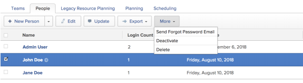

# Enhanced Authentication 1.0 {#enhanced-authentication}

>[!IMPORTANT] {type="important"}
>
>`This article is for organizations that migrated from Legacy Authentication to Enhanced Authentication 1.0. Most customers are currently using Legacy Authentication and will not migrate to Enhanced Authentication 1.0. Instead, they will migrate to Enhanced Authentication 2.0 in 2020.  
  
>If your organization is currently using Legacy Authentication, see [Get started with the Enhanced Authentication experience](get-started-enhanced-authentication.md) for more information about Enhanced Authentication 2.0.` 

The following sections describe how to configure and manage the Enhanced Authentication 1.0 experience for your organization as the `Workfront administrator`:

## Configure your email system to allow emails for Enhanced Authentication {#configure-your-email-system-to-allow-emails-for-enhanced-authentication}

You should configure your email system to allow emails from no-reply@verificationemail.com.

This is the email address `Workfront` uses to send emails to users for the following purposes: 

*  The confirmation email when resetting the&nbsp;password for the Enhanced Authentication experience, as described in [Log in to Workfront with the Enhanced Authentication experience configured](#logging-in-to-workfront-with-new-authentication-configured).
*  The welcome email that is sent after the user successfully configures the Enhanced Authentication experience. 

If you do not configure your email system to allow emails from this address, these important emails might go to the user's spam folder. 

## Configure password policies for Enhanced Authentication {#configure-password-policies-for-enhanced-authentication}

For information about how to configure password policies for the Enhanced Authentication experience, see the article [Configure password policies for authentication](configure-password-policies-authentication.md).

## Update SAML 2.0 metadata in your identity provider {#update-saml-metadata-in-your-identity-provider}

For information about configuring SAML 2.0 metadata, see [Update SAML 2.0 metadata in your IDP when using enhanced authentication](update-saml-2-metadata-ip-eauth .md).

## Reset passwords for users as the `Workfront administrator` {#reset-passwords-for-users-as-the-workfront-administrator}

With the Enhanced Authentication experience, you can no longer manually reset another user's password when editing a user as a `Workfront administrator`. Instead, you can initiate a Forgot Password email. 

>[!NOTE]
>
>Users must have a valid email address to be able to retrieve their password.

To send the Forgot Password email: 

1. Go to the **People** area, then click the **People** tab.

1. Select the users whose passwords you want to reset.
1. Click **More** > **Send Forgot Password Email**.  
   

## Reset your administrator password {#reset-your-administrator-password}

1.  Click your profile picture in the upper-right corner of the `Workfront` interface, then click **My Settings**. 

1.  In the My Settings dialog box, click **Reset Password**.  
   A new pop-up is displayed where you can specify your new password.  
   <![CDATA[     ]]>

1.  After you confirm your new password, you should receive a confirmation email. Go to your email inbox and look for an email from "no-reply@verificationemail.com". This email might be in your spam folder. 

## Log in to `Workfront` with the Enhanced Authentication experience configured {#log-in-to-workfront-with-the-enhanced-authentication-experience-configured}

>[!NOTE]
>
>The migration affects only Production accounts. Use your existing login credentials when accessing Preview or Sandbox instances of `Workfront`.

The first time you log in to `Workfront` after your organization is upgraded to the Enhanced Authentication experience:

1. In a web browser, go to your `Workfront` site.
1. Use your current `Workfront` login credentials to log in to the `Workfront` site.

1. When prompted, reset your password.  
   You can use your existing password if it&nbsp;complies with the new password requirements.  
   

## Use Legacy Authentication (for Organizations Not Yet Migrated to the Enhanced Authentication Experience) {#use-legacy-authentication-for-organizations-not-yet-migrated-to-the-enhanced-authentication-experience}

If your organization has not yet been migrated to the Enhanced Authentication experience, you must continue to use the legacy form of authentication until your organization is migrated to the new form of authentication. 

For information about how to view or modify Legacy Authentication settings, see the article [Enhanced Authentication 1.0](#).
