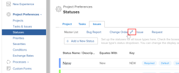

# Configure request types {#configure-request-types}

While working on a project, you might discover that unexpected events arise. You can log those unexpected events as issues for a particular project or task. You can also submit requests, which are recorded as issues on a project that is designated as a Request Queue. Issues and requests are used considered to be interchangeable in *`Adobe Workfront`*.

For information about creating issues in *`Workfront`*, see [Create issues](create-issues.md). For information about creating requests in *`Workfront`*, see [Create and submit Adobe Workfront requests](create-submit-requests.md). For information about associating Request&nbsp;Types with projects, see [Define Request Types for a project in Adobe Workfront](define-request-types-for-project.md). 

## Access requirements {#access-requirements}

You must have the following to perform the steps in this article:

<table style="width: 100%;margin-left: 0;margin-right: auto;mc-table-style: url('../../../Resources/TableStyles/TableStyle-List-options-in-steps.css');" class="TableStyle-TableStyle-List-options-in-steps" cellspacing="0"> 
 <col class="TableStyle-TableStyle-List-options-in-steps-Column-Column1"> 
 <col class="TableStyle-TableStyle-List-options-in-steps-Column-Column2"> 
 <tbody> 
  <tr class="TableStyle-TableStyle-List-options-in-steps-Body-LightGray"> 
   <td class="TableStyle-TableStyle-List-options-in-steps-BodyE-Column1-LightGray" role="rowheader">Adobe Workfront plan</td> 
   <td class="TableStyle-TableStyle-List-options-in-steps-BodyD-Column2-LightGray"> 
Any
 </td> 
  </tr> 
  <tr class="TableStyle-TableStyle-List-options-in-steps-Body-MediumGray"> 
   <td class="TableStyle-TableStyle-List-options-in-steps-BodyE-Column1-MediumGray" role="rowheader">Adobe Workfront license</td> 
   <td class="TableStyle-TableStyle-List-options-in-steps-BodyD-Column2-MediumGray"> 
Plan 
 </td> 
  </tr> 
  <tr class="TableStyle-TableStyle-List-options-in-steps-Body-LightGray"> 
   <td class="TableStyle-TableStyle-List-options-in-steps-BodyB-Column1-LightGray" role="rowheader">Access level configurations</td> 
   <td class="TableStyle-TableStyle-List-options-in-steps-BodyA-Column2-LightGray"> 
You must be a Workfront administrator. For more information, see <a href="grant-a-user-full-administrative-access.md" class="MCXref xref">Grant a user full administrative access</a>.
 
Note: If you still don't have access, ask your Workfront administrator if they set additional restrictions in your access level. For information on how a Workfront administrator can modify your access level, see <a href="create-modify-access-levels.md" class="MCXref xref">Create or modify custom access levels</a>.
 </td> 
  </tr> 
 </tbody> 
</table>

## Customize the names of the request types {#customize-the-names-of-the-request-types}

As a *`Workfront administrator`*, you can configure the names of the request types in your system. The new names are visible in any area of *`Workfront`* where the `Issue Type` or `Request Type` fields display:

* In the `Queue Details` area of&nbsp;a project that will receive the issues or requests.&nbsp;
*  If more than one request type is selected for a Request Queue, in the `New Issue Form` in the `Issue Type` field, when you create a new issue or submit a new request.

  For more information about creating issues in *`Workfront`*, see&nbsp; [Create issues](create-issues.md)

  For more information about creating requests in *`Workfront`*, see&nbsp; [Create and submit Adobe Workfront requests](create-submit-requests.md).

* On the `Queue Topic Detail` form, when you configure the Queue Topic.  
  For more information about creating Queue Topics, see [Create Queue Topics](create-queue-topics.md).

To customize the names of the request types:

1. Click `Setup` near the upper-right corner of *`Adobe Workfront`* on the Global Navigation Bar.

1. Click `Project Preferences` > `Statuses`.

1. Click the `Issues` tab.
1.  At the top of the `Issues` tab, hover over the name of a request type, then click the `Edit` icon that appears.  

   

1.  In the box that appears, type a new name, then press `Enter`.

## Configure issue statuses within different request types {#configure-issue-statuses-within-different-request-types}

You can associate each request type with different issue statuses. You can also change&nbsp;the order in which the statuses display on an issue, depending on what type of issue it is.&nbsp;

For more information about changing the default order of issue statuses and configuring issue statuses, see the [Create or edit a status](create-or-edit-a-status.md) section in [Create or edit a status](create-or-edit-a-status.md).
