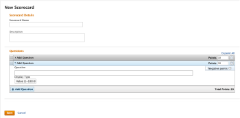
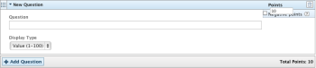
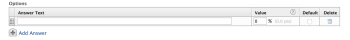
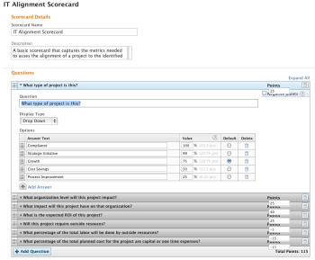

# Create a scorecard  {#create-a-scorecard}

A scorecard is used to measure how well a project aligns with the previously established criteria of a portfolio. A scorecard often reflects an organization’s mission, values, and strategic goals.

Portfolio managers usually define the scorecard questions and answers to ensure they are meaningful and valuable during project prioritization and selection. An *`Adobe Workfront administrator`* builds the scorecards&nbsp;based on the recommendations from&nbsp;portfolio managers.

The questions and answers chosen for a scorecard must be quantifiable in order to provide an alignment value to compare different projects.

## Access requirements {#access-requirements}

You must have the following to perform the steps in this article:

<table style="width: 100%;margin-left: 0;margin-right: auto;mc-table-style: url('../../../Resources/TableStyles/TableStyle-List-options-in-steps.css');" class="TableStyle-TableStyle-List-options-in-steps" cellspacing="0"> 
 <col class="TableStyle-TableStyle-List-options-in-steps-Column-Column1"> 
 <col class="TableStyle-TableStyle-List-options-in-steps-Column-Column2"> 
 <tbody> 
  <tr class="TableStyle-TableStyle-List-options-in-steps-Body-LightGray"> 
   <td class="TableStyle-TableStyle-List-options-in-steps-BodyE-Column1-LightGray" role="rowheader">Adobe Workfront plan</td> 
   <td class="TableStyle-TableStyle-List-options-in-steps-BodyD-Column2-LightGray"> 
Any
 </td> 
  </tr> 
  <tr class="TableStyle-TableStyle-List-options-in-steps-Body-MediumGray"> 
   <td class="TableStyle-TableStyle-List-options-in-steps-BodyB-Column1-MediumGray" role="rowheader">Adobe Workfront license</td> 
   <td class="TableStyle-TableStyle-List-options-in-steps-BodyA-Column2-MediumGray"> 
Business or higher
 
You must have the System Administrator access level. For more information, see <a href="grant-a-user-full-administrative-access.md" class="MCXref xref">Grant a user full administrative access</a>.
 </td> 
  </tr> 
 </tbody> 
</table>

## Create a scorecard {#create-a-scorecard-1}

1. Click the `Main Menu` icon  in the upper-right corner of *`Adobe Workfront`*, then click `Setup` .

1.  Click `Scorecards`, then click `New Scorecard` to create a new scorecard and launch the scorecard builder.

   

1.  Specify the following information for the new scorecard:

1.  Click the `Add Question` drop-down menu to open the scorecard question section.

   

   Specify the following information for your question:

<table style="width: 100%;margin-left: 0;margin-right: auto;mc-table-style: url('../../../Resources/TableStyles/TableStyle-List-options-in-steps.css');" class="TableStyle-TableStyle-List-options-in-steps" cellspacing="0"> 
 <col class="TableStyle-TableStyle-List-options-in-steps-Column-Column1"> 
 <col class="TableStyle-TableStyle-List-options-in-steps-Column-Column2"> 
 <tbody> 
  <tr class="TableStyle-TableStyle-List-options-in-steps-Body-LightGray"> 
   <td class="TableStyle-TableStyle-List-options-in-steps-BodyE-Column1-LightGray" role="rowheader">Question</td> 
   <td class="TableStyle-TableStyle-List-options-in-steps-BodyD-Column2-LightGray">Specify the question you want to include in the scorecard.</td> 
  </tr> 
  <tr class="TableStyle-TableStyle-List-options-in-steps-Body-MediumGray"> 
   <td class="TableStyle-TableStyle-List-options-in-steps-BodyE-Column1-MediumGray" role="rowheader">Points</td> 
   <td class="TableStyle-TableStyle-List-options-in-steps-BodyD-Column2-MediumGray">Specify the maximum points possible for this&nbsp;question.</td> 
  </tr> 
  <tr class="TableStyle-TableStyle-List-options-in-steps-Body-LightGray"> 
   <td class="TableStyle-TableStyle-List-options-in-steps-BodyE-Column1-LightGray" role="rowheader">Negative Points</td> 
   <td class="TableStyle-TableStyle-List-options-in-steps-BodyD-Column2-LightGray">Select this option&nbsp;to indicate that Workfront should subtract from the total possible points. Negative scores cannot be added to the maximum possible points of a scorecard.</td> 
  </tr> 
  <tr class="TableStyle-TableStyle-List-options-in-steps-Body-MediumGray"> 
   <td class="TableStyle-TableStyle-List-options-in-steps-BodyB-Column1-MediumGray" role="rowheader">Display Type</td> 
   <td class="TableStyle-TableStyle-List-options-in-steps-BodyA-Column2-MediumGray"> 
Select from the following options:
 </td> 
  </tr> 
 </tbody> 
</table>

    
    
    * `Value(0-100)`: This is a numerical value. If selected, a numeric field is displayed in the scorecard where users can specify any value between 0-100.
    *  `Drop Down:` If selected, the `Options` section is now displayed.
    
    
          
    

    
    
      Click `Answer` to add a possible answer to your question.
    
    
    
    *  `Radio Button:` If selected, the `Options` section is now displayed.
    
    
          
    

    
    
      Click `Answer` to add a possible answer to your question.  
      `Answer Text`: Specify one of the possible answers for your question.  
      `Value`: Specify the value in percentage points of this answer, in case that it is fulfilled. If you choose 100%, the number of points allotted for this question is fully achieved. If you want to indicate that this answer carries only a portion of the total amount of points allotted to this question, select a lower percentage value for this answer. For example, if your question is valued at 10 points, and you want this answer to carry 5 of those points, choose 50% for your `Value`.
    
    
      `Default`: Specify whether this answer is the default one.  
      `Delete`: You can&nbsp;delete an answer, if you consider it to no longer be pertinent.
    
    
    

1.  Click `Add Question` to add more questions and answers to your scorecard, following the same steps.

   >[!NOTE]
   >
   >You can reorder the questions in your scorecard by dragging and dropping the questions in the correct order.  

1.  Click `Save` when you are finished entering your data.

   

## Apply a scorecard to a project {#apply-a-scorecard-to-a-project}

A user with manage permissions to a project can apply a scorecard to a project, after the scorecard has been created by the *`Workfront administrator`*.  
For more information about&nbsp;creating scorecards, see [Create a scorecard](#creating-a-scorecard).  
For more information about project permissions, see [Share a project in Adobe Workfront](share-a-project.md).

A scorecard is added to a project as part of creating a business case for the project. For more information about&nbsp;adding a scorecard to a project, see [Apply a scorecard to a project and generate an Alignment Score](apply-scorecard-to-project-to-generate-alignment-score.md).
