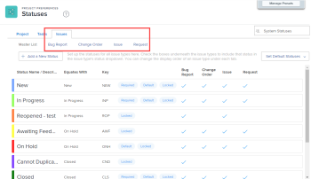
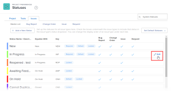

# Customize default issue types {#customize-default-issue-types}

Issue types are useful in the following circumstances:

* When customizing issue statuses, as described in [Create or edit a status](create-or-edit-a-status.md).
* When creating a request queue, as described in [Create a Request Queue](create-request-queue.md).

You can customize the labels for each default issue type to better match the terminology used in your organization.

## Access requirements {#access-requirements}

You must have the following to perform the steps in this article:

<table style="width: 100%;margin-left: 0;margin-right: auto;mc-table-style: url('../../../Resources/TableStyles/TableStyle-List-options-in-steps.css');" class="TableStyle-TableStyle-List-options-in-steps" cellspacing="0"> 
 <col class="TableStyle-TableStyle-List-options-in-steps-Column-Column1"> 
 <col class="TableStyle-TableStyle-List-options-in-steps-Column-Column2"> 
 <tbody> 
  <tr class="TableStyle-TableStyle-List-options-in-steps-Body-LightGray"> 
   <td class="TableStyle-TableStyle-List-options-in-steps-BodyE-Column1-LightGray" role="rowheader">Adobe Workfront plan</td> 
   <td class="TableStyle-TableStyle-List-options-in-steps-BodyD-Column2-LightGray"> 
Any
 </td> 
  </tr> 
  <tr class="TableStyle-TableStyle-List-options-in-steps-Body-MediumGray"> 
   <td class="TableStyle-TableStyle-List-options-in-steps-BodyE-Column1-MediumGray" role="rowheader">Adobe Workfront license</td> 
   <td class="TableStyle-TableStyle-List-options-in-steps-BodyD-Column2-MediumGray"> 
Plan 
 </td> 
  </tr> 
  <tr class="TableStyle-TableStyle-List-options-in-steps-Body-LightGray"> 
   <td class="TableStyle-TableStyle-List-options-in-steps-BodyB-Column1-LightGray" role="rowheader">Access level configurations</td> 
   <td class="TableStyle-TableStyle-List-options-in-steps-BodyA-Column2-LightGray"> 
You must be a Workfront administrator. For more information, see <a href="grant-a-user-full-administrative-access.md" class="MCXref xref">Grant a user full administrative access</a>.
 
Note: If you still don't have access, ask your Workfront administrator if they set additional restrictions in your access level. For information on how a Workfront administrator can modify your access level, see <a href="create-modify-access-levels.md" class="MCXref xref">Create or modify custom access levels</a>.
 </td> 
  </tr> 
 </tbody> 
</table>

## Default issue types {#default-issue-types}

If you have *`Adobe Workfront administrator`* access, there are four default issue types that you can configure and rename:

* `Bug Report` Used to track reported bugs in the system.
* `Change Order` Used to track issues&nbsp;that need to&nbsp;be updated or revised.
* `Issue` An object in *`Workfront`* that communicates unplanned work, a problem that arises, or something that must be resolved in order to continue a task.

* `Request` An issue type that applies to a request queue where users make requests in *`Workfront`*.

 

## Customize an issue type {#customize-an-issue-type}

Consider the following about customizing issue types:

* You can modify the label for an issue type, but you can't change its function.
* You can't create additional issue types.
* You can't change the filter values for the name of an issue type. So, if you create a filter on an issue report, the value of the filter (key) does not reflect the issue type's custom name. 
*  Three default statuses are associated with each issue type: New, In Progress, and Closed. You can't delete these statuses or remove them from an issue type, but you can rename them.
*  You can re-order the options that appear on the drop-down menu for each issue type.

To customize an issue type:

1. Click the `Main Menu` icon  in the upper-right corner of *`Adobe Workfront`*, then click `Setup` .

1. Click `Project Preferences` > `Statuses`.

1. Click the `Issues` tab.
1. Do any of the following:
    
    
    * Hover over the issue type you want to customize, click the Edit icon  that appears to the far right, then type a new name for the issue type.
    
    
          
    

    
    * Click an issue type to list its associated statuses, then drag the handles that appear when you hover over them and and drop them in the order you want them to appear in your users' issue `Status` drop-down menu.
    
    

