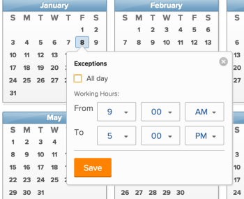

# Create a schedule

As an `Adobe Workfront administrator`, you can define your work week by using schedules. You can associate a schedule with a user or a project. This allows `Workfront` to calculate timelines and user availability.

For information about associating schedules with users and projects, see the following articles:

* [Edit a user's profile](../../../administration-and-setup/add-users/create-and-manage-users/edit-a-users-profile.md) 
* [Edit projects](../../../manage-work/projects/manage-projects/edit-projects.md)

`Group administrators` can also create schedules that are associated with the groups they manage. For more information, see [Create and modify a group’s schedules](../../../administration-and-setup/manage-groups/work-with-group-objects/create-and-modify-a-groups-schedules.md).

## Access requirements

You must have the following to perform the steps in this article:

<table cellspacing="0"> 
 <col> 
 <col> 
 <tbody> 
  <tr> 
   <td role="rowheader">Adobe Workfront plan</td> 
   <td> 
Any
 </td> 
  </tr> 
  <tr> 
   <td role="rowheader">Adobe Workfront license</td> 
   <td> 
Plan 
 </td> 
  </tr> 
  <tr> 
   <td role="rowheader">Access level configurations</td> 
   <td> 
You must be a Workfront administrator. For more information, see <a href="../../../administration-and-setup/add-users/configure-and-grant-access/grant-a-user-full-administrative-access.md" class="MCXref xref">Grant a user full administrative access</a>.
 
Note: If you still don't have access, ask your Workfront administrator if they set additional restrictions in your access level. For information on how a Workfront administrator can modify your access level, see <a href="../../../administration-and-setup/add-users/configure-and-grant-access/create-modify-access-levels.md" class="MCXref xref">Create or modify custom access levels</a>.
 </td> 
  </tr> 
 </tbody> 
</table>

## Create a schedule

<ol> 
 <li value="1"> 
Click the Main Menu icon  in the upper-right corner of Adobe Workfront, then click Setup .
 </li> 
 <li value="2">Click Schedules.</li> 
 <li value="3">Click New Schedule.</li> 
 <li value="4">Specify a name for the schedule.</li> 
 <li value="5"> 
(Optional) Select Default Schedule to identify this schedule as your default.
 
You can have more than one schedule in Workfront, but you can only have one default schedule.
 
You must have at least one schedule in Workfront. If you only have one, that is designated as the default schedule.
 <note type="note">
    You cannot designate a schedule as the default schedule if you are a group administrator. Only a 
   Workfront administrator can designate a schedule as the default for the system.
    
  </note> 
  
 </li> 
 <li value="6"> 
In the Schedule tab, select a daily schedule by dragging the blue outline across hour blocks to highlight them.
 
We recommend that you select 8 one-hour blocks over a 9 hour period of time. This accommodates for lunch or other breaks. 
 
    
 </li> 
 <li value="7">On the Details tab, specify the following information: 
  <ul>
   <li>
Group with Administration Access: Indicate the group whose Group Administrators have the permission to edit this schedule. 
<note type="important">
     <ul>
      <li>
If you are a group administrator creating a schedule, this field is mandatory.

A group administrator can create a schedule only if it is designated for a group or subgroup for which they are designated as the administrator.

If you manage only one group, that group is selected in this field, by default. 

If you manage several groups, you must select a group in this field before you can save the schedule. 
</li>
      <li>
If you are a Workfront administrator creating a schedule, this field is optional. When you create a schedule without associating it with a group, it is saved as a system-level schedule and cannot be managed by a group administrator of any group.

Schedules assigned to accounts or projects are visible to all users who can edit these objects. This is true for both system-level and group-level schedules. 
</li>
     </ul>
    </note>
Specifying a Group with Administration Access for a schedule does not assign the schedule to the users in the group. Specifying a Group with Administration Access only allows the Group Administrators in the group to edit, delete, and copy the schedule. Group Administrators cannot edit, delete, or copy system-level schedules. For more information, see <a href="../../../administration-and-setup/manage-groups/group-roles/group-administrators.md" class="MCXref xref">Group administrators</a>.
</li>
   <li>Select the Groups with View Access to which this schedule is visible to. Only the users in the groups specified here can find the schedule in the drop-down menu when they are assigning it to users or projects. </li>
   <li>Select the Time Zone for your schedule. </li>
  </ul></li> 
 <li value="8"> 
On the Exceptions tab, specify the exceptions to the schedule. 
 
Exceptions are full or half days which need to be excluded from the schedule, such as holidays or company events. 
 <note type="note">
   If you already know what your recurring schedule exceptions are, you can define your schedule exceptions for many years in the future.
  </note> 
Full or partial days can be excluded from the work schedule. Click the date to select it as an exception, then select the All day field to indicate whether the exception is a full day or not.
 
    
 </li> 
 <li value="9"> 
Specify the start and end time for the partial day exceptions.
 
  
 </li> 
 <li value="10">Click Save, then click Save Changes.</li> 
 <li value="11"> 
(Optional) Associate the schedule with a user.
 
For information, see <a href="../../../administration-and-setup/add-users/create-and-manage-users/edit-a-users-profile.md" class="MCXref xref">Edit a user's profile</a>.
 </li> 
 <li value="12"> 
(Optional)&nbsp;Associate the schedule with a project.
 
For information, see <a href="../../../manage-work/projects/manage-projects/edit-projects.md" class="MCXref xref">Edit projects</a>.
 </li> 
</ol>

##  

