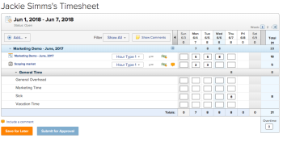

# Manage timesheets for all users

You can manage users' timesheets.

## Access requirements

You must have the following to perform the steps in this article:

<table cellspacing="0"> 
 <col> 
 <col> 
 <tbody> 
  <tr> 
   <td role="rowheader"><em>Adobe Workfront</em> plan*</td> 
   <td> 
Any
 </td> 
  </tr> 
  <tr> 
   <td role="rowheader"><em>Adobe Workfront</em> license*</td> 
   <td> 
<em>Plan</em> 
 </td> 
  </tr> 
 </tbody> 
</table>

&#42;To find out what plan or license type you have, contact your *Workfront administrator*.

## Filter timesheets

<ol> <draft-comment>
  <li value="1" data-mc-conditions="QuicksilverOrClassic.Quicksilver">Click the Main Menu , then click Timesheets.</li>
 </draft-comment>
 <li value="1" data-mc-conditions="QuicksilverOrClassic.Quicksilver">Click the Main Menu , then click Timesheets.</li> <draft-comment>
  <li value="2" data-mc-conditions="QuicksilverOrClassic.Quicksilver">Click All Timesheets  in the left panel.</li>
 </draft-comment>
 <li value="2" data-mc-conditions="QuicksilverOrClassic.Quicksilver">Click All Timesheets  in the left panel.</li> 
 <li value="3"> 
 Configure the filter options.
 
These include Belonging To, Approver, Status, and Time Period.
 
The filters in the Time Period drop-down list are based on the timesheet's start and end dates. Timesheets with any date in the selected time frame are filtered, not just by the start or end date. 
 
For example, if you have a timesheet from February 26 to March 12, you see this timesheet under the filters This Month and Next Month because the timesheet covers dates in February and in March.
 
  <table cellspacing="0"> 
   <col> 
   <col> 
   <tbody> 
    <tr> 
     <td role="rowheader">This Week</td> 
     <td>A timesheet with dates that fall between 12:00 am Sunday to 11:59 Saturday in the current week.</td> 
    </tr> 
    <tr> 
     <td role="rowheader">Next Week</td> 
     <td> &nbsp;A timesheet with dates that fall between 12:00 am Sunday to 11:59 Saturday in the next week. </td> 
    </tr> 
    <tr> 
     <td role="rowheader">Last Week</td> 
     <td> &nbsp;A timesheet with dates that fall between 12:00 am Sunday to 11:59 Saturday in the previous week. </td> 
    </tr> 
    <tr> 
     <td role="rowheader">This Month</td> 
     <td>&nbsp;A timesheet with dates that fall between the first and last day of the month.</td> 
    </tr> 
    <tr> 
     <td role="rowheader">Next Month</td> 
     <td> &nbsp;A timesheet with dates that fall between the first and last day of the next month. </td> 
    </tr> 
    <tr> 
     <td role="rowheader">Last Month</td> 
     <td> &nbsp;A timesheet with dates that fall between the first and last day of the previous month. </td> 
    </tr> 
    <tr> 
     <td role="rowheader">This Year</td> 
     <td>&nbsp;A timesheet with dates that fall between January 1 and the current day.</td> 
    </tr> 
    <tr> 
     <td role="rowheader">Past Year</td> 
     <td>&nbsp;A timesheet with dates that fall between 365 days from the current date.</td> 
    </tr> 
    <tr> 
     <td role="rowheader">Last Year</td> 
     <td> &nbsp;A timesheet with dates that fall between January 1 and December 31st of the previous year. </td> 
    </tr> 
    <tr> 
     <td role="rowheader">Containing the date</td> 
     <td>A timesheet containing the specified date.</td> 
    </tr> 
    <tr> 
     <td role="rowheader">Specific Dates</td> 
     <td>A timesheet with dates that fall between the specified date range.</td> 
    </tr> 
   </tbody> 
  </table> </li> 
 <li value="4">Click Filter.</li> 
</ol>

## Update user timesheets

<ol> <draft-comment>
  <li value="1" data-mc-conditions="QuicksilverOrClassic.Quicksilver">Click the Main Menu , then click Timesheets.</li>
 </draft-comment>
 <li value="1" data-mc-conditions="QuicksilverOrClassic.Quicksilver">Click the Main Menu , then click Timesheets.</li> <draft-comment>
  <li value="2" data-mc-conditions="QuicksilverOrClassic.Quicksilver">Click All Timesheets  in the left panel.</li>
 </draft-comment>
 <li value="2" data-mc-conditions="QuicksilverOrClassic.Quicksilver">Click All Timesheets  in the left panel.</li> 
 <li value="3"> 
Set the filter options.
 
For more information, see the <a href="#filtering-timesheets" class="MCXref xref">Filter timesheets</a> section in this article.
 </li> 
 <li value="4">Click Date Range to select a timesheet.</li> 
 <li value="5"> 
Update the information as needed.
 
For more information, see <a href="../../../timesheets/create-and-manage-timesheets/log-time.md" class="MCXref xref">Log time</a>.
 </li> 
 <li value="6">(Optional) Click Include a Comment.</li> 
 <li value="7"> 
If you are not finished updating the timesheet, click Save for Later.
 
Or
 
If you are finished updating the timesheet, click Submit for Approval.
 
  
 </li> 
</ol>

