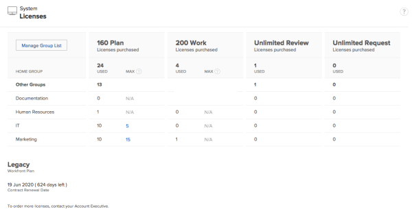
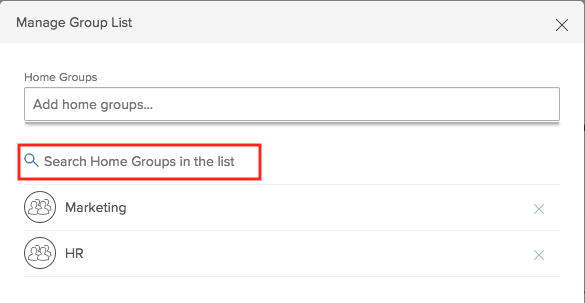
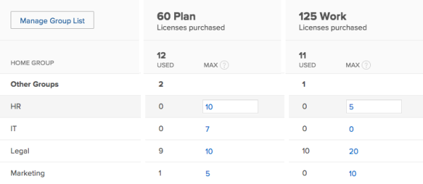

# Manage available licenses in your system {#manage-available-licenses-in-your-system}

As a `Workfront administrator`, you can access information about your `Workfront` account, including the number of licenses purchased, as well as the number of licenses currently in use.

## View licenses {#view-licenses}

As a system or group administrator, you can view license information in the Setup area. The number of used licenses updates dynamically as you assign access levels&nbsp;to users when you create them. For more information about creating new users and assigning access levels, see [Add users](add-users.md).

>[!NOTE]
>
>Users without administrative access can use a Group report to view license count. In the Report tab, create a new group report and add the following columns:>
>
>
>* License Type Limit: Worker Limit
>* License Type Limit: Planner Limit&nbsp;
>
>
>To learn more about creating a report, see [Create a report](create-report.md).

To view license information in your system:

1. Click the **Main Menu** icon  in the upper-right corner of `Workfront`, then click **Setup** .

1.  At the bottom of the left panel, click **System** > **Licenses**..

   For more information about the licenses listed on this page, see [License types](license-types.md).

   >[!NOTE]
   >
   >Proof licenses are available only to customers who have purchased a `Workfront Proof` component in addition to their `Workfront` license. For more information about `proofing`, see .

   

## Manage licenses {#manage-licenses}

### Add a group to the Licenses page {#add-a-group-to-the-licenses-page}

A Business or Enterprise `Workfront` Plan is required to use this feature. For more information about the various plans available, see [ `Workfront` Plans.](https://www.workfront.com/plans)

As a `Workfront administrator`, you can control which home groups display on the Licenses page. 

>[!IMPORTANT] {type="important"}
>
>&nbsp;To effectively manage licenses with home groups, we recommend setting up specific Home Groups for business units before updating the max license count.&nbsp;For more information, see [Home Groups](home-groups.md)

1. Click the **Main Menu** icon  in the upper-right corner of `Workfront`, then click **Setup** .

1. At the bottom of the left panel, click **System** > **Licenses**.

1. Click **Manage Group List**.
1. Type the name of the group in the **Home Group**&nbsp;search field.  

   >[!NOTE]
   >
   >You can add groups only at the parent level. If a user has a subgroup assigned as their Home Group, their license count displays with the parent group's count.

1. Click **Save**.

### Remove a group from the Licenses page {#remove-a-group-from-the-licenses-page}

To remove a group from the list:

1. Click the **Main Menu** icon  in the upper-right corner of `Workfront`, then click **Setup** .

1. At the bottom of the left panel, click **System** > **Licenses**.

1. Click **Manage Group List**.
1. Locate the group you want to remove.
1. Click the (x) icon inline with the group name.
1. Click **Save**.

### Search for a group on the Licenses page {#search-for-a-group-on-the-licenses-page}

To search for a specific group within the group list:

1. Click the **Main Menu** icon  in the upper-right corner of `Workfront`, then click **Setup** .

1. At the bottom of the left panel, click **System** > **Licenses**.

1. Click **Manage Group List**.
1.  In the **Home Group** search field, start typing the name of the group, then select it when it displays.

   

### Update the Max License Count {#update-the-max-license-count}

As a `Workfront administrator`, you can set maximum license counts for the Home Groups in your system. Setting a max license count allows you to prevent a business unit from using `Workfront` licenses purchased for other business units within your organization. By default, the max license count is set to N/A, which means there is no limit.

When setting a max license count for a Home Group, the number of users with licenses cannot exceed the max set for a Home Group. If users attempt to exceed this max, they receive an error.

&nbsp;To update max license count:

1. Click the **Main Menu** icon  in the upper-right corner of `Workfront`, then click **Setup** .

1. At the bottom of the left panel, click **System** > **Licenses**.

1. (Optional) Add additional Home Groups: 
    
    
    1. Click **Manage Group List**.
    1. Type the name of the group in the **Home Groups** search field.
    1. Click **Save**.
    
    
1. Locate the group you want to update.
1. Click the value in the **Max** column of the group you want to update.  
   An input field is displayed.

1.  Specify a new max value for the group.

   >[!NOTE]
   >
   >&nbsp;To set a group's max back to the default, delete the number in the textbox. Do not set the number to 0. Setting the max to 0 indicates there are no licenses available for that group.

   

