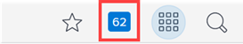
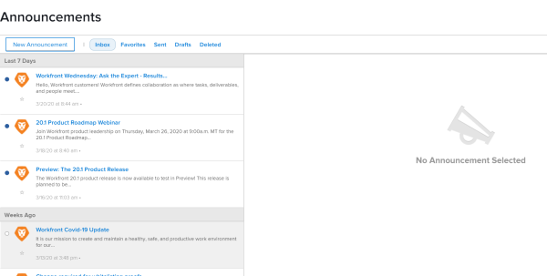
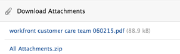

# View and send announcements {#view-and-send-announcements}

As a `Workfront administrator`, you can use the Announcements page to review communications from `Workfront` and to send announcements to users. 

Announcement messages from `Workfront` typically includes information regarding new features and releases,&nbsp;process changes, and so on.

## Review announcements from `Workfront` {#review-announcements-from-workfront}

1.  Click the numbered icon in the upper-right corner of `Workfront` to open your list of notifications.

   

   This list includes notifications both about work items and about announcements. For more information, see [View and manage in-app notifications](view-and-manage-in-app-notifications.md).

1.  Click an announcement you want to view, marked with the Announcements icon. 

   Or

   Click **All Announcements** at the bottom of the list.

   The **Announcements** page appears, listing all of your announcements. If you clicked an announcement, it is selected on the left. 

   

1. Select the announcement message you want to view.
1. (Optional) Download any attachments in PDF or Word format, or download all attachments as a ZIP file.  
   

For information on how to delete and restore announcements, see [Delete an announcement notification](view-and-manage-in-app-notifications.md#deleting-notifications) in [View and manage in-app notifications](view-and-manage-in-app-notifications.md).&nbsp;

## Limit the types of `Workfront` announcements you receive {#limit-the-types-of-workfront-announcements-you-receive}

By default, you receive all messages sent from `Workfront`. This is the recommended configuration.

However, though `Workfront` sends a limited number of&nbsp;messages via the Announcements area, you can unsubscribe from receiving&nbsp;certain types of messages.

1.  On the Announcements&nbsp;page, click **Settings.**
1. Select the topics for which you no longer want to receive messages.
1. Click **Save Settings.**

## Send announcements&nbsp;to users {#send-announcements-to-users}

You can use the **Announcements** page to communicate with users in your `Workfront` system by forwarding announcements sent from `Workfront` and by composing new announcements. You can send announcements to specific users, groups, teams, or companies within your `Workfront` system.

* [Forward Workfront announcements to users](#forwarding-announcements-to-users) 
* [Compose new announcements](#composing-new-announcements) 

### Forward `Workfront` announcements to users {#forward-workfront-announcements-to-users}

You can easily forward messages that you receive from `Workfront` to users in your system.

1. On the **Announcements** page, select the message that you want to forward.
1. Click **Forward**.&nbsp;
1.  In the **Send to** box,&nbsp;begin typing the name of a user, group, team, or company who you want to receive the announcement message, then click the name when it appears in the drop-down list. Repeat this process to add multiple users, groups, teams, or companies.  

   Or

   To forward the announcement to all users in your system, begin typing **Everyone**, then click it when it appears in the drop-down list.&nbsp;

1. Continue with Step 3&nbsp;in [Compose new announcements](#composing-new-announcements).

### Compose new announcements {#compose-new-announcements}

1. On the **Announcements** page, click **New Announcement.**

1.  In&nbsp;the **Send to** box,&nbsp;begin typing the name of a user, group, team, or company who you want to receive the announcement message, then click the name when it appears in the drop-down list. Repeat this process to add multiple users, groups, teams, or companies.  

   By default,&nbsp;when sending a&nbsp;new announcement&nbsp;message, **Everyone** is pre-populated in this field. If&nbsp;you do not want all users in your system to receive the announcement message, remove **Everyone** from the list.

1.  Specify the following additional&nbsp;information:

1. (Optional) Click **Save As Draft**&nbsp;to save the message (including the recipient list, subject, and attachments)&nbsp;as a draft.  

1. (Optional) To view a draft, in the **Announcements** area, click&nbsp;**Drafts.&nbsp;**

1.  Click **Send.**  

   Users can now view the announcement message, as described in [View and manage in-app notifications](view-and-manage-in-app-notifications.md).

