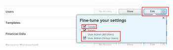
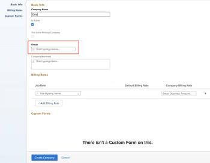

# Create and edit companies

The highlighted information on this page refers to functionality not yet generally available. It is available only in the Preview Sandbox environment.

A company is an organizational unit in *Adobe Workfront* that can represent your organization, a department within the organization, or a client you work with. You can add companies to *Workfront* and use them for financial planning, reporting purposes, to define permissions around objects, and to keep information confidential.

## Access requirements

You must have the following in order to manage companies in *Workfront*:

<table cellspacing="0"> <draft-comment>
  <col data-mc-conditions="">
 </draft-comment>
 <col data-mc-conditions=""> <draft-comment>
  <col data-mc-conditions="">
 </draft-comment>
 <col data-mc-conditions=""> 
 <tbody> 
  <tr> 
   <td role="rowheader"> 
Workfront plan*
 </td> 
   <td><em>Team</em> or higher</td> 
  </tr> 
  <tr> 
   <td role="rowheader"> 
<em>Adobe Workfront</em> license*
 </td> 
   <td> 
<em>Plan</em> 
 </td> 
  </tr> <draft-comment>
   <tr data-mc-conditions=""> 
    <td role="rowheader">Access level configurations* </td> 
    <td> 
One of the following:
 
     <ul> 
      <li> 
The System Administrator access level, which allows you to edit any company in the system. For more information, see <a href="../../../administration-and-setup/add-users/configure-and-grant-access/grant-a-user-full-administrative-access.md" class="MCXref xref">Grant a user full administrative access</a>. 
 </li> 
      <li> 
Administrative access to manage companies, which allows you to edit any company in the system. For more information, see <a href="../../../administration-and-setup/add-users/configure-and-grant-access/grant-users-admin-access-certain-areas.md" class="MCXref xref">Grant users administrative access to certain areas</a>.
 </li> 
     </ul> 
Note:  
      <ul> 
       <li> 
You can also manage companies associated with any group where you are assigned as a <em>group administrator</em>.
 </li> 
       <li> 
In order to add to and remove users from the <em>Workfront</em> system, you must have one of the following:
 
        <ul> 
         <li> 
The System Administrator access level. For information about this access level, see <a href="../../../administration-and-setup/add-users/configure-and-grant-access/grant-a-user-full-administrative-access.md" class="MCXref xref">Grant a user full administrative access</a>. 
 </li> 
         <li> 
In your access level, Edit must be selected for the Users setting. And, for the Users setting, under Fine-tune your settings  , the Create option and at least one of the two User Admin options must be enabled. 
 
If you are using the User Admin (Group Users) option, you must be a <em>group administrator</em> of a group where the user is a member.
 
  
 </li> 
        </ul> 
For information about the Users setting in an access level, see <a href="../../../administration-and-setup/add-users/configure-and-grant-access/grant-access-other-users.md" class="MCXref xref">Grant access to users</a>.
 </li> 
      </ul> 
 </td> 
   </tr>
  </draft-comment>
  <tr data-mc-conditions=""> 
   <td role="rowheader">Access level configurations* </td> 
   <td> 
One of the following:
 
    <ul> 
     <li> 
The System Administrator access level, which allows you to edit any company in the system. For more information, see <a href="../../../administration-and-setup/add-users/configure-and-grant-access/grant-a-user-full-administrative-access.md" class="MCXref xref">Grant a user full administrative access</a>. 
 </li> 
     <li> 
Administrative access to manage companies, which allows you to edit any company in the system. For more information, see <a href="../../../administration-and-setup/add-users/configure-and-grant-access/grant-users-admin-access-certain-areas.md" class="MCXref xref">Grant users administrative access to certain areas</a>.
 </li> 
    </ul> 
Note:  
     <ul> 
      <li> 
You can also manage companies associated with any group where you are assigned as a <em>group administrator</em>.
 </li> 
      <li> 
In order to add to and remove users from the <em>Workfront</em> system, you must have one of the following:
 
       <ul> 
        <li> 
The System Administrator access level. For information about this access level, see <a href="../../../administration-and-setup/add-users/configure-and-grant-access/grant-a-user-full-administrative-access.md" class="MCXref xref">Grant a user full administrative access</a>. 
 </li> 
        <li> 
In your access level, Edit must be selected for the Users setting. And, for the Users setting, under Fine-tune your settings  , the Create option and at least one of the two User Admin options must be enabled. 
 
If you are using the User Admin (Group Users) option, you must be a <em>group administrator</em> of a group where the user is a member.
 
  
 </li> 
       </ul> 
For information about the Users setting in an access level, see <a href="../../../administration-and-setup/add-users/configure-and-grant-access/grant-access-other-users.md" class="MCXref xref">Grant access to users</a>.
 </li> 
     </ul> 
 </td> 
  </tr> 
 </tbody> 
</table>

&#42;To find out what plan, license type, or access level configurations you have, contact your *Workfront administrator*.

## Benefits of adding users to a company

* You can build a company's organization chart by associating users with direct reports. Only users from the same company can be added as direct reports of another user from that company.
* As a project manager, you can identify available resources within the same company.
* You can keep information private between companies by choosing one or all of the following settings:
* `<li> 
Users from the same company can see each others’ requests.
 
For more information about how a <em>Workfront administrator</em> can give similar access to requests based on users' company, see the section <a href="../../../administration-and-setup/set-up-workfront/configure-system-defaults/set-task-issue-preferences.md#changing-task-and-issue-preferences" class="MCXref xref">Configure task and issues preferences for everyone in Workfront</a> in the article <a href="../../../administration-and-setup/set-up-workfront/configure-system-defaults/set-task-issue-preferences.md" class="MCXref xref">Configure system-wide task and issue preferences</a>.
 
For more information about how a <em>group administrator</em> can give similar access to requests based on users' company, see <a href="../../../administration-and-setup/manage-groups/create-and-manage-groups/configure-task-issue-preferences-group.md" class="MCXref xref">Configure task and issue preferences for a group</a>.
 </li>` `<li>Users can see only request queues that are associated with their companies. For more information about restricting visibility of a request queue, see <a href="../../../manage-work/requests/create-and-manage-request-queues/provide-access-to-request-queues.md" class="MCXref xref">Provide access to request queues</a>.</li>` `<li>You can restrict users to only see users in their company or their company and the primary company. For information about the primary company functionality regarding user privacy, see <a href="../../../administration-and-setup/add-users/configure-and-grant-access/create-modify-access-levels.md" class="MCXref xref">Create or modify custom access levels</a>.</li>` `<li>Users can restrict updates they make on items to be visible by their company users only. For more information about making an update private to a company, see <a href="../../../workfront-basics/updating-work-items-and-viewing-updates/update-work.md" class="MCXref xref">Update work</a>.</li>`

## Create or edit a company in *Workfront*

There is no limit to the number of companies you can add. However, we recommend that limit the number of companies you use because of problems that can occur with object permissions—too much fragmentation might interfere with users' visibility to work items.

By default, the company associated with your instance of *Workfront* is already created in your *Workfront* system and is the Primary Company for your organization. It has the same name as your customer name. For more information about your customer information in *Workfront*, see [Configure basic information for your system](../../../administration-and-setup/get-started-wf-administration/configure-basic-info.md).

To add or edit a company:

<ol> 
 <li value="1">Click the Main Menu icon  in the upper-right corner of <em>Adobe Workfront</em>, then click Setup .</li> 
 <li value="2"> Click Companies.</li> 
 <li value="3"> 
 If you are adding a company, click New Company.
 
Or
 
If you are editing an existing company, select the company, then click Edit.
 </li> 
 <li value="4"> 
Use the options that display to configure the following information:
 
  <table cellspacing="0"> 
   <col> 
   <col> 
   <tbody> 
    <tr> 
     <td role="rowheader">Basic Info section</td> 
     <td> 
      <ul> 
       <li> 
<b>Company Name</b>: Type a name for the company.
 </li> 
       <li> 
<b>Is Active</b>: When this option is enabled, users can find the <em>company</em> and attach it to projects that they create and edit. An inactive <em>company</em> cannot be attached to projects. This option is enabled by default.
 </li> 
       <li> 
<b>This is the Primary Company</b>: Assigns the company as your organization's primary company. The primary company typically represents your <em>Workfront</em> account where most of your users work.
 
By modifying their access levels, you can restrict users to see other users:
 
        <ul> 
         <li>Only in their primary company</li> 
         <li> 
In their associated company and the primary company 
 
For information about the primary company functionality within users' access levels, see <a href="../../../administration-and-setup/add-users/configure-and-grant-access/create-modify-access-levels.md" class="MCXref xref">Create or modify custom access levels</a>.
 
You can have only one or no company designated as a primary company, but you cannot have multiple companies designated as primary companies. For more information, see <a href="../../../administration-and-setup/add-users/configure-and-grant-access/create-modify-access-levels.md" class="MCXref xref">Create or modify custom access levels</a>.
 </li> 
        </ul> </li> 
       <li> 
<b>Group</b>: If there is a group that conducts business with the company, you can add the name of the group here. This is useful for <em>group administrators</em> who need to report on and manage all the companies that their groups do business with.
 <note type="important">
         If you don’t associate the group that will be working with this company, administrators for the group can’t access unless they have administrative access to companies in their access level. For information about how this access is granted, see 
         <a href="../../../administration-and-setup/add-users/configure-and-grant-access/grant-users-admin-access-certain-areas.md" class="MCXref xref">Grant users administrative access to certain areas</a>.
        </note> <draft-comment>
         
Start typing the name of the group, then press Enter when it appears.

        </draft-comment>
Start typing the name of the group, then press Enter when it appears.
 <draft-comment>
         
When you assign a group to a company, the <em>group administrators</em> for the group gain Manage access to the company. For more information, see <a href="#access" class="MCXref xref">Group administrators and companies</a> in this article.

        </draft-comment>
When you assign a group to a company, the <em>group administrators</em> for the group gain Manage access to the company. For more information, see <a href="#access" class="MCXref xref">Group administrators and companies</a> in this article.
 </li> 
       <li> 
<b>Company Members</b>: Add existing users to the company. By doing this, you are associating these users with this company.
 
There is no limit to how many users you associate with one company, but a user cannot be associated with more than one company.
 </li> 
      </ul> </td> 
    </tr> 
    <tr> 
     <td role="rowheader">Billing Rates section</td> 
     <td> 
You can override billing rates associated with your job roles at the company level. For information about creating job roles and associating them with billing rates, see <a href="../../../administration-and-setup/set-up-workfront/organizational-setup/create-manage-job-roles.md" class="MCXref xref">Create and manage job roles</a>.
 
For more information about overriding billing rates at the company level, see <a href="../../../administration-and-setup/set-up-workfront/organizational-setup/override-job-role-billing-rates-company-level.md" class="MCXref xref">Override job role billing rates at the company level</a>.
 </td> 
    </tr> 
    <tr> 
     <td role="rowheader">Custom Forms section</td> 
     <td> 
If there are fields that you want to add to your company that are not available in <em>Workfront</em>, you can build a Custom Form and associate it with your company. You can attach this form to your company by selecting it from the drop-down menu. Only active companies are listed in the drop-down menu. For information about creating Custom Forms, see <a href="../../../administration-and-setup/customize-workfront/create-manage-custom-forms/create-or-edit-a-custom-form.md" class="MCXref xref">Create or edit a custom form</a>. 
 </td> 
    </tr> 
   </tbody> 
  </table> </li> 
 <li value="5"> 
If you are creating a new company, click Create Company.
 
Or
 
If you are editing an existing company, click Save Changes.
 </li> 
</ol>

##

<!--

<h2>Manage company memberships</h2>

For information about managing memberships for an existing company, see <a href="../../../administration-and-setup/set-up-workfront/organizational-setup/manage-company-memberships.md" class="MCXref xref">Manage company memberships</a>.

-->

## Manage company memberships

For information about managing memberships for an existing company, see [Manage company memberships](../../../administration-and-setup/set-up-workfront/organizational-setup/manage-company-memberships.md).

## About sharing objects with companies

Certain permissions are available to users who are associated with a company, as explained in the section [Benefits of adding users to a company](#benefits) in the article [Create and edit companies](#). In addition to these permissions, you can allow users permissions to view, contribute, or edit objects in *Workfront* by sharing the object with their company.

Rather than sharing an object with one individual user at a time, you can share it with their entire company. Each user in the company has the same permissions on that object.

For more information about sharing objects, see [Overview of sharing permissions on objects in Adobe Workfront](../../../workfront-basics/grant-and-request-access-to-objects/sharing-permissions-on-objects-overview.md).

## *Group administrators* and companies

When a *Workfront administrator* assigns a group to a company, the *group administrators* for the group gain Manage access to the company in Setup. This includes access to the Companies page in Setup, where they can see and manage the company associated with their group.

With this access to the Companies page, a *group administrator* can assign a group to a company, but it must be a company that the *group administrator* created. If the *group administrator*‘s access level is not configured with administrative access to companies, the Group field is required when the *group administrator* creates the company—it’s bolded title indicates this:

For information about how users gain administrative access to companies in their access level, see [Grant users administrative access to certain areas](../../../administration-and-setup/add-users/configure-and-grant-access/grant-users-admin-access-certain-areas.md).

For information about managing a company in the Setup area, see [Create or edit a company in Workfront](#adding-a-company-to-workfront) in this article.
