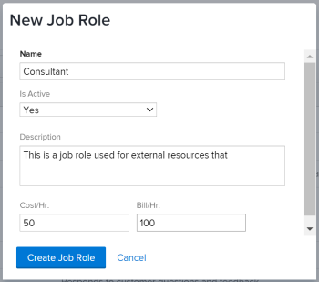
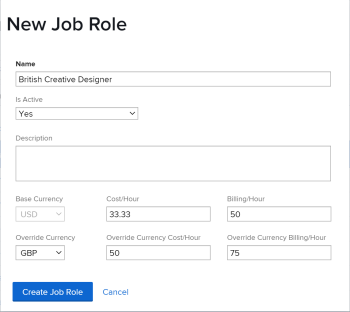

# Create and manage job roles

As an *Adobe Workfront administrator* or a user with administrative access to Job&nbsp;Roles, you can create job roles which can be assigned to users and delete default job roles that are not relevant to your organization. For information about administrative access in *Workfront*, see [Grant users administrative access to certain areas](../../../administration-and-setup/add-users/configure-and-grant-access/grant-users-admin-access-certain-areas.md).

## Access requirements

You must have the following:

<table cellspacing="0"> 
 <col> 
 <col> 
 <tbody> 
  <tr> 
   <td role="rowheader"><em>Adobe Workfront</em> plan*</td> 
   <td> 
Any 
 </td> 
  </tr> 
  <tr> 
   <td role="rowheader"><em>Adobe Workfront</em> license*</td> 
   <td> 
<em>Plan</em> 
 </td> 
  </tr> 
  <tr> 
   <td role="rowheader">Access level configurations*</td> 
   <td> 
Administrative access to Job roles
 
Note: If you still don't have access, ask your <em>Workfront administrator</em> if they set additional restrictions in your access level. For information on how a <em>Workfront administrator</em> can modify your access level, see <a href="../../../administration-and-setup/add-users/configure-and-grant-access/create-modify-access-levels.md" class="MCXref xref">Create or modify custom access levels</a>.
 </td> 
  </tr> 
 </tbody> 
</table>

&#42;To find out what plan, license type, or access you have, contact your *Workfront administrator*.

## Create a job role

<ol data-mc-continue="false"> <draft-comment>
  <li value="1" data-mc-conditions="QuicksilverOrClassic.Quicksilver">Click the Main Menu icon  in the upper-right corner of <em>Adobe Workfront</em>, then click Setup .</li>
 </draft-comment>
 <li value="1" data-mc-conditions="QuicksilverOrClassic.Quicksilver">Click the Main Menu icon  in the upper-right corner of <em>Adobe Workfront</em>, then click Setup .</li> 
 <li value="2">In the left panel, click Job Roles.</li> 
 <li value="3"> 
Click New Job Role.
 <draft-comment>
   
  

  </draft-comment>
  
 <draft-comment>
   
  

  </draft-comment>
  
 </li> 
 <li value="4"> 
Update the following fields: 
 
  <table cellspacing="0"> 
   <col> 
   <col> 
   <tbody> 
    <tr> 
     <td role="rowheader">Name</td> 
     <td> 
Indicate a name for the job role.&nbsp;This is the name that displays everywhere in&nbsp;<em>Workfront</em> where the Job&nbsp;Role field displays. 
 <note type="tip">
       The name of a job role may contain up to 255 characters. However, longer names might be truncated in certain areas of 
       <em>Workfront</em>. 
      </note> </td> 
    </tr> <draft-comment>
     <tr data-mc-conditions=""> 
      <td role="rowheader">Is Active </td> 
      <td> 
       <ul> 
        <li> 
Select Yes if you want the role to be active and available everywhere in <em>Workfront</em> to be associated with users, work items, etc. 
 </li> 
        <li> 
Select No, if you want the role to be deactivated and not available to assign to users, work items, etc. 
 </li> 
       </ul> 
For information about deactivating job roles, see <a href="../../../administration-and-setup/set-up-workfront/organizational-setup/deactivate-job-roles.md" class="MCXref xref">Deactivate job roles</a>. 
 </td> 
     </tr>
    </draft-comment>
    <tr data-mc-conditions=""> 
     <td role="rowheader">Is Active </td> 
     <td> 
      <ul> 
       <li> 
Select Yes if you want the role to be active and available everywhere in <em>Workfront</em> to be associated with users, work items, etc. 
 </li> 
       <li> 
Select No, if you want the role to be deactivated and not available to assign to users, work items, etc. 
 </li> 
      </ul> 
For information about deactivating job roles, see <a href="../../../administration-and-setup/set-up-workfront/organizational-setup/deactivate-job-roles.md" class="MCXref xref">Deactivate job roles</a>. 
 </td> 
    </tr> 
    <tr> 
     <td role="rowheader">Description</td> 
     <td>Enter a description for the role that indicates what is unique about it. </td> 
    </tr> <draft-comment>
     <tr data-mc-conditions=""> 
      <td role="rowheader">Base Currency </td> 
      <td> 
This is the Base Currency, as set in the Setup area by your <em>Workfront administrator</em>. For information, see <a href="../../../administration-and-setup/manage-workfront/exchange-rates/set-up-exchange-rates.md" class="MCXref xref">Set up exchange rates</a> .
 <note type="tip">
        You cannot edit the Base Currency at the job role level.&nbsp;This field is dimmed and serves as a reminder for what the base currency is for your system. 
       </note> </td> 
     </tr>
    </draft-comment>
    <tr data-mc-conditions=""> 
     <td role="rowheader">Base Currency </td> 
     <td> 
This is the Base Currency, as set in the Setup area by your <em>Workfront administrator</em>. For information, see <a href="../../../administration-and-setup/manage-workfront/exchange-rates/set-up-exchange-rates.md" class="MCXref xref">Set up exchange rates</a> .
 <note type="tip">
       You cannot edit the Base Currency at the job role level.&nbsp;This field is dimmed and serves as a reminder for what the base currency is for your system. 
      </note> </td> 
    </tr> 
    <tr> 
     <td role="rowheader">Cost/ Hr.</td> 
     <td>This is the cost per hour rate of the job role. This value calculates the planned and the actual costs of tasks and issues associated with the role, and ultimately the planned and actual costs of the projects. Enter the rate using the Base Currency. </td> 
    </tr> 
    <tr> 
     <td role="rowheader">Bill/ Hr. </td> 
     <td>This is the billing per hour rate of the job role. This value calculates the planned and actual revenues of tasks and issues associated with the role, and ultimately the planned and actual revenues of the projects. Enter the rate using the Base Currency. </td> 
    </tr> <draft-comment>
     <tr data-mc-conditions=""> 
      <td role="rowheader">Override Currency </td> 
      <td> 
       
 
        
Select a currency associated with this job role. This is the currency that <em>Workfront</em> uses for calculating costs and revenue associated with this job role. 
 
        
This is a different than the Base Currency set up by your <em>Workfront administrator</em> in the Setup area, and can be different than the currency associated with a project. 
 <note type="tip">
         Only currencies available in the Exchange Rates area in your system are available in this field.
        </note> 
       
 
For information about setting up the Base Currency in <em>Workfront</em>, see <a href="../../../administration-and-setup/manage-workfront/exchange-rates/set-up-exchange-rates.md" class="MCXref xref">Set up exchange rates</a>.
 
For information about changing the currency of a project, see <a href="../../../manage-work/projects/project-finances/change-project-currency.md" class="MCXref xref">Change the project currency</a>.
 </td> 
     </tr>
    </draft-comment>
    <tr data-mc-conditions=""> 
     <td role="rowheader">Override Currency </td> 
     <td> 
      
 
       
Select a currency associated with this job role. This is the currency that <em>Workfront</em> uses for calculating costs and revenue associated with this job role. 
 
       
This is a different than the Base Currency set up by your <em>Workfront administrator</em> in the Setup area, and can be different than the currency associated with a project. 
 <note type="tip">
        Only currencies available in the Exchange Rates area in your system are available in this field.
       </note> 
      
 
For information about setting up the Base Currency in <em>Workfront</em>, see <a href="../../../administration-and-setup/manage-workfront/exchange-rates/set-up-exchange-rates.md" class="MCXref xref">Set up exchange rates</a>.
 
For information about changing the currency of a project, see <a href="../../../manage-work/projects/project-finances/change-project-currency.md" class="MCXref xref">Change the project currency</a>.
 </td> 
    </tr> <draft-comment>
     <tr data-mc-conditions=""> 
      <td role="rowheader">Override Currency Cost/ Hour </td> 
      <td> 
       
 
        
This is the cost per hour rate of the job role using the selected Override Currency. <em>Workfront</em> uses this value to calculate the planned and the actual costs of tasks and issues associated with the job role. 
 
        
Enter the rate in the Override Currency specified above. This also updates the Cost/ Hour rate for this job role when using the Base Currency. 
 
        
For information about how <em>Workfront</em> calculates cost, see <a href="../../../manage-work/projects/project-finances/track-costs.md" class="MCXref xref">Track costs</a>.
 
       
 <note type="tip">
        When updating an existing job role that already has a Cost/ Hour rate associated with it, 
        <em>Workfront</em> calculates the Override Currency rate based on the conversion rate in your system. If you update the Override Currency Cost/ Hour, the Cost/ Hour of the job role also updates automatically.
       </note> </td> 
     </tr>
    </draft-comment>
    <tr data-mc-conditions=""> 
     <td role="rowheader">Override Currency Cost/ Hour </td> 
     <td> 
      
 
       
This is the cost per hour rate of the job role using the selected Override Currency. <em>Workfront</em> uses this value to calculate the planned and the actual costs of tasks and issues associated with the job role. 
 
       
Enter the rate in the Override Currency specified above. This also updates the Cost/ Hour rate for this job role when using the Base Currency. 
 
       
For information about how <em>Workfront</em> calculates cost, see <a href="../../../manage-work/projects/project-finances/track-costs.md" class="MCXref xref">Track costs</a>.
 
      
 <note type="tip">
       When updating an existing job role that already has a Cost/ Hour rate associated with it, 
       <em>Workfront</em> calculates the Override Currency rate based on the conversion rate in your system. If you update the Override Currency Cost/ Hour, the Cost/ Hour of the job role also updates automatically.
      </note> </td> 
    </tr> <draft-comment>
     <tr data-mc-conditions=""> 
      <td role="rowheader">Override Currency Billing/ Hour </td> 
      <td> 
       
 
        
This is the billing per hour rate of the job role using the selected Override Currency. <em>Workfront</em> uses this value to calculate the planned and the actual revenue of tasks and issues associated with the job role. 
 
        
Enter the rate in the Override Currency specified above. This also updates the Billing/ Hour rate for this job role when using the Base Currency. 
 
        
For information about how <em>Workfront</em> calculates revenue, see <a href="../../../manage-work/projects/project-finances/billing-and-revenue-overview.md" class="MCXref xref">Overview of Billing and Revenue</a>.
 
       
 <note type="tip">
        When updating an existing job role that already has a Billing/ Hour rate associated with it, 
        <em>Workfront</em> calculates the Override Currency rate based on the conversion rate in your system. If you update the Override Currency Billing/ Hour, the Billing/ Hour of the job role also updates automatically. 
       </note> </td> 
     </tr>
    </draft-comment>
    <tr data-mc-conditions=""> 
     <td role="rowheader">Override Currency Billing/ Hour </td> 
     <td> 
      
 
       
This is the billing per hour rate of the job role using the selected Override Currency. <em>Workfront</em> uses this value to calculate the planned and the actual revenue of tasks and issues associated with the job role. 
 
       
Enter the rate in the Override Currency specified above. This also updates the Billing/ Hour rate for this job role when using the Base Currency. 
 
       
For information about how <em>Workfront</em> calculates revenue, see <a href="../../../manage-work/projects/project-finances/billing-and-revenue-overview.md" class="MCXref xref">Overview of Billing and Revenue</a>.
 
      
 <note type="tip">
       When updating an existing job role that already has a Billing/ Hour rate associated with it, 
       <em>Workfront</em> calculates the Override Currency rate based on the conversion rate in your system. If you update the Override Currency Billing/ Hour, the Billing/ Hour of the job role also updates automatically. 
      </note> </td> 
    </tr> 
   </tbody> 
  </table> <note type="tip">
   Job roles are an integral&nbsp;part of managing resources. To use the resource planning tools, job roles need a cost and billing rate associated with them. For information, see 
   <a href="../../../resource-mgmt/resource-mgmt-overview/get-started-resource-management.md" class="MCXref xref">Get started with Resource Management </a>. 
  </note> </li> 
 <li value="5"> 
Click Create Job Role. The job role is now available to be assigned to tasks, issues, approvals, or you can share layout templates or other objects with it. For information about all uses of job roles in&nbsp;<em>Workfront</em>, see <a href="../../../administration-and-setup/set-up-workfront/organizational-setup/job-role-overview.md" class="MCXref xref">Job role overview</a>. For information about deleting a job role, see <a href="../../../administration-and-setup/set-up-workfront/organizational-setup/delete-job-roles.md" class="MCXref xref">Delete job roles</a>. 
 </li> 
</ol>

<!--

<h2>Delete a job role</h2>
<ol data-mc-continue="false"> <draft-comment>
<li value="1" data-mc-conditions="QuicksilverOrClassic.Quicksilver">Click the Main Menu icon  in the upper-right corner of <em>Adobe Workfront</em>, then click Setup .</li>
</draft-comment>
<li value="1" data-mc-conditions="QuicksilverOrClassic.Quicksilver">Click the Main Menu icon  in the upper-right corner of <em>Adobe Workfront</em>, then click Setup .</li>
<li value="2">Click Job Roles.</li>
<li value="3">Select the job role that you want to delete, then click Delete.</li>
<li value="4">If there are any objects (users, tasks, issues) that&nbsp;are assigned to the job role, do one of the following: 
<ul>
<li>
Replace&nbsp;the job role with a different job role: Select the new job role from the drop-down list.

Any current and past resource allocations that are&nbsp;associated with the deleted job role are transferred to the job role that you select.

Users who have only one job role assigned to&nbsp;them are reassigned to the job role that you select; users who have a secondary job role assigned to them are not reassigned to the job role that you select.
</li>
<li>
Delete&nbsp;the job role and its resource allocation: Select None&nbsp;from the drop-down list.
<note type="important">
Deleting a job role deletes all current and past resource allocation related to that job role for all projects.
</note>
​For example, if a task or issue is assigned to only that job role, the task or issue is unassigned after the job role is deleted.
</li>
</ul></li>
<li value="5">Click <draft-comment>
<MadCap:conditionalText data-mc-conditions="QuicksilverOrClassic.Quicksilver">
Yes, Delete It.
</MadCap:conditionalText>
</draft-comment><MadCap:conditionalText data-mc-conditions="QuicksilverOrClassic.Quicksilver">
Yes, Delete It.
</MadCap:conditionalText></li>
</ol>

-->

## Delete a job role

<ol data-mc-continue="false"> 
 <li value="1" data-mc-conditions="QuicksilverOrClassic.Quicksilver">Click the Main Menu icon  in the upper-right corner of <em>Adobe Workfront</em>, then click Setup .</li> 
 <li value="2">Click Job Roles.</li> 
 <li value="3">Select the job role that you want to delete, then click Delete.</li> 
 <li value="4">If there are any objects (users, tasks, issues) that&nbsp;are assigned to the job role, do one of the following:  
  <ul> 
   <li>
Replace&nbsp;the job role with a different job role: Select the new job role from the drop-down list.

Any current and past resource allocations that are&nbsp;associated with the deleted job role are transferred to the job role that you select.

Users who have only one job role assigned to&nbsp;them are reassigned to the job role that you select; users who have a secondary job role assigned to them are not reassigned to the job role that you select.
</li> 
   <li>
Delete&nbsp;the job role and its resource allocation: Select None&nbsp;from the drop-down list.
<note type="important">
      Deleting a job role deletes all current and past resource allocation related to that job role for all projects.
    </note>
​For example, if a task or issue is assigned to only that job role, the task or issue is unassigned after the job role is deleted.
</li> 
  </ul></li> 
 <li value="5">Click <MadCap:conditionalText data-mc-conditions="QuicksilverOrClassic.Quicksilver"> 
   Yes, Delete It. 
  </MadCap:conditionalText></li> 
</ol>

##  

