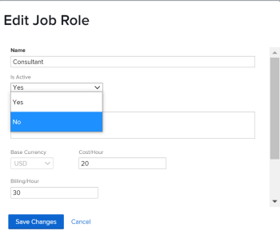

# Deactivate job roles {#deactivate-job-roles}

The highlighted information on this page refers to functionality not yet generally available. It is available only in the Preview Sandbox environment.

As an  *`Adobe Workfront administrator`* or a user with administrative access to Job&nbsp;Roles, you can deactivate job roles that become obsolete in your system. When you deactivate a job role instead of deleting it, you can keep any historical information that is associated with it.

You can also reactivate job roles that have previously been deactivated. 

## Access requirements {#access-requirements}

You must have the following:

<table style="width: 100%;margin-left: 0;margin-right: auto;mc-table-style: url('../../../Resources/TableStyles/TableStyle-List-options-in-steps.css');" class="TableStyle-TableStyle-List-options-in-steps" cellspacing="0"> 
 <col class="TableStyle-TableStyle-List-options-in-steps-Column-Column1"> 
 <col class="TableStyle-TableStyle-List-options-in-steps-Column-Column2"> 
 <tbody> 
  <tr class="TableStyle-TableStyle-List-options-in-steps-Body-LightGray"> 
   <td class="TableStyle-TableStyle-List-options-in-steps-BodyE-Column1-LightGray" role="rowheader">Adobe Workfront plan*</td> 
   <td class="TableStyle-TableStyle-List-options-in-steps-BodyD-Column2-LightGray"> 
Any 
 </td> 
  </tr> 
  <tr class="TableStyle-TableStyle-List-options-in-steps-Body-MediumGray"> 
   <td class="TableStyle-TableStyle-List-options-in-steps-BodyE-Column1-MediumGray" role="rowheader">Adobe Workfront license*</td> 
   <td class="TableStyle-TableStyle-List-options-in-steps-BodyD-Column2-MediumGray"> 
Plan 
 </td> 
  </tr> 
  <tr class="TableStyle-TableStyle-List-options-in-steps-Body-LightGray"> 
   <td class="TableStyle-TableStyle-List-options-in-steps-BodyB-Column1-LightGray" role="rowheader">Access level configurations*</td> 
   <td class="TableStyle-TableStyle-List-options-in-steps-BodyA-Column2-LightGray"> 
Administrative access to Job roles
 
Note: If you still don't have access, ask your Workfront administrator if they set additional restrictions in your access level. For information on how a Workfront administrator can modify your access level, see <a href="create-modify-access-levels.md" class="MCXref xref">Create or modify custom access levels</a>.
 </td> 
  </tr> 
 </tbody> 
</table>

&#42;To find out what plan, license type, or access you have, contact your *`Workfront administrator`*.

## The impact of deactivating job roles {#the-impact-of-deactivating-job-roles}

If you deactivate a job role, it no longer displays in the following areas:

*  The Assignments typeahead field (for tasks, template tasks, issues, approvals, and routing rules)
*  The Assignments fields in lists and reports
*  User profiles

  >[!NOTE]
  >
  >When you add a new role to a user, a deactivated job role doesn't display. But it does continue to display in the Primary Role and Other Roles fields if the user was associated with the job role before it was deactivated.

*  The Sharing dialog box for objects, including layout template assignment
*  Typeahead fields in custom forms
*  The Pool Members field in&nbsp;Resource Pools
*  The Job&nbsp;Role field of a Billing Rate edit screen when a user is overriding billing rates for projects
*  The Add assignment to Kanban board dialog box in a project
*  The Job Role field of a plan or an initiative when someone is using the *`Adobe Workfront Scenario Planner`*. 

  This is available only in *`the new Adobe Workfront experience`* and requires an additional license. For information about the *`Workfront Scenario Planner`*, see [The Adobe Workfront Scenario Planner overview](scenario-planner-overview.md). 

>[!TIP] {type="tip"}
>
>Deactivated roles always display in filters in lists, reports, and other tools such as the *`Workload Balancer`*. 

## Considerations before deactivating a job role {#considerations-before-deactivating-a-job-role}

It is better to deactivate rather than delete job roles that become obsolete so that you can keep all the historical information associated with roles you may have used in the past. 

>[!NOTE]
>
>Any work assigned to the job role prior to deactivation remains assigned. 

We recommend that you do the following before deactivating an unused job role:

*  Build reports for any objects that are assigned to the role you plan to deactivate and reassign them to an active job role. For information about building reports, see [Create a report](create-report.md). 

  >[!TIP] {type="tip"}
  >
  >You can create a report to filter for any tasks or issues where the deactivated role is assigned. Then use the report to reassign outstanding tasks or issues to an active role. 

*  Take an inventory of all approval processes, current approval paths, and routing rules or other objects that are assigned to the job role you plan to deactivate and reassign them to an active role.

  >[!TIP] {type="tip"}
  >
  >When using request queues, if you deactivate a job role assigned as the default assignee in a routing rule, the role remains and requests are still routed to the deactivated role. We recommend updating routing rules with active roles before you deactivate the team. 

  For information about creating approval processes and routing rules, see the following articles:

    
    
    *  [Create an approval process](create-approval-processes.md) 
    *  [Create Routing Rules](create-routing-rules.md) 
    
    

## Deactivate a job role {#deactivate-a-job-role}

1. Click the `Main Menu` icon  in the upper-right corner of *`Adobe Workfront`*, then click `Setup` .

1. In the left panel, click `Job Roles.`
1.  (Optional) In the `Filter` drop-down menu, select `Active` to display only active job roles. 
1.  Click the name of the job role that you want to deactivate.
1.  In the `Is Active` drop-down menu, select `No`. 

   

1.  Click `Save Changes`. 

   The job role is deactivated and can no longer be assigned to work, associated with layout templates, and so on. For information about all uses of job roles in  *`Workfront`*, see [Job role overview](job-role-overview.md).

