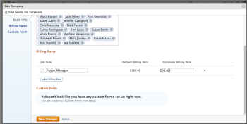

# Override job role billing rates at the company level

When a job role is created, you have the option to select an hourly billing rate for that role. You can create an hourly billing rate that is specific to a company.

At the project level, you can enable an option to allow company-level billing rates to override project-level rates. For more information, see [Override Project-Level Billing Rates with Company-Level Billing Rates](../../../manage-work/projects/project-finances/override-project-level-with-company-level-billing-rates.md).

## Access requirements

You must have the following:

<table cellspacing="0"> 
 <col> 
 <col> 
 <tbody> 
  <tr> 
   <td role="rowheader"><em>Adobe Workfront</em> plan*</td> 
   <td> 
Any 
 </td> 
  </tr> 
  <tr> 
   <td role="rowheader"><em>Adobe Workfront</em> license*</td> 
   <td> 
<em>Plan</em> 
 </td> 
  </tr> 
  <tr> 
   <td role="rowheader">Access level configurations*</td> 
   <td> 
Administrative access to Companies if you are not a System Administrator
 
Edit access to&nbsp;Financial&nbsp;Data
 
Note: If you still don't have access, ask your <em>Workfront administrator</em> if they set additional restrictions in your access level. For information on how a <em>Workfront administrator</em> can modify your access level, see <a href="../../../administration-and-setup/add-users/configure-and-grant-access/create-modify-access-levels.md" class="MCXref xref">Create or modify custom access levels</a>.
 </td> 
  </tr> 
 </tbody> 
</table>

&#42;To find out what plan, license type, or access you have, contact your *Workfront administrator*.

## Override or change an established billing rate used for a specific job role

<ol> 
 <li value="1">Click the Main Menu icon  in the upper-right corner of <em>Adobe Workfront</em>, then click Setup .</li> 
 <li value="2">Click Companies.</li> 
 <li value="3">Locate the company where the job role is assigned.</li> 
 <li value="4">Click&nbsp;Edit Company in the upper-right corner.</li> 
 <li value="5"> 
In the Billing Rates section, select the job role you want to edit, and enter the new billing rate for that job role in the&nbsp;Company Billing Rate box.
 
  
 <note type="note">
    Job role rates changed&nbsp;on the project will only impact only that project. Rates changed at the company level will impact all projects. For more information, see 
   <a href="../../../manage-work/projects/project-finances/override-role-billing-rates-and-calculate-project-revenue.md" class="MCXref xref">Overview of overriding Job Role Billing Rates and calculating Revenue on a project</a>.
  </note> </li> 
</ol>

