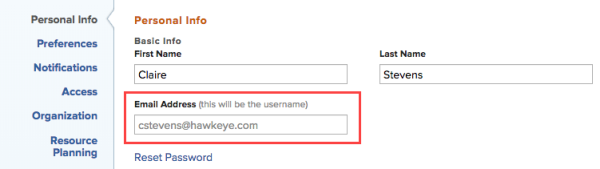

# Change a username {#change-a-username}

As a `Workfront administrator`, you can update a user's username.

1. Click the **Main Menu** icon  in the upper-right corner of `Workfront`, then click **Users** . 

1. Select the user, then click **Edit**.
1.  In the **Email Address** field, type the new username.

   

1. Click **Save Changes**.

