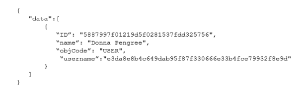
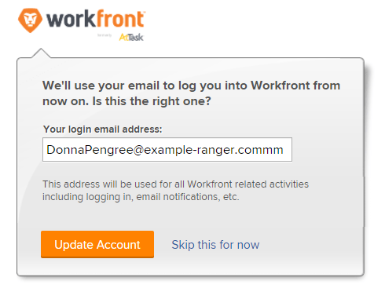

# Change the password for an auto-provisioned user {#change-the-password-for-an-auto-provisioned-user}

When you create users through auto provisioning, Workfront assigns them a GUID (Globally Unique Identifier) for a user name. A GUID&nbsp;is a unique string of random numbers and letters, for example, *5489cb430012526e1ea635e8c29f377f*. 

Often, when a new user attempts to change their temporary password, they enter their email address for their user name and receive an error for an incorrect user name. In order for the user to change their password, they must enter their system-assigned user name, which is a GUID. 

Because GUID user names can be difficult to use, we recommend you first change a user's user name to their Workfront mail address, then allow them to change their password.

>[!NOTE]
>
>The only way to find a user's GUID is through a query of the Workfront API.

1.  Determine a user's GUID user name by passing an API request, as shown in the following example:
   `<pre><a href="https://domain.my.workfront.com/attask/api/v10/USER/search?fields=Username&ID=">https://<domain>.my.workfront.com/attask/api/v10/USER/search?fields=Username&ID=<ID of User></a></pre>` Where, *<domain>* is your company's domain and *<ID of User>* is the user's Workfront ID. 

   ` `**Tip: **`` To find a user's ID:

    
    
    1.  `<li value="1" data-mc-conditions="QuicksilverOrClassic.Quicksilver">Click the <b>Main Menu</b> icon  in the upper-right corner of Workfront, then click <b>Users</b> . </li>` `<li value="2"> 
Select the user.
 
The user's profile page opens and their user ID displays in the URL.
 </li>` 
    
    
    
   You receive a response similar to the following:

   

   The return for "username" is the user's GUID.

1.  Using their GUID as their user name, change the user's password.

   For more information on changing your password, see [Reset your password](reset-your-password.md).

   If your organization uses a SSO system, only a Workfront system administrator can change a user's password. For more information, see [Single sign-on in Workfront](sso-in-workfront.md)

1.  With the user logged in to Workfront, navigate to:

   https://<your domain>.my.workfront.com/login/convertUsername

1.  In the **Your login email address** box, verify that user's email address is correct, then click **Update Account**.

   

   The user's user name is changed to their Workfront email address.

