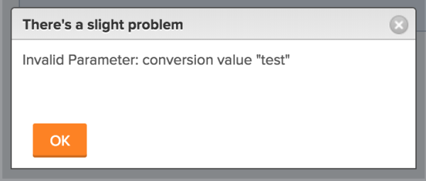

# Error message: Invalid Parameter: conversion value {#error-message-invalid-parameter-conversion-value}

## Problem {#problem}

You receive the following error message when attempting to change the Format of a Custom Field on an existing Custom Form: "Invalid Parameter: conversion value "<...>""  

## Cause {#cause}

This message occurs in the following scenario:

For example, you have a Custom Field formatted as Text.  Now, you want to change the Format of the Custom Field to Currency. Somewhere in your `Workfront` instance, this field is already attached to an object and it has information already specified in it. The existing information in at least one such field is already formatted as Text. Therefore, the Format of the field cannot be changed to Currency.

## Solution {#solution}

Do the following:

1. Build reports for all the objects that might have this field associated with their Custom Forms.  
   For information about building a report, see [Create a report](create-report.md).

1. Include the Custom Field you are trying to edit in the view of the report, so you can see which object has this field populated with a text value.&nbsp;
1. Correct the Custom Field values of the objects that display in a text format and give them a value formatted as Currency; then attempt to change the Format field on the Custom Form again.  
   Or  
   If you have too many field values already populated with text-formatted information, consider adding a new Custom Field to your Custom Form and format it as Currency.&nbsp;&nbsp;

