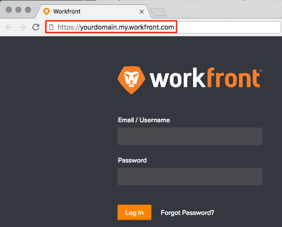

# Error: SSO Users are Unable to Log In to `Workfront` Due to Various Errors {#error-sso-users-are-unable-to-log-in-to-workfront-due-to-various-errors}

## Problem {#problem}

I am unable to log in to `Workfront` and received one of the following errors:

* Sorry, you can't access `Workfront` through this login screen. `Workfront` is set up for Federated Single Sign-On with SAML 2.0. Please contact your `Workfront administrator`.

* That username/password combination wasn't quite right. Make sure your caps lock isn't on and try again.
* Sorry, you do not have access to `Workfront`. Please contact your `Workfront administrator` to get a username and password.

## Solution {#solution}

Your `Workfront` instance uses SSO, and you are trying to log in through an incorrect URL. Make sure you're logging in using the correct URL without anything after ".com"

>[!TIP] {type="tip"}
>
>&nbsp;Remove any existing bookmarks that have invalid URLs.

