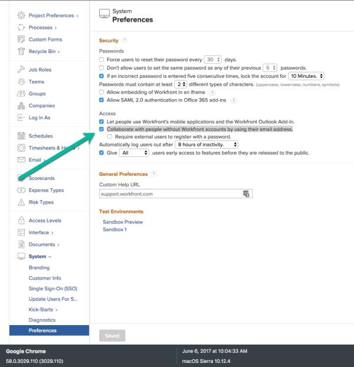

# External user license type missing from access levels {#external-user-license-type-missing-from-access-levels}

## Problem {#problem}

I can no longer see External User license type under Access Levels in Setup.

## Solution {#solution}

Go to **Setup > System > Preferences > Access** and ensure the checkbox beginning with "Collaborate" is checked. If this box is not checked, the external user will not appear in Access Level Setup.

