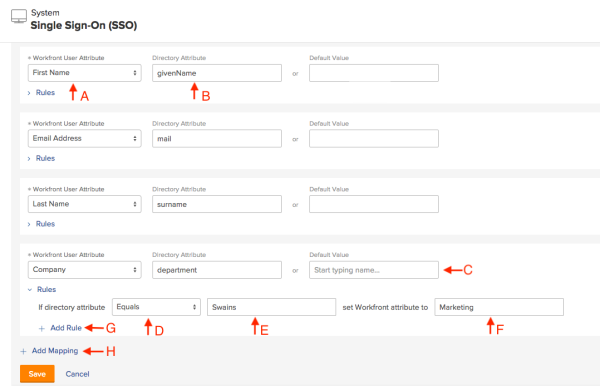

# Map user attributes  {#map-user-attributes}

1. Click the **Main Menu** icon  in the upper-right corner of `Workfront`, then click **Setup** .

1.  Click **System** > **Single Sign-On (SSO)**, then select **Map User Attributes**

   &nbsp;

   A. `Workfront` Attribute

   B. SSO Attribute Label

   C. Default Value: The value in this field is what `Workfront` sets if no value is presented or the value is NULL during the connection.

   D. Attribute Modifier

   E. Directory Attribute Value&nbsp;

   G. Add Additional Rules

   H. Add Additional Attribute Mappings

## Attributes you can map {#attributes-you-can-map}

You can map the following Attributes to your `Workfront` users:

*  Access Level

  >[!IMPORTANT] {type="important"}
  >
  >We do not recommend mapping Access Levels in the Attribute Mappings. If you do, be careful when you are setting the default value to make sure that you don't remove Admin Access inadvertently.

* Address
* Address2
* Billing Per Hour
* City
* Company
* Cost Per Hour
* Email Address
* Extension
* First Name
* Home Group
* Home Team
* Job Role
* Last Name
* Layout Template
* Manager
* Mobile Phone
* Phone Number
* Postal Code
* Schedule
* State
* Timesheet Profile
* Title

## Tips for mapping attributes {#tips-for-mapping-attributes}

Keep the following in mind when mapping attributes:

* Attribute Mappings work on a 1:1 Ratio.  
  For example, you cannot set every Group a user belongs to.
* Default Values are set if no value is detected or no Comparisons return True.
* Only use Default Value when you apply attribute&nbsp;mapping rules. The default value acts as an&nbsp;exception to those rules.&nbsp;
* Attribute mappings happen on each login, not just during auto provisioning.
* Use a non- `Workfront administrator` account for testing.

