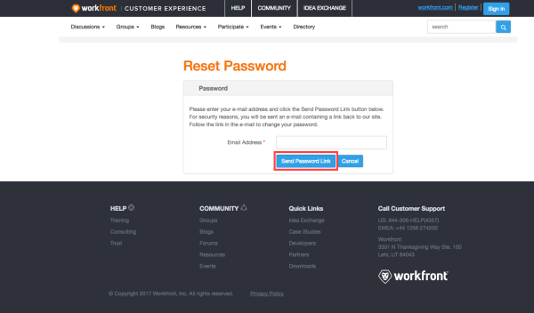

# Reset the password for the Community site {#reset-the-password-for-the-community-site}

This process allows you to change your password for `Workfront Community` if you use SSO for your Workfront instance (which means that `Workfront Customer Support` created a `Workfront Community` account for you). If you don't use SSO with your `Workfront` account, use your existing `Workfront` credentials to log in.

>[!NOTE]
>
>
>
>
>* Your instance of Workfront is not associated with this `Workfront Community` login. 
>* The steps below change your password only for the `Workfront Community` site, not for the Help site or the Training site.
>
>

## Change your `Workfront Community` password {#change-your-workfront-community-password}

1. Go to [https://workfront.connectedcommunity.org/HigherLogic/Security/ResetPassword.aspx.](https://www.google.com/url?q=https%3A%2F%2Fworkfront.connectedcommunity.org%2FHigherLogic%2FSecurity%2FResetPassword.aspx&sa=D&sntz=1&usg=AFQjCNHV8ej22ovKq06TOzNhYut2ALsATw)
1. Enter the&nbsp;email address&nbsp;associated with your Community account.
1.  Click **Send Password Link**.  

   

1. Check your email for a password reset notification.
1.  In the email, click the link http://community.workfront.com/Update.  

1.  On the page that appears, enter and confirm your new password, then click **Update**.  

1.  Return to [community.workfront.com](https://community.workfront.com/home) and complete the fields as follows:

    
    
    * **Username**: Email address
    * **Password**: New password
    *  **Subdomain**: Leave blank
    
    
          
    

    
    
    

## Update your email address {#update-your-email-address}

If you are a Workfront SSO user, please contact `Workfront Customer Support`:

* In the US,&nbsp;call 844-306-4357
* In EMEA, call +44 1256 274200

If you do not use SSO with your `Workfront` account, log in using your existing `Workfront` credentials. Your subdomain is at the very beginning of your Workfront URL, as in *your company.my.workfront.com*.

If you aren't sure what type of account you have, contact `Workfront Customer Support` (1.844.306.4357) to have an account created for you.
