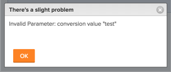

# Error message: Invalid Parameter: conversion value {#error-message-invalid-parameter-conversion-value}

## Problem {#problem}

You receive the following error message when attempting to change the Format of a Custom Field on an existing Custom Form: "Invalid Parameter: conversion value "<...>""  

## Cause {#cause}

This message occurs in the following scenario:

For example, you have a Custom Field formatted as Text.  Now, you want to change the Format of the Custom Field to Currency. Somewhere in your *`Adobe Workfront`* instance, this field is already attached to an object and it has information already specified in it. The existing information in at least one such field is already formatted as Text. Therefore, the Format of the field cannot be changed to Currency.

<table class="TableStyle-TableStyle-List-options-in-steps" style="margin-left: 0;margin-right: auto;mc-table-style: url('../../Resources/TableStyles/TableStyle-List-options-in-steps.css');" cellspacing="0"> 
 <col class="TableStyle-TableStyle-List-options-in-steps-Column-Column1" style="width: 300px;"> 
 <col class="TableStyle-TableStyle-List-options-in-steps-Column-Column2"> 
 <tbody> 
  <tr class="TableStyle-TableStyle-List-options-in-steps-Body-LightGray"> 
   <td class="TableStyle-TableStyle-List-options-in-steps-BodyE-Column1-LightGray" role="rowheader"> 
<a href="https://www.workfront.com/plans" target="_blank">Workfront plan</a>*
 </td> 
   <td class="TableStyle-TableStyle-List-options-in-steps-BodyD-Column2-LightGray">Any</td> 
  </tr> 
  <tr class="TableStyle-TableStyle-List-options-in-steps-Body-MediumGray"> 
   <td class="TableStyle-TableStyle-List-options-in-steps-BodyE-Column1-MediumGray" role="rowheader"> 
<a href="wf-licenses.md" class="MCXref xref">Adobe Workfront licenses overview</a>*
 </td> 
   <td class="TableStyle-TableStyle-List-options-in-steps-BodyD-Column2-MediumGray"> 
Plan 
 </td> 
  </tr> 
  <tr class="TableStyle-TableStyle-List-options-in-steps-Body-LightGray" data-mc-conditions=""> 
   <td class="TableStyle-TableStyle-List-options-in-steps-BodyB-Column1-LightGray" role="rowheader">Access level* </td> 
   <td class="TableStyle-TableStyle-List-options-in-steps-BodyA-Column2-LightGray"> 
Edit access to:
 
    <ul> 
     <li> 
Create Reports, Dashboards, and Calendars
 </li> 
     <li> 
Create Filters, Views, and Groupings
 </li> 
    </ul> 
Note: If you still don't have access, ask your Workfront administrator if they set additional restrictions in your access level. For information on how a Workfront administrator can change your access level, see <a href="create-modify-access-levels.md" class="MCXref xref">Create or modify custom access levels</a>.
 </td> 
  </tr> 
 </tbody> 
</table>

## Solution {#solution}

Do the following:

1. Build reports for all the objects that might have this field associated with their Custom Forms.  
   For information about building a report, see [Create a custom report](create-custom-report.md).

1. Include the Custom Field you are trying to edit in the view of the report, so you can see which object has this field populated with a text value.&nbsp;
1. Correct the Custom Field values of the objects that display in a text format and give them a value formatted as Currency; then attempt to change the Format field on the Custom Form again.  
   Or  
   If you have too many field values already populated with text-formatted information, consider adding a new Custom Field to your Custom Form and format it as Currency.&nbsp;&nbsp;

