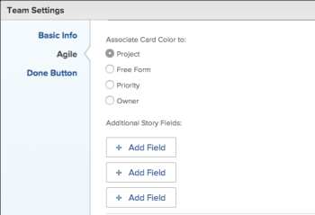

# Configure Scrum

You can configure the following options for agile teams during or after the team is created. You create an agile&nbsp;team (Kanban or Scrum) in *Adobe Workfront* as described in&nbsp; [Create an agile team](../../agile/get-started-with-agile-in-workfront/create-an-agile-team.md).

## Access requirements

You must have the following access to perform the steps in this article:

<table cellspacing="0"> 
 <col> 
 </col> 
 <col> 
 </col> 
 <tbody> 
  <tr> 
   <td role="rowheader"><em>Adobe Workfront</em> plan*</td> 
   <td> 
Any
 </td> 
  </tr> 
  <tr> 
   <td role="rowheader"><em>Adobe Workfront</em> license*</td> 
   <td> 
<em>Work</em> or higher
 </td> 
  </tr> 
 </tbody> 
</table>

&#42;To find out what plan or license type you have, contact your *Workfront administrator*.

## Configure whether stories are estimated in points or hours

>[!NOTE]
>
>This setting cannot be changed if the team has any&nbsp;iterations that are currently In Progress.

You can configure stories to be estimated either using points or hours.

To configure how stories are estimated for your agile team:

<ol> <draft-comment>
  <li value="1" data-mc-conditions="QuicksilverOrClassic.Quicksilver">Click the Main Menu icon  in the upper-right corner of <em>Workfront</em>, then click Teams.</li>
 </draft-comment>
 <li value="1" data-mc-conditions="QuicksilverOrClassic.Quicksilver">Click the Main Menu icon  in the upper-right corner of <em>Workfront</em>, then click Teams.</li> <draft-comment>
  <li value="2" data-mc-conditions="QuicksilverOrClassic.Quicksilver">Click the Switch team icon, then either select a new team from the drop-down menu or search for a team in the search bar.</li>
 </draft-comment>
 <li value="2" data-mc-conditions="QuicksilverOrClassic.Quicksilver">Click the Switch team icon, then either select a new team from the drop-down menu or search for a team in the search bar.</li> 
 <li value="3">Select the agile&nbsp;team that you want to manage.</li> 
 <li value="4"> <draft-comment>
   
Click the More menu, then select Edit.

  </draft-comment>
Click the More menu, then select Edit.
 <draft-comment>
   
Only team members with either a Plan or Work license see this option. 

  </draft-comment>
Only team members with either a Plan or Work license see this option. 
 </li> 
 <li value="5"> 
In the&nbsp;Agile&nbsp;section, in the&nbsp;Estimate Stories in&nbsp;area,&nbsp;select whether you want to use points or hours for estimating the size (work load) of stories. If you select&nbsp;Points,&nbsp;specify how many hours are equal to 1 point. (The default is 1 point = 8 hours.) This is the number of Planned Hours that are added to the story.
 
Example: </b>"><b>Example: </b>If you have selected to estimate stories in points and 1 point equals 8 hours, and&nbsp;a story is estimated at 3 points, 24 Planned Hours are added to the story.
 </li> 
 <li value="6">Click&nbsp;Save Changes.</li> 
</ol>

## Configure status columns on the agile story board

You can configure which columns are displayed on the agile story board for all iterations assigned to your&nbsp;team, or for a given project.

* [Configure status columns for iterations](#configuring-status-columns-for-iterations) 
* [Configure status columns for projects](#configuring-status-columns-for-projects)

### Configure status columns for iterations

You can define the statuses that exist on the story board for the agile team. These are the only statuses that display on the story board.

To define the statuses that are available for the story board associated with&nbsp;the agile team:

<ol> <draft-comment>
  <li value="1" data-mc-conditions="QuicksilverOrClassic.Quicksilver">Click the Main Menu icon  in the upper-right corner of <em>Workfront</em>, then click Teams.</li>
 </draft-comment>
 <li value="1" data-mc-conditions="QuicksilverOrClassic.Quicksilver">Click the Main Menu icon  in the upper-right corner of <em>Workfront</em>, then click Teams.</li> <draft-comment>
  <li value="2" data-mc-conditions="QuicksilverOrClassic.Quicksilver">Click the Switch team icon , then either select a new team from the drop-down menu or search for a team in the search bar.</li>
 </draft-comment>
 <li value="2" data-mc-conditions="QuicksilverOrClassic.Quicksilver">Click the Switch team icon , then either select a new team from the drop-down menu or search for a team in the search bar.</li> 
 <li value="3">Select the agile&nbsp;team that you want to manage.</li> 
 <li value="4"> <draft-comment>
   
Click the More menu, then select Edit.

  </draft-comment>
Click the More menu, then select Edit.
 <draft-comment>
   
Only team members with either a Plan or Work license see this option.

  </draft-comment>
Only team members with either a Plan or Work license see this option.
 <draft-comment>
   
    

  </draft-comment>
    
 </li> 
 <li value="5">In the Agile&nbsp;section, locate the Story Board&nbsp;area.</li> 
 <li value="6">(Optional) Click Add Column to add an additional status column to the story board.</li> 
 <li value="7"> 
(Optional) Drag any status column using the drag-and-drop indicator to reorder the status columns on the story board. The first column can't be moved, and you cannot drag another column in front of the first column.
 
   <draft-comment>
    
   </draft-comment> 
 </li> 
</ol>

<ol start="8" data-mc-continue="true"> 
 <li value="8"> 
Select both task and issue statuses.&nbsp;Task statuses are displayed as the column title for each column on the story board. The issue statuses you select map to the task statuses. This means that when you move an issue to another column of the story board, the issue status changes to the issue statuses shown here, and not to the name of the column on the story board (which reflects the task status).
 <note type="important">
   Only locked system-wide statuses are available to select; you cannot select group-specific statuses. Also, the status of the first column always corresponds to 
   New.
  </note> 
You can add custom statuses if your <em>Workfront administrator</em> has configured them; custom statuses can be configured as described in <a href="../../administration-and-setup/customize-workfront/creating-custom-status-and-priority-labels/create-or-edit-a-status.md" class="MCXref xref">Create or edit a status</a>.
 <note type="note">
   When selecting issue statuses, the third column always defaults to Closed. If you have more than three columns, ensure that you manually update the columns to reflect the proper statuses.
  </note> </li> 
</ol>

1. Click `Save Changes`.

### Configure status columns for projects

For information about how to configure status columns for a project, see the section [Create or customize an Agile view](../../reports-and-dashboards/reports/reporting-elements/create-edit-views.md#customizing-an-agile-view) in the article [Create and edit views](../../reports-and-dashboards/reports/reporting-elements/create-edit-views.md).

## Configure additional fields to display on story cards on the agile story board

>[!NOTE]
>
>This setting is temporarily unavailable in the new Workfront Experience while in beta.

When you add fields to story cards, fields are view-only and display-only when the field is populated.

By default, the following types of data is displayed on the story card for tasks and issues:

* Story name with a&nbsp;link directly to the task or issue
* The project name with a link directly to the project
* This link is displayed only for stories, not for subtasks
* The task or issue description
* Current commitment
* View and edit the percent complete either by adjusting the percent complete itself or by adjusting the number of points or hours that are complete
* Assigned Users

You can display additional data (including custom data) on story cards.&nbsp;You might want to display additional fields on story cards for any number of reasons.&nbsp;For example, you might want to&nbsp;display the Customer ID if you are working on stories for multiple customers within the&nbsp;iteration, or you might want to display&nbsp;the Project Start Date or Project Completion Date.

To configure story cards that are assigned to the agile team to display additional fields:

<ol> <draft-comment>
  <li value="1" data-mc-conditions="QuicksilverOrClassic.Quicksilver">Click the Main Menu icon  in the upper-right corner of <em>Workfront</em>, then click Teams.</li>
 </draft-comment>
 <li value="1" data-mc-conditions="QuicksilverOrClassic.Quicksilver">Click the Main Menu icon  in the upper-right corner of <em>Workfront</em>, then click Teams.</li> <draft-comment>
  <li value="2" data-mc-conditions="QuicksilverOrClassic.Quicksilver">Click the Switch team icon , then either select a new team from the drop-down menu or search for a team in the search bar.</li>
 </draft-comment>
 <li value="2" data-mc-conditions="QuicksilverOrClassic.Quicksilver">Click the Switch team icon , then either select a new team from the drop-down menu or search for a team in the search bar.</li> 
 <li value="3">Select the agile&nbsp;team that you want to manage.</li> 
 <li value="4"> <draft-comment>
   
Click the More menu, then select Edit. Only team members with either a Plan or Work license see this option.

  </draft-comment>
Click the More menu, then select Edit. Only team members with either a Plan or Work license see this option.
 <draft-comment>
   
    

  </draft-comment>
    
 </li> 
 <li value="5">In the Agile section, click Add Field.</li> 
 <li value="6"> 
Select the name of the field you'd like to add.
 
    
 </li> 
 <li value="7">Click Save Changes.</li> 
</ol>

## Configure how color indicators are used for stories on the agile story board

By default, story board tiles in an agile iteration are color-coded according to the project that the story is associated with. Each project is arbitrarily&nbsp;assigned a color on the story board. You can change this default behavior for each agile team. Colors for agile stories can be tied to&nbsp;story priority, owner, and so forth.

To change the behavior of how colors are assigned to stories for an agile team:

<ol> <draft-comment>
  <li value="1" data-mc-conditions="QuicksilverOrClassic.Quicksilver">Click the Main Menu icon  in the upper-right corner of <em>Workfront</em>, then click Teams.</li>
 </draft-comment>
 <li value="1" data-mc-conditions="QuicksilverOrClassic.Quicksilver">Click the Main Menu icon  in the upper-right corner of <em>Workfront</em>, then click Teams.</li> <draft-comment>
  <li value="2" data-mc-conditions="QuicksilverOrClassic.Quicksilver">Click the Switch team icon , then either select a new team from the drop-down menu or search for a team in the search bar.</li>
 </draft-comment>
 <li value="2" data-mc-conditions="QuicksilverOrClassic.Quicksilver">Click the Switch team icon , then either select a new team from the drop-down menu or search for a team in the search bar.</li> 
 <li value="3">Select the agile&nbsp;team that you want to manage.</li> 
 <li value="4"> <draft-comment>
   
Click the More menu, then select Edit.

  </draft-comment>
Click the More menu, then select Edit.
 <draft-comment>
   
Only team members with either a Plan or Work license see this option.

  </draft-comment>
Only team members with either a Plan or Work license see this option.
 <draft-comment>
   
    

  </draft-comment>
    
 </li> 
 <li value="5"> 
In the&nbsp;Agile&nbsp;section, in the&nbsp;Associate Card Color to&nbsp;area, select from the following options:
 
  <ul> 
   <li>Project:&nbsp;Colors are associated with&nbsp;the project that the story is tied to. (When a story is created, it must be associated with a project, as described in&nbsp;"Creating an Agile Story.") All tasks from the same project are displayed with the same color.</li> 
   <li>Free Form:&nbsp;All cards are displayed as blue by default until a user changes the color manually, as described in "Categorizing Stories by Color" in&nbsp;"Creating and Managing Agile Iterations."</li> 
   <li>Priority:&nbsp;Colors are associated with the story priority, as follows: 
    <ul> 
     <li>High = Red</li> 
     <li>Medium = Yellow</li> 
     <li>Low = Green If your system administrator has configured custom priorities for your <em>Workfront</em> system, the highest priority is red, the second-highest is yellow, and the third-highest is green.</li> 
    </ul></li> 
   <li>Task Owner:&nbsp;All stories with the same primary assignee are the same color. The primary assignee is the user who was first assigned to the task.</li> 
  </ul> </li> 
 <li value="6">Click&nbsp;Save Changes.</li> 
</ol>

<!--

<h2>Configure how dates are applied when adding work items to an iteration</h2>

By default, when you add a work item to a Scrum iteration, the Planned Start Date and Planned Completion Date on the work item are modified to match the iteration start and end dates. You can choose to keep the original dates on all work items for the team.

<ol>
<li value="1"> 
Click the Main Menu icon  in the upper-right corner of <em>Adobe Workfront</em>, then click Teams.
 </li>
<li value="2"> 
Click the Switch team icon , then either select a Scrum team from the drop-down menu or search for a team in the search bar.
 </li>
<li value="3"> 
Click the More menu, then select Edit. Only team members with either a Plan or Work license see this option.
 </li>
<li value="4"> 
In the Agile section, in the When a Work Item is Added to an Iteration area, select from the following options:

<ul>
<li> 
Modify the Planned Start Date and Planned Completion Date to match the iteration start and end dates: When work items are added to an iteration, the work item dates are changed to the iteration dates. For more information on how the dates are modified, see the section <a href="../../agile/use-scrum-in-an-agile-team/iterations/add-stories-to-existing-iteration.md#understa" class="MCXref xref">Understand how adding stories affects task dates</a> in the article <a href="../../agile/use-scrum-in-an-agile-team/iterations/add-stories-to-existing-iteration.md" class="MCXref xref">Add stories to an existing iteration</a>.
 </li>
<li> 
Do not modify the Planned Start Date and Planned Completion Date to match the iteration start and end dates: When work items are added to an iteration, the work items retain their original dates.
 </li>
</ul> 
If you change the date option, dates for work items already on the iteration are not adjusted. 
 
These options can affect dates when teams assign work items to each others' iterations. For example, team A modifies work item dates to the iteration dates and team B does not modify work item dates. If team B assigns a work item to team A's iteration, the work item dates will be changed. However, if team A assigns a work item to team B's iteration, the dates will not change.
 </li>
<li value="5"> 
Click Save Changes.
 </li>
</ol>

-->

## Configure how dates are applied when adding work items to an iteration

By default, when you add a work item to a Scrum iteration, the Planned Start Date and Planned Completion Date on the work item are modified to match the iteration start and end dates. You can choose to keep the original dates on all work items for the team.

<ol> 
 <li value="1"> 
Click the Main Menu icon  in the upper-right corner of <em>Adobe Workfront</em>, then click Teams.
 </li> 
 <li value="2"> 
Click the Switch team icon , then either select a Scrum team from the drop-down menu or search for a team in the search bar.
 </li> 
 <li value="3"> 
Click the More menu, then select Edit. Only team members with either a Plan or Work license see this option.
 </li> 
 <li value="4"> 
In the Agile section, in the When a Work Item is Added to an Iteration area, select from the following options:
 
  <ul> 
   <li> 
Modify the Planned Start Date and Planned Completion Date to match the iteration start and end dates: When work items are added to an iteration, the work item dates are changed to the iteration dates. For more information on how the dates are modified, see the section <a href="../../agile/use-scrum-in-an-agile-team/iterations/add-stories-to-existing-iteration.md#understa" class="MCXref xref">Understand how adding stories affects task dates</a> in the article <a href="../../agile/use-scrum-in-an-agile-team/iterations/add-stories-to-existing-iteration.md" class="MCXref xref">Add stories to an existing iteration</a>.
 </li> 
   <li> 
Do not modify the Planned Start Date and Planned Completion Date to match the iteration start and end dates: When work items are added to an iteration, the work items retain their original dates.
 </li> 
  </ul> 
If you change the date option, dates for work items already on the iteration are not adjusted. 
 
These options can affect dates when teams assign work items to each others' iterations. For example, team A modifies work item dates to the iteration dates and team B does not modify work item dates. If team B assigns a work item to team A's iteration, the work item dates will be changed. However, if team A assigns a work item to team B's iteration, the dates will not change.
 </li> 
 <li value="5"> 
Click Save Changes.
 </li> 
</ol>

