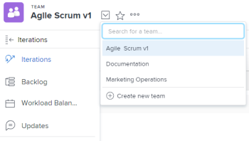

# Create an agile team

*Adobe Workfront* enables agile teams to complete work in an incremental, organized way.

Any user in the organization can see the agile team and view all agile components for the team, including the backlog, iterations, story board, and individual stories. However, only members of the team with Edit access to work can make changes to work assigned to the team.

*Workfront* supports the following agile methodologies:

* `Scrum`: Teams have a backlog of work that needs to be done. When the team is ready to work on a specific chunk of work, the work is moved from the backlog to an iteration. For more detailed information about managing a Scrum team, see [Scrum in an agile team](../../agile/use-scrum-in-an-agile-team/scrum-in-an-agile-team.md).

* `Kanban:` Teams move work in&nbsp;the Kanban view across predetermined&nbsp;statuses. Default statuses are: backlog, in-process, and done. For more detailed information about managing a Kanban&nbsp;team, see [Kanban in an agile team](../../agile/use-kanban-in-an-agile-team/using-kanban-in-an-agile-team.md).

## Access requirements

You must have the following access to perform the steps in this article:

<table cellspacing="0"> 
 <col> 
 </col> 
 <col> 
 </col> 
 <tbody> 
  <tr> 
   <td role="rowheader"><em>Adobe Workfront</em> plan*</td> 
   <td> 
Any
 </td> 
  </tr> 
  <tr> 
   <td role="rowheader"><em>Adobe Workfront</em> license*</td> 
   <td> 
<em>Plan</em> to create a new agile team; <em>Work</em> or higher to convert a team to an agile team
 </td> 
  </tr> 
 </tbody> 
</table>

&#42;To find out what plan or license type you have, contact your *Workfront administrator*.

## Decide on an agile methodology

You can use either a Scrum or Kanban agile methodology for your agile team. Each methodology provides various benefits. The way your agile team works determines the agile methodology you choose to use.

Both Scrum and Kanban agile methodologies in *Workfront* allow you to move stories across a story board to indicate a status change and progress of the story.

Scrum and Kanban agile methodologies in *Workfront* differ in the following ways:

### Benefits of using Kanban in *Workfront*

The Kanban agile methodology in *Workfront* enables you to more easily move stories across an agile story board while limiting the amount of work in progress. There are no start and end dates when using the Kanban agile methodology.

The following functionality supports this methodology:

* Display the backlog on the Kanban agile story board.  
  For more information, see [Add the backlog to the Kanban board](../../agile/use-kanban-in-an-agile-team/view-the-backlog-on-the-kanban-board.md).

* Configure items on the backlog to be automatically added to the Kanban agile story board when other items are moved to a status that equates with Complete.  
  For more information, see the section [Configure stories to be automatically added from the backlog](../../agile/get-started-with-agile-in-workfront/configure-kanban.md#configur5) in the article [Configure Kanban](../../agile/get-started-with-agile-in-workfront/configure-kanban.md).

* Configure a Work In Progress (WIP) limit to be displayed on the Kanban agile story board.  
  For more information, see [Manage the work in progress (WIP) limit on the Kanban board](../../agile/use-kanban-in-an-agile-team/work-in-progress-limit-on-the-kanban-board.md).

### Benefits of using Scrum in *Workfront*

The Scrum agile methodology in *Workfront* enables you to add a set of stories to an agile iteration and create a story board for that iteration. The iteration is based on the start and end dates that you define.

The following functionality supports this methodology:

* Include issues on the Scrum story board
* Include issues on the backlog&nbsp;of an agile team
* Subtasks can be displayed on the Scrum story board
* View a burndown chart to see progress against stories during the iteration  
  For more information, see [Agile burndown chart overview](../../agile/use-scrum-in-an-agile-team/burndown/burndown-chart-overview.md).

## Create a new agile team

<ol> <draft-comment>
  <li value="1" data-mc-conditions="QuicksilverOrClassic.Quicksilver"> 
Click the Main Menu icon  in the upper-right corner of <em>Adobe Workfront</em>, then click Teams.
 </li>
 </draft-comment>
 <li value="1" data-mc-conditions="QuicksilverOrClassic.Quicksilver"> 
Click the Main Menu icon  in the upper-right corner of <em>Adobe Workfront</em>, then click Teams.
 </li> <draft-comment>
  <li value="2" data-mc-conditions="QuicksilverOrClassic.Quicksilver"> 
 
Click the Switch Teams icon , then click Create New Team.
 
  
 
 </li>
 </draft-comment>
 <li value="2" data-mc-conditions="QuicksilverOrClassic.Quicksilver"> 
 
Click the Switch Teams icon , then click Create New Team.
 
  
 
 </li> 
 <li value="3"> 
Specify the following information on the New Team dialog:
 
  <table cellspacing="0"> 
   <col> 
   <col> 
   <tbody> 
    <tr> 
     <td role="rowheader">Team Name </td> 
     <td>Type a name for the new agile team.</td> 
    </tr> 
    <tr> 
     <td role="rowheader">This is an Agile Team </td> 
     <td>Select this option to configure this new team to be an agile team.</td> 
    </tr> <draft-comment>
     <tr data-mc-conditions="QuicksilverOrClassic.Quicksilver"> 
      <td role="rowheader">Group </td> 
      <td> 
Begin typing the name of a group to add to the team, then select the name when it appears in the drop-down list.
 <note type="note">
        When a team is assigned to a group or subgroup, any 
        <em>group administrators</em> of that group or subgroup can manage the team without being a member of it. 
        <em>Group administrators</em> can go to the Teams area from the Main Menu and click the Switch Teams arrow 
         to list all of the teams that are assigned to the groups that they manage.
       </note> </td> 
     </tr>
    </draft-comment>
    <tr data-mc-conditions="QuicksilverOrClassic.Quicksilver"> 
     <td role="rowheader">Group </td> 
     <td> 
Begin typing the name of a group to add to the team, then select the name when it appears in the drop-down list.
 <note type="note">
       When a team is assigned to a group or subgroup, any 
       <em>group administrators</em> of that group or subgroup can manage the team without being a member of it. 
       <em>Group administrators</em> can go to the Teams area from the Main Menu and click the Switch Teams arrow 
        to list all of the teams that are assigned to the groups that they manage.
      </note> </td> 
    </tr> 
    <tr> 
     <td role="rowheader">Team Members </td> 
     <td>Begin typing the name of a user to be on the team, then select the name when it appears in the drop-down list. Repeat this process to add multiple users to the team. Because users can be on more than one team, they can be on both agile and non-agile teams.</td> 
    </tr> 
    <tr> 
     <td role="rowheader">Description </td> 
     <td>Type a description for the team.</td> 
    </tr> 
   </tbody> 
  </table> </li> 
 <li value="4"> 
Click Create.
 
For information on configuring an Agile team, see the following articles:
 
  <ul> 
   <li><a href="../../agile/get-started-with-agile-in-workfront/configure-kanban.md" class="MCXref xref">Configure Kanban</a> </li> 
   <li><a href="../../agile/get-started-with-agile-in-workfront/configure-scrum.md" class="MCXref xref">Configure Scrum</a> </li> 
  </ul> </li> 
</ol>

## Convert an existing team into an agile team

You can&nbsp;convert an existing team to be&nbsp;an agile team:

<ol> <draft-comment>
  <li value="1" data-mc-conditions="QuicksilverOrClassic.Quicksilver"> 
Click the Main Menu icon  in the upper-right corner of <em>Adobe Workfront</em>, then click Teams.
 </li>
 </draft-comment>
 <li value="1" data-mc-conditions="QuicksilverOrClassic.Quicksilver"> 
Click the Main Menu icon  in the upper-right corner of <em>Adobe Workfront</em>, then click Teams.
 </li> <draft-comment>
  <li value="2" data-mc-conditions="QuicksilverOrClassic.Quicksilver">Click the Switch team icon , then either select a new team from the drop-down menu or search for a team in the search bar.</li>
 </draft-comment>
 <li value="2" data-mc-conditions="QuicksilverOrClassic.Quicksilver">Click the Switch team icon , then either select a new team from the drop-down menu or search for a team in the search bar.</li> 
 <li value="3">Select the team that you want to convert to an agile team.</li> <draft-comment>
  <li value="4" data-mc-conditions="QuicksilverOrClassic.Quicksilver">Click the More menu, then select Edit. Only team members with either a Plan or Work license see this option. </li>
 </draft-comment>
 <li value="4" data-mc-conditions="QuicksilverOrClassic.Quicksilver">Click the More menu, then select Edit. Only team members with either a Plan or Work license see this option. </li> 
 <li value="5">In the Agile&nbsp;section, select&nbsp;This is an Agile Team.</li> 
 <li value="6">In the Methodology section, select whether the team will be using a&nbsp;Scrum&nbsp;or&nbsp;Kanban&nbsp;agile methodology. </li> 
 <li value="7"> 
Click&nbsp;Save Changes.
 
For information on configuring an Agile team, see the following articles:
 
  <ul> 
   <li><a href="../../agile/get-started-with-agile-in-workfront/configure-kanban.md" class="MCXref xref">Configure Kanban</a> </li> 
   <li><a href="../../agile/get-started-with-agile-in-workfront/configure-scrum.md" class="MCXref xref">Configure Scrum</a> </li> 
  </ul> </li> 
</ol>

