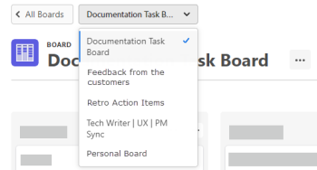

# Create or edit a board

From the boards dashboard, you can create a new board or edit an existing board.

## Access requirements

You must have the following access to perform the steps in this article:

<table cellspacing="0"> 
 <col> 
 <col> 
 <tbody> 
  <tr> 
   <td role="rowheader">Adobe Workfront plan*</td> 
   <td> 
Any
 </td> 
  </tr> 
  <tr> 
   <td role="rowheader">Adobe Workfront license*</td> 
   <td> 
Request or higher
 </td> 
  </tr> 
 </tbody> 
</table>

&#42;To find out what plan, license type, or access you have, contact your `Workfront administrator`.

## Create a new board

<ol> 
 <li value="1"> 
Click the Main Menu icon  in the upper-right corner of Adobe Workfront, then click Boards.
 </li> 
 <li value="2"> 
Click Create New.
 </li> 
 <li value="3"> 
Type a name for the board in the Board field and press Enter.
 </li> 
 <li value="4"> 
Configure the board as needed.
 
For information, see <a href="../../agile/get-started-with-boards/add-members-to-board.md" class="MCXref xref">Add or remove members from a board</a>, <a href="../../agile/get-started-with-boards/manage-board-columns.md" class="MCXref xref">Manage board columns</a>, and <a href="../../agile/get-started-with-boards/add-card-to-board.md" class="MCXref xref">Add a card to a board</a>.
 </li> 
 <li value="5"> 
Click All Boards to return to the boards dashboard.
 
You can also locate the drop-down menu labeled with Select an option, and click it to switch to another board.
 </li> 
</ol>

## Edit an existing board

<ol> 
 <li value="1"> 
Click the Main Menu icon  in the upper-right corner of Adobe Workfront, then click Boards.
 </li> 
 <li value="2"> 
On the dashboard, select the board to open.
 </li> 
 <li value="3"> 
Edit the board as needed. You can click on the board name to rename it.
 
For information, see <a href="../../agile/get-started-with-boards/add-members-to-board.md" class="MCXref xref">Add or remove members from a board</a>, <a href="../../agile/get-started-with-boards/manage-board-columns.md" class="MCXref xref">Manage board columns</a>, and <a href="../../agile/get-started-with-boards/add-card-to-board.md" class="MCXref xref">Add a card to a board</a>.
 </li> 
 <li value="4"> 
To delete the board, click the More menu  next to the board name and select Delete. Then, click Delete board on the confirmation message.
 </li> 
 <li value="5"> 
Click All Boards to return to the boards dashboard.
 
You can also locate the drop-down menu labeled with the name of the current board, and click it to switch to another board.
 
  
 </li> 
</ol>

