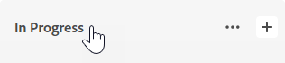

# Manage board columns

A new board contains the default columns New, In Progress, and Complete. You can add more columns, change the order of the columns, rename columns, and delete any columns that you don’t need.

## Access requirements

You must have the following access to perform the steps in this article:

<table cellspacing="0"> 
 <col> 
 </col> 
 <col> 
 </col> 
 <tbody> 
  <tr> 
   <td role="rowheader"><em>Adobe Workfront</em> plan*</td> 
   <td> 
Any
 </td> 
  </tr> 
  <tr> 
   <td role="rowheader"><em>Adobe Workfront</em> license*</td> 
   <td> 
<em>Request</em> or higher
 </td> 
  </tr> 
 </tbody> 
</table>

&#42;To find out what plan, license type, or access you have, contact your *Workfront administrator*.

## Add a column to a board

<ol> 
 <li value="1"> 
Click the Main Menu icon  in the upper-right corner of <em>Adobe Workfront</em>, then click Boards.
 </li> 
 <li value="2"> 
Access a board. For information, see <a href="../../agile/get-started-with-boards/create-edit-board.md" class="MCXref xref">Create or edit a board</a>.
 </li> 
 <li value="3"> 
Click Add Column to the right of the existing columns.
 </li> 
 <li value="4"> 
In the new column, type a name and click Add Column.
 
 <![CDATA[                ]]>
 </li> 
</ol>

## Reorder columns on a board

<ol> 
 <li value="1"> 
Click the Main Menu icon  in the upper-right corner of <em>Adobe Workfront</em>, then click Boards.
 </li> 
 <li value="2"> 
Access a board. For information, see <a href="../../agile/get-started-with-boards/create-edit-board.md" class="MCXref xref">Create or edit a board</a>.
 </li> 
 <li value="3"> 
Drag and drop the columns into the correct order. Be sure to select the top of the column before dragging it to another location.Is there a way to do this with the keyboard?
 
  
 </li> 
</ol>

## Rename a board column

<ol> 
 <li value="1"> 
Click the Main Menu icon  in the upper-right corner of <em>Adobe Workfront</em>, then click Boards.
 </li> 
 <li value="2"> 
Access a board. For information, see <a href="../../agile/get-started-with-boards/create-edit-board.md" class="MCXref xref">Create or edit a board</a>.
 </li> 
 <li value="3"> 
Click on the column name, type the new name, and press Enter.
 </li> 
</ol>

## Delete a board column

<ol> 
 <li value="1"> 
Click the Main Menu icon  in the upper-right corner of <em>Adobe Workfront</em>, then click Boards.
 </li> 
 <li value="2"> 
Access a board. For information, see <a href="../../agile/get-started-with-boards/create-edit-board.md" class="MCXref xref">Create or edit a board</a>.
 </li> 
 <li value="3"> 
Click the More menu  on the column, and select Delete.
 <note type="note">
   Columns that contain cards can't be deleted.
  </note> </li> 
</ol>

