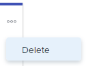

# Delete stories or issues from the Kanban board {#delete-stories-or-issues-from-the-kanban-board}

You can delete a story or issue from the Kanban board. When you delete a story or issue, it is moved to the Recycle Bin for 30 days and can be recovered only by the system administrator.

## Access requirements {#access-requirements}

You must have the following access to perform the steps in this article:

<table style="width: 100%;margin-left: 0;margin-right: auto;mc-table-style: url('../../Resources/TableStyles/TableStyle-List-options-in-steps.css');" class="TableStyle-TableStyle-List-options-in-steps" cellspacing="0"> 
 <col class="TableStyle-TableStyle-List-options-in-steps-Column-Column1"> 
 </col> 
 <col class="TableStyle-TableStyle-List-options-in-steps-Column-Column2"> 
 </col> 
 <tbody> 
  <tr class="TableStyle-TableStyle-List-options-in-steps-Body-LightGray"> 
   <td class="TableStyle-TableStyle-List-options-in-steps-BodyE-Column1-LightGray" role="rowheader">Adobe Workfront plan*</td> 
   <td class="TableStyle-TableStyle-List-options-in-steps-BodyD-Column2-LightGray"> 
Any
 </td> 
  </tr> 
  <tr class="TableStyle-TableStyle-List-options-in-steps-Body-MediumGray"> 
   <td class="TableStyle-TableStyle-List-options-in-steps-BodyE-Column1-MediumGray" role="rowheader">Adobe Workfront license*</td> 
   <td class="TableStyle-TableStyle-List-options-in-steps-BodyD-Column2-MediumGray"> 
Work or higher
 </td> 
  </tr> 
  <tr class="TableStyle-TableStyle-List-options-in-steps-Body-LightGray"> 
   <td class="TableStyle-TableStyle-List-options-in-steps-BodyE-Column1-LightGray" role="rowheader">Access level configurations*</td> 
   <td class="TableStyle-TableStyle-List-options-in-steps-BodyD-Column2-LightGray"> 
Worker or higher
 
Note: If you still don't have access, ask your Workfront administrator if they set additional restrictions in your access level. For information on how a Workfront administrator can modify your access level, see <a href="create-modify-access-levels.md" class="MCXref xref">Create or modify custom access levels</a>.
 </td> 
  </tr> 
  <tr class="TableStyle-TableStyle-List-options-in-steps-Body-MediumGray"> 
   <td class="TableStyle-TableStyle-List-options-in-steps-BodyB-Column1-MediumGray" role="rowheader">Object permissions</td> 
   <td class="TableStyle-TableStyle-List-options-in-steps-BodyA-Column2-MediumGray"> 
Manage access to the task or issue
 
For information on requesting additional access, see <a href="request-access.md" class="MCXref xref">Request access to objects in Adobe Workfront</a>.
 </td> 
  </tr> 
 </tbody> 
</table>

&#42;To find out what plan, license type, or access you have, contact your *`Workfront administrator`*.

## Delete a story or issue {#delete-a-story-or-issue}

1. Click the `Main Menu` icon  in the upper-right corner of *`Adobe Workfront`*, then click `Teams`.

1.  (Optional) Click the `Switch team` icon , then either select a new Kanban team from the drop-down menu or search for a team in the search bar.
1.  Click the `More` icon on the story or issue, and select `Delete`.

   

1.  On the confirmation message, click `Yes, delete it`.

