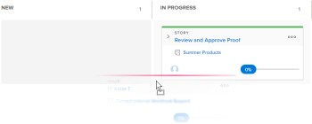

# Update the status of stories on the Kanban board

You can change the status of a story directly from the Kanban&nbsp;board in order to reflect how the stories are progressing.

>[!NOTE]
>
>Only statuses selected in the Story Board section in the team settings area are available on the Kanban board and in the status drop-down menu. For more information, see [Configure Kanban](../../agile/get-started-with-agile-in-workfront/configure-kanban.md)

## Access requirements

You must have the following access to perform the steps in this article:

<table cellspacing="0"> 
 <col> 
 <col> 
 <tbody> 
  <tr> 
   <td role="rowheader">Adobe Workfront plan*</td> 
   <td> 
Any
 </td> 
  </tr> 
  <tr> 
   <td role="rowheader">Adobe Workfront license*</td> 
   <td> 
Work or higher
 </td> 
  </tr> 
  <tr> 
   <td role="rowheader">Access level configurations*</td> 
   <td> 
Worker or higher
 
Note: If you still don't have access, ask your Workfront administrator if they set additional restrictions in your access level. For information on how a Workfront administrator can change your access level, see <a href="../../administration-and-setup/add-users/configure-and-grant-access/create-modify-access-levels.md" class="MCXref xref">Create or modify custom access levels</a>.
 </td> 
  </tr> 
 </tbody> 
</table>

&#42;To find out what plan, license type, or access you have, contact your `Workfront administrator`.

## Update the status of stories on the Kanban board

<ol> Click the Main Menu icon in the upper-right corner of Adobe Workfront, then click Teams. (Optional) Click the Switch team icon , then either select a new Kanban team from the drop-down menu or search for a team in the search bar. 
 <li value="3">Go to the Kanban board where you want to update the status of a story.</li> 
 <li value="4">Drag a story from one status column on the Kanban&nbsp;board and into another column. A story remains in the Complete column for two weeks after it is added. </li> 
</ol>

