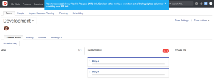

# Manage the work in progress (WIP) limit on the Kanban board {#manage-the-work-in-progress-wip-limit-on-the-kanban-board}

You can configure a Work In Progress (WIP) limit for each column on the Kanban board, as described in the article [Configure Kanban](configure-kanban.md).

The WIP limit is simply a visual warning and does not restrict your team from having more items in each status column than the limit you set.

## Access requirements {#access-requirements}

You must have the following access to perform the steps in this article:

<table style="width: 100%;margin-left: 0;margin-right: auto;mc-table-style: url('../../Resources/TableStyles/TableStyle-List-options-in-steps.css');" class="TableStyle-TableStyle-List-options-in-steps" cellspacing="0"> 
 <col class="TableStyle-TableStyle-List-options-in-steps-Column-Column1"> 
 <col class="TableStyle-TableStyle-List-options-in-steps-Column-Column2"> 
 <tbody> 
  <tr class="TableStyle-TableStyle-List-options-in-steps-Body-LightGray"> 
   <td class="TableStyle-TableStyle-List-options-in-steps-BodyE-Column1-LightGray" role="rowheader">Adobe Workfront plan*</td> 
   <td class="TableStyle-TableStyle-List-options-in-steps-BodyD-Column2-LightGray"> 
Any
 </td> 
  </tr> 
  <tr class="TableStyle-TableStyle-List-options-in-steps-Body-MediumGray"> 
   <td class="TableStyle-TableStyle-List-options-in-steps-BodyE-Column1-MediumGray" role="rowheader">Adobe Workfront license*</td> 
   <td class="TableStyle-TableStyle-List-options-in-steps-BodyD-Column2-MediumGray"> 
Work or higher
 </td> 
  </tr> 
  <tr class="TableStyle-TableStyle-List-options-in-steps-Body-LightGray"> 
   <td class="TableStyle-TableStyle-List-options-in-steps-BodyB-Column1-LightGray" role="rowheader">Access level configurations*</td> 
   <td class="TableStyle-TableStyle-List-options-in-steps-BodyA-Column2-LightGray"> 
Worker or higher
 
Note: If you still don't have access, ask your Workfront administrator if they set additional restrictions in your access level. For information on how a Workfront administrator can change your access level, see <a href="create-modify-access-levels.md" class="MCXref xref">Create or modify custom access levels</a>.
 </td> 
  </tr> 
 </tbody> 
</table>

&#42;To find out what plan, license type, or access you have, contact your *`Workfront administrator`*.

## View the Work In Progress (WIP) limit on the Kanban board {#view-the-work-in-progress-wip-limit-on-the-kanban-board}

When a WIP limit is configured for your agile team, it is displayed in the upper-right corner of each column on the Kanban board (except for the Complete column).

Any time the limit is exceeded for any column on the Kanban board, the limit is highlighted in red and a message is displayed.  

## Update the Work In Progress (WIP) limit from the Kanban board {#update-the-work-in-progress-wip-limit-from-the-kanban-board}

Team members with Edit rights can update the WIP limit for each status column directly from the Kanban board. Alternatively, you can update the WIP limit as described in the article [Configure Kanban](configure-kanban.md).

1. Click the `Main Menu` icon  in the upper-right corner of *`Adobe Workfront`*, then click `Teams`.

1. (Optional) Click the `Switch team` icon , then either select a new Kanban team from the drop-down menu or search for a team in the search bar.

1. On the Kanban board, locate the WIP limit in the upper-right corner of each column on the Kanban board.
1. Click the WIP limit you want to modify, then specify a new limit.
1. Press `Enter`.

