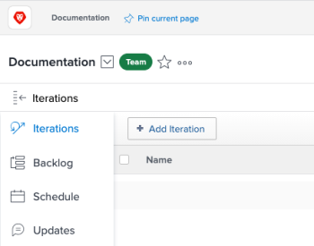

# Create an iteration

Iterations are a key component for Scrum agile teams in planning out work capacity. *Adobe Workfront* allows Scrum agile teams to manage their work by creating multiple&nbsp;iterations to accommodate team needs.

## Access requirements

You must have the following access to perform the steps in this article:

<table cellspacing="0"> 
 <col> 
 </col> 
 <col> 
 </col> 
 <tbody> 
  <tr> 
   <td role="rowheader"><em>Adobe Workfront</em> plan*</td> 
   <td> 
Any
 </td> 
  </tr> 
  <tr> 
   <td role="rowheader"><em>Adobe Workfront</em> license*</td> 
   <td> 
<em>Review</em> or higher
 </td> 
  </tr> 
 </tbody> 
</table>

&#42;To find out what plan or license type you have, contact your *Workfront administrator*.

<!--
<h2 data-mc-conditions="QuicksilverOrClassic.Quicksilver">Add an iteration</h2>
-->

## Add an iteration

<!--

Use the Add Iteration feature to quickly create an iteration and add tasks and issues later.

-->

Use the Add Iteration feature to quickly create an iteration and add tasks and issues later.

<!--
<ol data-mc-conditions="QuicksilverOrClassic.Quicksilver">
<li value="1">Click the Main Menu icon  in the upper-right corner of <em>Adobe Workfront</em>, then click Teams.</li>
<li value="2">(Optional) Click the Switch team icon , then either select a new Scrum team from the drop-down menu or search for a team in the search bar.</li>
<li value="3">On the Iterations tab, click Add Iteration.  </li>
<li value="4">Specify the following: 
<table cellspacing="0">
<col>
<col>
<tbody>
<tr>
<td role="rowheader">Iteration Name</td>
<td>Enter the name of the iteration.</td>
</tr>
<tr>
<td role="rowheader">Goal</td>
<td>Add any goals you have for the iteration.</td>
</tr>
<tr>
<td role="rowheader">Start Date</td>
<td>Enter the date the iteration should start.</td>
</tr>
<tr>
<td role="rowheader">End Date</td>
<td>
Enter the date the iteration should end. Workfront recommends setting an end date no longer than 4 weeks from the start date.
<note type="tip">
Make sure to choose a working day as the end date. The burndown chart uses only working days in its calculations.
 By default, the burndown chart uses the&nbsp;default schedule to define working days (as described in&nbsp;
<a href="../../../administration-and-setup/set-up-workfront/configure-timesheets-schedules/create-schedules.md" class="MCXref xref">Create a schedule</a>). Or, to incorporate team-specific non-working days,&nbsp;agile teams can choose to use an alternate schedule (as described in"Defining an Alternate Team Schedule for Burndown Charts" in&nbsp;
<a href="../../../agile/get-started-with-agile-in-workfront/create-an-agile-team.md" class="MCXref xref">Create an agile team</a>).
</note></td>
</tr>
<tr>
<td role="rowheader">Capacity</td>
<td> Specify the capacity for the iteration. This is the number of points or hours your team is able to accomplish in the iteration. The number you enter must be equal to or greater than the number of points or hours from the sum of all the stories in the iteration. <em>Workfront</em> pre-populates this field with 50 capacity by default. </td>
</tr>
<tr>
<td role="rowheader">Focus</td>
<td>Specify the focus percentage of the team. If all members of the team will be focused completely on this iteration, the focus would be 100%. <em>Workfront</em> pre-populates this field with 100% by default. </td>
</tr>
</tbody>
</table></li>
<li value="5">Click Submit. Now that you've created an iteration, you need to add stories. For more information, see <a href="../../../agile/use-scrum-in-an-agile-team/iterations/add-stories-to-existing-iteration.md" class="MCXref xref">Add stories to an existing iteration</a>. </li>
</ol>
-->

<ol data-mc-conditions="QuicksilverOrClassic.Quicksilver"> 
 <li value="1">Click the Main Menu icon  in the upper-right corner of <em>Adobe Workfront</em>, then click Teams.</li> 
 <li value="2">(Optional) Click the Switch team icon , then either select a new Scrum team from the drop-down menu or search for a team in the search bar.</li> 
 <li value="3">On the Iterations tab, click Add Iteration.  </li> 
 <li value="4">Specify the following:  
  <table cellspacing="0"> 
   <col> 
   <col> 
   <tbody> 
    <tr> 
     <td role="rowheader">Iteration Name</td> 
     <td>Enter the name of the iteration.</td> 
    </tr> 
    <tr> 
     <td role="rowheader">Goal</td> 
     <td>Add any goals you have for the iteration.</td> 
    </tr> 
    <tr> 
     <td role="rowheader">Start Date</td> 
     <td>Enter the date the iteration should start.</td> 
    </tr> 
    <tr> 
     <td role="rowheader">End Date</td> 
     <td>
Enter the date the iteration should end. Workfront recommends setting an end date no longer than 4 weeks from the start date.
<note type="tip">
       Make sure to choose a working day as the end date. The burndown chart uses only working days in its calculations.
        By default, the burndown chart uses the&nbsp;default schedule to define working days (as described in&nbsp;
       <a href="../../../administration-and-setup/set-up-workfront/configure-timesheets-schedules/create-schedules.md" class="MCXref xref">Create a schedule</a>). Or, to incorporate team-specific non-working days,&nbsp;agile teams can choose to use an alternate schedule (as described in"Defining an Alternate Team Schedule for Burndown Charts" in&nbsp;
       <a href="../../../agile/get-started-with-agile-in-workfront/create-an-agile-team.md" class="MCXref xref">Create an agile team</a>).
      </note></td> 
    </tr> 
    <tr> 
     <td role="rowheader">Capacity</td> 
     <td> Specify the capacity for the iteration. This is the number of points or hours your team is able to accomplish in the iteration. The number you enter must be equal to or greater than the number of points or hours from the sum of all the stories in the iteration. <em>Workfront</em> pre-populates this field with 50 capacity by default. </td> 
    </tr> 
    <tr> 
     <td role="rowheader">Focus</td> 
     <td>Specify the focus percentage of the team. If all members of the team will be focused completely on this iteration, the focus would be 100%. <em>Workfront</em> pre-populates this field with 100% by default. </td> 
    </tr> 
   </tbody> 
  </table></li> 
 <li value="5">Click Submit. Now that you've created an iteration, you need to add stories. For more information, see <a href="../../../agile/use-scrum-in-an-agile-team/iterations/add-stories-to-existing-iteration.md" class="MCXref xref">Add stories to an existing iteration</a>. </li> 
</ol>

## Plan an iteration on the Backlog tab

Use the Plan Iteration feature to create an iteration using tasks on your backlog.

<ol> <draft-comment>
  <li value="1" data-mc-conditions="QuicksilverOrClassic.Quicksilver">Click the Main Menu icon  in the upper-right corner of <em>Adobe Workfront</em>, then click Teams.</li>
 </draft-comment>
 <li value="1" data-mc-conditions="QuicksilverOrClassic.Quicksilver">Click the Main Menu icon  in the upper-right corner of <em>Adobe Workfront</em>, then click Teams.</li> <draft-comment>
  <li value="2" data-mc-conditions="QuicksilverOrClassic.Quicksilver">(Optional) Click the Switch team icon , then either select a new Scrum team from the drop-down menu or search for a team in the search bar.</li>
 </draft-comment>
 <li value="2" data-mc-conditions="QuicksilverOrClassic.Quicksilver">(Optional) Click the Switch team icon , then either select a new Scrum team from the drop-down menu or search for a team in the search bar.</li> <draft-comment>
  <li value="3" data-mc-conditions="QuicksilverOrClassic.Quicksilver">Select Backlog on the left panel. Then, click Plan Iteration.</li>
 </draft-comment>
 <li value="3" data-mc-conditions="QuicksilverOrClassic.Quicksilver">Select Backlog on the left panel. Then, click Plan Iteration.</li> 
 <li value="4">Specify the following information:  
  <table cellspacing="0"> 
   <col> 
   <col> 
   <tbody> 
    <tr> 
     <td role="rowheader">Iteration Name:</td> 
     <td>Specify a name for the iteration.</td> 
    </tr> 
    <tr> 
     <td role="rowheader">Start Date:</td> 
     <td> Specify the date the iteration should start.</td> 
    </tr> 
    <tr> 
     <td role="rowheader">End Date:&nbsp;</td> 
     <td>
Specify the date the iteration should end. Workfront recommends setting an end date no longer than 4 weeks from the start date.
<note type="tip">
       Make sure to choose a working day as the end date. The burndown chart uses only working days in its calculations.
        By default, the burndown chart uses the&nbsp;default schedule to define working days (as described in&nbsp;
       <a href="../../../administration-and-setup/set-up-workfront/configure-timesheets-schedules/create-schedules.md" class="MCXref xref">Create a schedule</a>). Or, to incorporate team-specific non-working days,&nbsp;agile teams can choose to use an alternate schedule (as described in 
       <a href="../../../agile/use-scrum-in-an-agile-team/burndown/use-alt--team-schedule-burndown-charts.md" class="MCXref xref">Use an alternate team schedule for burndown charts</a>).
      </note></td> 
    </tr> 
    <tr> 
     <td role="rowheader">Focus:</td> 
     <td>Specify the focus percentage of the team. If all members of the team will be focused completely on this iteration, the focus would be 100%. <em>Workfront</em> pre-populates this field with the average value from your team's past iterations. If this is your team's first iteration, this field value is 0 by default.</td> 
    </tr> 
    <tr> 
     <td role="rowheader"> Capacity:</td> 
     <td> Specify the capacity for the iteration. This is the number of points or hours your team is able to accomplish in the iteration. The number you enter must be equal to or greater than the number of points or hours from the sum of all the stories in the iteration. <em>Workfront</em> pre-populates this field with the average value from your team's past iterations. If this is your team's first iteration, this field value is 0 by default.</td> 
    </tr> 
    <tr> 
     <td role="rowheader"> Goal:</td> 
     <td> Specify a goal for the iteration.&nbsp;This field is not required.</td> 
    </tr> 
   </tbody> 
  </table></li> 
 <li value="5">(Optional) Select stories to add them to&nbsp;the iteration now, or you can skip this step and add stories to an iteration at a later time. The stories at the top of the backlog are higher priority. Stories&nbsp;are highlighted in green when they fit in the capacity; they are highlighted in red if they do not. You can add both tasks and issues to a single iteration: 
  <ul> 
   <li>To add tasks to the iteration: On the Backlog tab, ensure that the Stories tab is selected (this tab is selected by default when viewing the backlog). Select the stories you want to add to the iteration. When you add tasks to an iteration, the start date of the task is calculated as described in&nbsp;<a href="#understanding-how-task-start-dates-are-calculated-when-added-to-an-iteration" class="MCXref xref">Understand how task start dates are calculated when added to an iteration</a>.</li> 
   <li>To add issues to the iteration: On the Backlog tab, click the Issues tab. Select the issues you want to add to the iteration.</li> 
  </ul></li> 
 <li value="6">Click Save. The iteration is created.</li> 
 <li value="7">(Optional) To add stories to an existing iteration, see <a href="../../../agile/use-scrum-in-an-agile-team/iterations/add-stories-to-existing-iteration.md" class="MCXref xref">Add stories to an existing iteration</a>.</li> 
</ol>

## Understand how task start dates are calculated when added to an iteration

When you add a task as a story to an iteration, the Must Finish On task constraint is used for&nbsp;each story. In most cases, the planned start date of the task is calculated based on the following formula:

Iteration End Date minus (-) Task Duration equals (=) Task Planned Start Date

The Project End Date is used instead of the Iteration End Date if&nbsp;the&nbsp;project start date is after the iteration start date, and the project end date is after the iteration end date.

<!--

You can configure individual Scrum teams to use the project dates by default, rather than the iteration dates. For information, see the section <a href="../../../agile/get-started-with-agile-in-workfront/configure-scrum.md#configur5" class="MCXref xref">Configure how dates are applied when adding work items to an iteration</a> in the article <a href="../../../agile/get-started-with-agile-in-workfront/configure-scrum.md" class="MCXref xref">Configure Scrum</a>. 

-->

You can configure individual Scrum teams to use the project dates by default, rather than the iteration dates. For information, see the section [Configure how dates are applied when adding work items to an iteration](../../../agile/get-started-with-agile-in-workfront/configure-scrum.md#configur5) in the article [Configure Scrum](../../../agile/get-started-with-agile-in-workfront/configure-scrum.md). 
