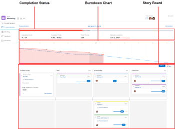

# Iterations overview {#iterations-overview}

Agile iterations consist of three areas: completion status, burndown, and the story board.

For information about the burndown chart and completion status, see the [Burndown](_burndown.md) section.

For more information about the story board, see the [Scrum board](_scrum-board.md) section.
