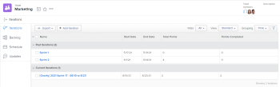
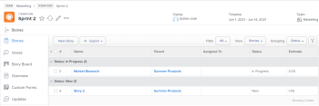

# View an iteration {#view-an-iteration}

You can view all iterations for a given team, or you can view an individual iteration.&nbsp;Iterations display data about the&nbsp;stories, issues, and documents that are contained in the iteration.

## Access requirements {#access-requirements}

You must have the following access to perform the steps in this article:

<table style="width: 100%;margin-left: 0;margin-right: auto;mc-table-style: url('../../../Resources/TableStyles/TableStyle-List-options-in-steps.css');" class="TableStyle-TableStyle-List-options-in-steps" cellspacing="0"> 
 <col class="TableStyle-TableStyle-List-options-in-steps-Column-Column1"> 
 </col> 
 <col class="TableStyle-TableStyle-List-options-in-steps-Column-Column2"> 
 </col> 
 <tbody> 
  <tr class="TableStyle-TableStyle-List-options-in-steps-Body-LightGray"> 
   <td class="TableStyle-TableStyle-List-options-in-steps-BodyE-Column1-LightGray" role="rowheader">Adobe Workfront plan*</td> 
   <td class="TableStyle-TableStyle-List-options-in-steps-BodyD-Column2-LightGray"> 
Any
 </td> 
  </tr> 
  <tr class="TableStyle-TableStyle-List-options-in-steps-Body-MediumGray"> 
   <td class="TableStyle-TableStyle-List-options-in-steps-BodyB-Column1-MediumGray" role="rowheader">Adobe Workfront license*</td> 
   <td class="TableStyle-TableStyle-List-options-in-steps-BodyA-Column2-MediumGray"> 
Review or higher
 </td> 
  </tr> 
 </tbody> 
</table>

&#42;To find out what plan or license type you have, contact your *`Workfront administrator`*.

## View iterations assigned to a given team {#view-iterations-assigned-to-a-given-team}

1. Click the `Main Menu` icon  in the upper-right corner of *`Adobe Workfront`*, then click `Teams`.

1. (Optional) Click the `Switch team` icon , then either select a new Scrum team from the drop-down menu or search for a team in the search bar.

1.  In the left panel, select `Iterations` to choose a specific iteration, or select `Current Iteration`.

   

1.  (Optional) Click the name of the specific iteration that you want to view.  
   The iteration stories display.

   

