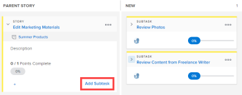
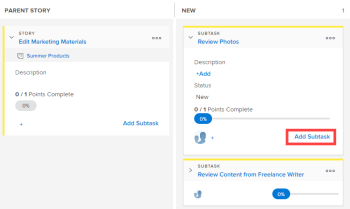

# Add a subtask to an existing story on the Scrum board

When creating subtasks for existing stories, keep in mind the following:

`When the Completion Mode setting for the project is set to Manual:`

* Moving a parent story with subtasks to Complete updates the parent story to 100% and the Status to Complete. Subtasks are not updated.
* To&nbsp;update the Percent Complete for the story, you must update it from the Stories tab or from the&nbsp;Details page of the object.

`When the Completion Mode setting for the project is set to Automatic`:&nbsp;

* Moving a parent story with subtasks to Complete updates the parent story to 100% and the Status to Complete. Subtasks are also&nbsp;updated to 100% and the Status is updated to Complete.
* To update the Percent Complete for the story, you must update the Percent Complete for any subtasks. The Percent Complete for the story is calculated based on the Percent Complete of all subtasks.

## Access requirements

You must have the following access to perform the steps in this article:

<table cellspacing="0"> 
 <col> 
 </col> 
 <col> 
 </col> 
 <tbody> 
  <tr> 
   <td role="rowheader"><em>Adobe Workfront</em> plan*</td> 
   <td> 
Any
 </td> 
  </tr> 
  <tr> 
   <td role="rowheader"><em>Adobe Workfront</em> license*</td> 
   <td> 
<em>Work</em> or higher
 </td> 
  </tr> 
  <tr> 
   <td role="rowheader">Access level configurations*</td> 
   <td> 
Worker or higher
 
Note: If you still don't have access, ask your <em>Workfront administrator</em> if they set additional restrictions in your access level. For information on how a <em>Workfront administrator</em> can modify your access level, see <a href="../../../administration-and-setup/add-users/configure-and-grant-access/create-modify-access-levels.md" class="MCXref xref">Create or modify custom access levels</a>.
 </td> 
  </tr> 
  <tr> 
   <td role="rowheader">Object permissions</td> 
   <td> 
Contribute or Manage access to the task the subtask is on
 
For information on requesting additional access, see <a href="../../../workfront-basics/grant-and-request-access-to-objects/request-access.md" class="MCXref xref">Request access to objects in Adobe Workfront</a>.
 </td> 
  </tr> 
 </tbody> 
</table>

&#42;To find out what plan, license type, or access you have, contact your *Workfront administrator*.

## Add a subtask to an existing story on the Scrum board

<ol> <draft-comment>
  <li value="1" data-mc-conditions="QuicksilverOrClassic.Quicksilver">Click the Main Menu icon  in the upper-right corner of <em>Adobe Workfront</em>, then click Teams.</li>
 </draft-comment>
 <li value="1" data-mc-conditions="QuicksilverOrClassic.Quicksilver">Click the Main Menu icon  in the upper-right corner of <em>Adobe Workfront</em>, then click Teams.</li> <draft-comment>
  <li value="2" data-mc-conditions="QuicksilverOrClassic.Quicksilver">(Optional) Click the Switch team icon , then either select a new Scrum team from the drop-down menu or search for a team in the search bar.</li>
 </draft-comment>
 <li value="2" data-mc-conditions="QuicksilverOrClassic.Quicksilver">(Optional) Click the Switch team icon , then either select a new Scrum team from the drop-down menu or search for a team in the search bar.</li> 
 <li value="3">Go to the agile iteration or project that contains the story&nbsp;where&nbsp;you want to add a subtask. For information about how to navigate to an iteration, see <a href="../../../agile/use-scrum-in-an-agile-team/iterations/view-iteration.md" class="MCXref xref">View an iteration</a>.</li> 
 <li value="4">Go to the story tile on the story board where you want to add a subtask.</li> 
 <li value="5"> 
Click Add Subtask on the main story card&nbsp;to create a subtask to the story.
 
 <draft-comment>
    
   </draft-comment> 
 
Or
 
Click Add Subtask&nbsp;on a subtask tile to create a subtask to the subtask.
 
<em>Workfront</em> supports infinite levels of subtasks, but only two levels (subtasks of subtasks)&nbsp;are displayed on the agile story board.
 
 <draft-comment>
    
   </draft-comment> 
 
When adding a subtask to a story that currently does not have a swimlane, the parent task is promoted to the <draft-comment>
    <MadCap:conditionalText data-mc-conditions="QuicksilverOrClassic.Quicksilver">
     Parent Story
    </MadCap:conditionalText>
   </draft-comment><MadCap:conditionalText data-mc-conditions="QuicksilverOrClassic.Quicksilver">
    Parent Story
   </MadCap:conditionalText> column and the subtask moves inside&nbsp;the swimlane.
 </li> 
 <li value="6">Specify the following information: 
  <table cellspacing="0">
   <col>
   <col>
   <tbody>
    <tr>
     <td role="rowheader">Subtask Name:</td>
     <td> Specify a name for the subtask.</td>
    </tr>
    <tr>
     <td role="rowheader">Description:</td>
     <td>Specify a description for the subtask.</td>
    </tr>
    <tr>
     <td role="rowheader">Estimate:</td>
     <td>Specify the estimate for the subtask. 
Keep in mind the following when creating estimates:

      <ul>
       <li>If your&nbsp;agile team is configured to estimate stories in points, then by default 1 point equals 8 hours. Estimates are added as Planned Hours on the story.</li>
       <li>The combined&nbsp;estimates for all subtasks determines the estimate of&nbsp;the parent story. For more information, see <a href="../../../agile/use-scrum-in-an-agile-team/scrum-board/update-status-of-stories-and-subtasks.md" class="MCXref xref">Update the status of stories and subtasks on the Scrum board</a>.</li>
       <li>When you create a new subtask, the Estimate field is already set. If you reset the estimate on the subtask, you are resetting the estimate on the parent story (because the parent story is the sum of all its subtasks).</li>
      </ul> </td>
    </tr>
    <tr>
     <td role="rowheader">Planned Hours:</td>
     <td> (Available only in projects) Specify the number of planned hours for the task.</td>
    </tr>
    <tr>
     <td role="rowheader">Assignment:</td>
     <td>Begin typing the name of the team where you want to assign the subtask, then click it when it appears in the drop-down list.</td>
    </tr>
   </tbody>
  </table></li> 
 <li value="7">Click Create.</li> 
</ol>

