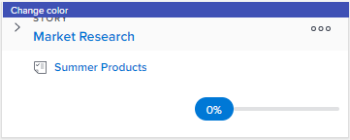
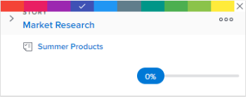

# Categorize stories by color on the Scrum board

## Change the default color&nbsp;association&nbsp;of stories

The default color&nbsp;association&nbsp;of stories differs depending on whether the story board is located on an iteration or on a project:

* `Iteration`: On an iteration, story board tiles are color-coded according to the project the story is associated with. (Each project is arbitrarily&nbsp;assigned a color on the story board.)&nbsp;You can change this default behavior for each agile team. Colors for agile stories on an iteration can be tied to the project (default), story priority, owner, or free form. For more information, see&nbsp; [Configure how color indicators are used for stories on the agile story board](../../../agile/get-started-with-agile-in-workfront/configure-scrum.md#configur4) in the article [Configure Scrum](../../../agile/get-started-with-agile-in-workfront/configure-scrum.md).

* `Project`: On a project, any subtasks match the color of the parent task, so that the colors of all stories in any given swimlane are the same.&nbsp;Colors are randomly assigned to tasks when they are created if the task does not have any subtasks or does not have a parent task. You can change this default behavior by modifying the agile view. Colors for agile stories on a project can be tied to the parent story (default), story priority, owner, or free form. For more information, see [Create or customize an Agile view](../../../reports-and-dashboards/reports/reporting-elements/views-overview.md#customizing-an-agile-view) in [Views overview in Adobe Workfront](../../../reports-and-dashboards/reports/reporting-elements/views-overview.md).

## Access requirements

You must have the following access to perform the steps in this article:

<table cellspacing="0"> 
 <col> 
 </col> 
 <col> 
 </col> 
 <tbody> 
  <tr> 
   <td role="rowheader"><em>Adobe Workfront</em> plan*</td> 
   <td> 
Any
 </td> 
  </tr> 
  <tr> 
   <td role="rowheader"><em>Adobe Workfront</em> license*</td> 
   <td> 
<em>Work</em> or higher
 </td> 
  </tr> 
  <tr> 
   <td role="rowheader">Access level configurations*</td> 
   <td> 
Worker or higher
 
Note: If you still don't have access, ask your <em>Workfront administrator</em> if they set additional restrictions in your access level. For information on how a <em>Workfront administrator</em> can change your access level, see <a href="../../../administration-and-setup/add-users/configure-and-grant-access/create-modify-access-levels.md" class="MCXref xref">Create or modify custom access levels</a>.
 </td> 
  </tr> 
 </tbody> 
</table>

&#42;To find out what plan, license type, or access you have, contact your *Workfront administrator*.

## Change the color of stories when using free form

If the agile team settings have&nbsp;been configured so the Associate Card Color to&nbsp;option is set to Free Form, users can manually change the color of individual story tiles. This can be useful to communicate other types of&nbsp;information that is important to the team or the organization:

<ol> <draft-comment>
  <li value="1" data-mc-conditions="QuicksilverOrClassic.Quicksilver">Click the Main Menu icon  in the upper-right corner of <em>Adobe Workfront</em>, then click Teams.</li>
 </draft-comment>
 <li value="1" data-mc-conditions="QuicksilverOrClassic.Quicksilver">Click the Main Menu icon  in the upper-right corner of <em>Adobe Workfront</em>, then click Teams.</li> <draft-comment>
  <li value="2" data-mc-conditions="QuicksilverOrClassic.Quicksilver">(Optional) Click the Switch team icon , then either select a new Scrum team from the drop-down menu or search for a team in the search bar.</li>
 </draft-comment>
 <li value="2" data-mc-conditions="QuicksilverOrClassic.Quicksilver">(Optional) Click the Switch team icon , then either select a new Scrum team from the drop-down menu or search for a team in the search bar.</li> <draft-comment>
  <li value="3" data-mc-conditions="QuicksilverOrClassic.Quicksilver"> 
In the left panel, select Iterations to choose a specific iteration, or select Current Iteration.
 </li>
 </draft-comment>
 <li value="3" data-mc-conditions="QuicksilverOrClassic.Quicksilver"> 
In the left panel, select Iterations to choose a specific iteration, or select Current Iteration.
 </li> 
 <li value="4">Hover over the colored banner at the top of the story tile.  <draft-comment>
   
  </draft-comment></li> 
 <li value="5">Click Change color, then select the desired color.  <draft-comment>
   
  </draft-comment></li> 
</ol>

