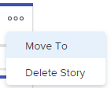

# Manage stories and issues on the Scrum board

You can move a story or issue from the Scrum board to another iteration or to the backlog, or delete it from the Scrum board. When you delete a story or issue, it is moved to the Recycle Bin for 30 days and can be recovered only by the system administrator.

## Access requirements

You must have the following access to perform the steps in this article:

<table cellspacing="0"> 
 <col> 
 <col> 
 <tbody> 
  <tr> 
   <td role="rowheader">Adobe Workfront plan*</td> 
   <td> 
Any
 </td> 
  </tr> 
  <tr> 
   <td role="rowheader">Adobe Workfront license*</td> 
   <td> 
Work or higher
 </td> 
  </tr> 
  <tr> 
   <td role="rowheader">Access level configurations*</td> 
   <td> 
Worker or higher
 
Note: If you still don't have access, ask your Workfront administrator if they set additional restrictions in your access level. For information on how a Workfront administrator can modify your access level, see <a href="../../../administration-and-setup/add-users/configure-and-grant-access/create-modify-access-levels.md" class="MCXref xref">Create or modify custom access levels</a>.
 </td> 
  </tr> 
  <tr> 
   <td role="rowheader">Object permissions</td> 
   <td> 
Manage access to the task or issue
 
For information on requesting additional access, see <a href="../../../workfront-basics/grant-and-request-access-to-objects/request-access.md" class="MCXref xref">Request access to objects in Adobe Workfront</a>.
 </td> 
  </tr> 
 </tbody> 
</table>

&#42;To find out what plan, license type, or access you have, contact your `Workfront administrator`.

## Move story or issue from the Scrum board

<ol> 
 <li value="1"> 
Click the Main Menu icon  in the upper-right corner of Adobe Workfront, then click Teams.
 </li> 
 <li value="2"> 
Click the Switch team icon , then either select a Scrum team from the drop-down menu or search for a team in the search bar.
 </li> 
 <li value="3"> 
In the left panel, select Iterations to choose a specific iteration, or select Current Iteration.
 </li> 
 <li value="4"> 
Click the More icon on the story or issue, and select Move to.
 
  
 </li> 
 <li value="5"> 
On the confirmation message, choose either:
 
  <table> 
   <col> 
   <col> 
   <tbody> 
    <tr> 
     <td>Another iteration </td> 
     <td>Select to move the item to another iteration, then choose which iteration the story or issue will move to. If no future iterations are defined, you cannot move the item.</td> 
    </tr> 
    <tr> 
     <td>Backlog </td> 
     <td>Select to move the story or issue to the team's backlog.</td> 
    </tr> 
   </tbody> 
  </table> <note type="note">
   The work item Planned Start Date and Planned Completion Date are affected by a setting on the Edit Team page. For information, see the section 
   <a href="../../../agile/get-started-with-agile-in-workfront/configure-scrum.md#configur5" class="MCXref xref">Configure how dates are applied when adding work items to an iteration</a> in the article 
   <a href="../../../agile/get-started-with-agile-in-workfront/configure-scrum.md" class="MCXref xref">Configure Scrum</a>. 
  </note> </li> 
 <li value="6"> 
Click Move.
 </li> 
</ol>

## Delete story or issue from the Scrum board

<ol> 
 <li value="1"> 
Click the Main Menu icon  in the upper-right corner of Adobe Workfront, then click Teams.
 </li> 
 <li value="2"> 
Click the Switch team icon , then either select a Scrum team from the drop-down menu or search for a team in the search bar.
 </li> 
 <li value="3"> 
In the left panel, select Iterations to choose a specific iteration, or select Current Iteration.
 </li> 
 <li value="4"> 
Click the More icon on the story or issue, and select Delete Story or Delete Issue.
 
  
 </li> 
 <li value="5"> 
On the confirmation message, click Yes, delete it.
 </li> 
</ol>

