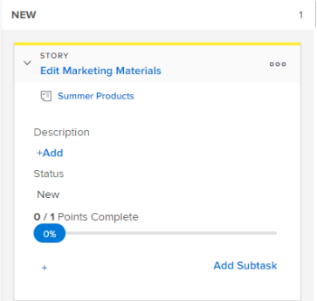

# View and edit story information on the Scrum board

## Understand what information can be viewed and edited

When viewing&nbsp;a story tile on the story board, the information in the following table is available. You can edit most information inline, directly from the story tile.

<table cellspacing="15"> 
 <col> 
 <col> 
 <col> 
 <thead> 
  <tr> 
   <th>Information </th> 
   <th>Visible </th> 
   <th>Editable Inline </th> 
  </tr> 
 </thead> 
 <tbody> 
  <tr> 
   <td>The story name with a link directly to the task or issue</td> 
   <td>✓</td> 
   <td>&nbsp;</td> 
  </tr> 
  <tr> 
   <td> 
The project name with a link directly to the project This link is displayed only on stories (parent tasks, not subtasks) when using the agile view on an iteration; it is not displayed when using an agile view on a project.
 </td> 
   <td>✓&nbsp;</td> 
   <td>&nbsp;</td> 
  </tr> 
  <tr> 
   <td> 
The number of points or hours complete on the story and the number of points or hours assigned&nbsp;to the story These numbers are used to calculate and display the&nbsp;Percent Complete&nbsp;for each story.
 </td> 
   <td>✓</td> 
   <td>✓</td> 
  </tr> 
  <tr> 
   <td> 
The Percent Complete for each story and issue. The Percent Complete for the iteration is calculated based on the Percent Complete for each story.
 
When updating Percent Complete for a story or issue, you can choose any number between 0 and 100.
 </td> 
   <td>✓</td> 
   <td>✓</td> 
  </tr> 
  <tr> 
   <td> 
Who the story is assigned to
 </td> 
   <td>✓</td> 
   <td>✓</td> 
  </tr> 
  <tr> 
   <td> 
The color or category of the tile
 </td> 
   <td>✓</td> 
   <td>✓</td> 
  </tr> 
  <tr> 
   <td> 
Any additional fields (including custom fields) that might have been added to the agile view by modifying the agile view, as described in "Creating and Customizing an Agile View" in <a href="../../../reports-and-dashboards/reports/reporting-elements/views-overview.md" class="MCXref xref">Views overview in Adobe Workfront</a>.
 </td> 
   <td>✓</td> 
   <td>✓</td> 
  </tr> 
 </tbody> 
</table>

## Access requirements

You must have the following access to perform the steps in this article:

<table cellspacing="0"> 
 <col> 
 </col> 
 <col> 
 </col> 
 <tbody> 
  <tr> 
   <td role="rowheader"><em>Adobe Workfront</em> plan*</td> 
   <td> 
Any
 </td> 
  </tr> 
  <tr> 
   <td role="rowheader"><em>Adobe Workfront</em> license*</td> 
   <td> 
<em>Work</em> or higher
 </td> 
  </tr> 
  <tr> 
   <td role="rowheader">Access level configurations*</td> 
   <td> 
Worker or higher
 
Note: If you still don't have access, ask your <em>Workfront administrator</em> if they set additional restrictions in your access level. For information on how a <em>Workfront administrator</em> can modify your access level, see <a href="../../../administration-and-setup/add-users/configure-and-grant-access/create-modify-access-levels.md" class="MCXref xref">Create or modify custom access levels</a>.
 </td> 
  </tr> 
  <tr> 
   <td role="rowheader">Object permissions</td> 
   <td> 
Edit access to the task or issue
 
For information on requesting additional access, see <a href="../../../workfront-basics/grant-and-request-access-to-objects/request-access.md" class="MCXref xref">Request access to objects in Adobe Workfront</a>.
 </td> 
  </tr> 
 </tbody> 
</table>

&#42;To find out what plan, license type, or access you have, contact your *Workfront administrator*.

## View and edit information on a story tile

<ol> <draft-comment>
  <li value="1" data-mc-conditions="QuicksilverOrClassic.Quicksilver">Click the Main Menu icon  in the upper-right corner of <em>Adobe Workfront</em>, then click Teams.</li>
 </draft-comment>
 <li value="1" data-mc-conditions="QuicksilverOrClassic.Quicksilver">Click the Main Menu icon  in the upper-right corner of <em>Adobe Workfront</em>, then click Teams.</li> <draft-comment>
  <li value="2" data-mc-conditions="QuicksilverOrClassic.Quicksilver">(Optional) Click the Switch team icon , then either select a new Scrum team from the drop-down menu or search for a team in the search bar.</li>
 </draft-comment>
 <li value="2" data-mc-conditions="QuicksilverOrClassic.Quicksilver">(Optional) Click the Switch team icon , then either select a new Scrum team from the drop-down menu or search for a team in the search bar.</li> <draft-comment>
  <li value="3" data-mc-conditions="QuicksilverOrClassic.Quicksilver">In the left panel, select Iterations to choose a specific iteration, or select Current Iteration.</li>
 </draft-comment>
 <li value="3" data-mc-conditions="QuicksilverOrClassic.Quicksilver">In the left panel, select Iterations to choose a specific iteration, or select Current Iteration.</li> 
 <li value="4">Go to the Scrum agile story board.</li> 
 <li value="5">Expand the story tile to view all fields associated with the story.  <draft-comment>
   
  </draft-comment></li> 
 <li value="6"> 
(Optional) To edit a field, click the field, then make any changes.
 
You must have Edit rights to the task or issue to edit the story tile.
 </li> 
</ol>

>[!NOTE]
>
>To change the Percent Complete, you must type a number between 0 and 100. The field is not a slider that you can move.

