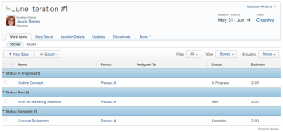

# Create an agile story

You can create an agile story on an iteration in various ways. After you create an agile story, you can add subtasks to the story.

When you add a story or subtask in an iteration, the Duration Type is set to Simple and the Task Constraint is set to Fixed Dates, with the dates locked within the iteration. You cannot modify the Duration Type or Task Constraint in an iteration. Also, the task duration must be greater than 0 minutes.

For information about how to manage the story after it is added to the iteration, see [Iterations](../../agile/use-scrum-in-an-agile-team/iterations/iterations.md).

## Access requirements

You must have the following access to perform the steps in this article:

<table cellspacing="0"> 
 <col> 
 </col> 
 <col> 
 </col> 
 <tbody> 
  <tr> 
   <td role="rowheader">Adobe Workfront plan*</td> 
   <td> 
Any
 </td> 
  </tr> 
  <tr> 
   <td role="rowheader">Adobe Workfront license*</td> 
   <td> 
Work or higher
 </td> 
  </tr> 
  <tr> 
   <td role="rowheader">Access level configurations*</td> 
   <td> 
Worker or higher
 
Note: If you still don't have access, ask your Workfront administrator if they set additional restrictions in your access level. For information on how a Workfront administrator can modify your access level, see <a href="../../administration-and-setup/add-users/configure-and-grant-access/create-modify-access-levels.md" class="MCXref xref">Create or modify custom access levels</a>.
 </td> 
  </tr> 
  <tr> 
   <td role="rowheader">Object permissions</td> 
   <td> 
Manage access to the project the story is on
 
For information on requesting additional access, see <a href="../../workfront-basics/grant-and-request-access-to-objects/request-access.md" class="MCXref xref">Request access to objects in Adobe Workfront</a>.
 </td> 
  </tr> 
 </tbody> 
</table>

&#42;To find out what plan, license type, or access you have, contact your `Workfront administrator`.

## Create an agile story in an iteration

<ol> 
 <li value="1"> Go to the agile iteration where you want to create the story: 
  <ol>
   Click the Main Menu icon in the upper-right corner of Adobe Workfront, then click Teams.(Optional) Click the Switch team icon , then either select a new Scrum team from the drop-down menu or search for a team in the search bar.In the left panel, select Iterations, then select All Iteration.
   <li value="4">Click the name of the specific iteration where you want to create a story.</li>
  </ol></li> 
 <li value="2">Click the Work Items tab then Stories. </li> 
 <li value="3">&nbsp;Click New Story.</li> 
 <li value="4">Specify the following information: 
  <table cellspacing="0">
   <col>
   <col>
   <tbody>
    <tr>
     <td role="rowheader">Story Name:</td>
     <td>Type a name for the story.</td>
    </tr>
    <tr>
     <td role="rowheader">Description:</td>
     <td>Type a description for the story.</td>
    </tr>
    <tr>
     <td role="rowheader">Ready:</td>
     <td>Select this option if the story is ready to be added to an iteration. When this option is selected, it indicates&nbsp;to users which stories in the backlog are ready to be added to an iteration. A story can be added to an iteration whether or not it is marked Ready.</td>
    </tr>
    <tr>
     <td role="rowheader">Estimate (points)</td>
     <td>Specify the estimate for the story. If your&nbsp;agile team is configured to estimate stories in points, then by default 1 point equals 8 hours. Estimates are added as Planned Hours on the story. For example, if you estimate a story as 3 points, the default behavior is to add 24 Planned Hours&nbsp;to the story. If a story contains subtasks, remember that the combined&nbsp;estimates for all subtasks determines the estimate of&nbsp;the parent story. For more information, see&nbsp;<a href="../../agile/use-scrum-in-an-agile-team/iterations/add-stories-to-existing-iteration.md" class="MCXref xref">Add stories to an existing iteration</a>.</td>
    </tr>
    <tr>
     <td role="rowheader">Parent Project</td>
     <td>Begin typing the name of the project that this story will be associated with. By default, the story color is displayed as the same color as other stories from this project. The status of the project must be set to Current. If the status of the project is anything but Current, it is not displayed in the drop-down menu.</td>
    </tr>
    <tr>
     <td role="rowheader">Parent Task</td>
     <td>After you choose a parent project, you have the option to choose a parent task. When you select a parent task,&nbsp;the story is created as a subtask of the parent task on the project that you selected. Begin&nbsp;typing the name of the parent task for the story, then click it when it appears in the drop-down list.</td>
    </tr>
    <tr>
     <td role="rowheader">Custom Forms</td>
     <td>Select any custom forms to add to the story.</td>
    </tr>
   </tbody>
  </table></li> 
 <li value="5">Click Save Story.</li> 
</ol>

## Create an agile story in the backlog

You can create an agile story from the agile backlog, as described in the section [Create new stories on the backlog](../../agile/work-in-an-agile-environment/manage-the-agile-backlog.md#creating-new-stories) in the article [Manage the agile backlog](../../agile/work-in-an-agile-environment/manage-the-agile-backlog.md).

## Add a task or issue as an agile story

You can add an existing task or issue as a story to an iteration. For more information, see [Add stories to an existing iteration](../../agile/use-scrum-in-an-agile-team/iterations/add-stories-to-existing-iteration.md)or Add stories and issues from the Scrum board.

## Create subtasks to an agile story

You can create a subtask to an agile story by using either of the following methods:

* By using the `Subtasks`&nbsp;tab, as described in [Create subtasks](../../manage-work/tasks/create-tasks/create-subtasks.md#creating-subtasks) in [Create subtasks](../../manage-work/tasks/create-tasks/create-subtasks.md).

* Directly from the story board, as described in&nbsp; [Create an iteration](../../agile/use-scrum-in-an-agile-team/iterations/create-an-iteration.md).

