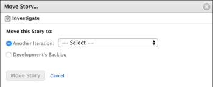

# Move an agile story

You can move an agile story either to a different iteration (for Scrum teams), or to the backlog (for Kanban and Scrum teams).

## Access requirements

You must have the following access to perform the steps in this article:

<table cellspacing="0"> 
 <col> 
 </col> 
 <col> 
 </col> 
 <tbody> 
  <tr> 
   <td role="rowheader">Adobe Workfront plan*</td> 
   <td> 
Any
 </td> 
  </tr> 
  <tr> 
   <td role="rowheader">Adobe Workfront license*</td> 
   <td> 
Work or higher
 </td> 
  </tr> 
  <tr> 
   <td role="rowheader">Access level configurations*</td> 
   <td> 
Worker or higher
 
Note: If you still don't have access, ask your Workfront administrator if they set additional restrictions in your access level. For information on how a Workfront administrator can modify your access level, see <a href="../../administration-and-setup/add-users/configure-and-grant-access/create-modify-access-levels.md" class="MCXref xref">Create or modify custom access levels</a>.
 </td> 
  </tr> 
  <tr> 
   <td role="rowheader">Object permissions</td> 
   <td> 
Manage access to the story
 
For information on requesting additional access, see <a href="../../workfront-basics/grant-and-request-access-to-objects/request-access.md" class="MCXref xref">Request access to objects in Adobe Workfront</a>.
 </td> 
  </tr> 
 </tbody> 
</table>

&#42;To find out what plan, license type, or access you have, contact your Workfront administrator.

## Move a story from an iteration or Kanban board to the backlog

<ol> 
 <li value="1">Go to the iteration or Kanban board that contains the story that you want to move to the backlog.</li> 
 <li value="2">Click the iteration heading at the top of the page.</li> 
 <li value="3">On the Stories tab, select the stories that you want to move.</li> 
 <li value="4"> 
Click More&nbsp;> Move to.
 
The Move Story&nbsp;dialog box is displayed.
 
  
 </li> 
 <li value="5">Select <em>team_name</em>'s Backlog. In the above example, the team name is&nbsp;Development.</li> 
 <li value="6">Click Move Story.</li> 
</ol>

## Move a story to a different iteration

You can move a story to a different iteration for your Scrum team.

<ol> 
 <li value="1">Go to the iteration that contains the story that you want to move.</li> 
 <li value="2">Click the iteration heading at the top of the page.</li> 
 <li value="3">On the Stories tab, select the stories that you want to move.</li> 
 <li value="4"> 
Click More&nbsp;> Move to.
 
The Move Story&nbsp;dialog box is displayed.
 
  
 </li> 
 <li value="5"> 
Select Another Iteration,&nbsp;then in the drop-down menu, select the iteration where you want to move the story.
 Note: The work item Planned Start Date and Planned Completion Date are affected by a setting on the Edit Team page. For information, see the section Configure how dates are applied when adding work items to an iteration in the article Configure Scrum. </li> 
 <li value="6"> 
Click Move Story.
 </li> 
</ol>

