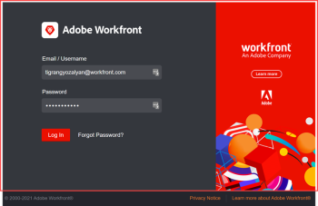

# Brand your Adobe Workfront instance

As an Adobe Workfront administrator, you can brand your Workfront instance with company-specific logos and images.

Branding of the Workfront instance enables you to modify the logo images on the login screen and on the Global Navigation Bar, as well as the background image of the login screen. For more information about customizing the Global Navigation Bar, see the section [Set Details](../../../administration-and-setup/customize-workfront/use-layout-templates/create-and-manage-layout-templates.md#setting-details) in the article [Create and manage layout templates](../../../administration-and-setup/customize-workfront/use-layout-templates/create-and-manage-layout-templates.md).

## Access requirements

You must have the following to perform the steps in this article:

<table cellspacing="0"> 
 <col> 
 <col> 
 <tbody> 
  <tr> 
   <td role="rowheader">Adobe Workfront plan</td> 
   <td> 
Any
 </td> 
  </tr> 
  <tr> 
   <td role="rowheader">Adobe Workfront license</td> 
   <td> 
Plan 
 </td> 
  </tr> 
  <tr> 
   <td role="rowheader">Access level configurations</td> 
   <td> 
You must be a Workfront administrator. For more information, see <a href="../../../administration-and-setup/add-users/configure-and-grant-access/grant-a-user-full-administrative-access.md" class="MCXref xref">Grant a user full administrative access</a>.
 
Note: If you still don't have access, ask your Workfront administrator if they set additional restrictions in your access level. For information on how a Workfront administrator can modify your access level, see <a href="../../../administration-and-setup/add-users/configure-and-grant-access/create-modify-access-levels.md" class="MCXref xref">Create or modify custom access levels</a>.
 </td> 
  </tr> 
 </tbody> 
</table>

## Brand the login screen

You can add a logo, a background color, and a background image to the login screen when you log in using the Workfront interface.

If you log in to Workfront using SSO and you use a custom SSO portal instead of the Workfront login screen, you cannot brand your custom SSO portal using the Workfront interface. Your custom SSO portal should be customized by your network or IT administrator rather than by a Workfront administrator.

>[!NOTE]
>
>The Workfront login screen displays a Workfront banner on the right side of the screen, which is not customizable. Your customizations are visible only in the space to the left of the Workfront banner:
>
>>

* [Add or change your logo on the login screen](#adding-a-logo-to-the-login-screen) 
* [Add a background color and image to the login screen](#adding-a-background-color-and-image-to-the-login-screen)

###  Add or change your logo on the login screen

For the best results, we recommend that the dimensions of the image you upload is larger than 20 x 20 pixels and smaller than 300 x 120 pixels. You can upload images with any of the following formats: PNG, JPG, GIF, and SVG.

1. Click **Setup** near the upper-right corner of Adobe Workfront on the Global Navigation Bar.
1. Click **System** > **Branding**, then scroll to the **Login Screen** area.

1. (Conditional) If you are changing a previously uploaded login screen logo, click **Change Image** next to the logo image, then&nbsp;find and select the logo image you want.
1. Do one of the following:

   * Drag your logo image file into the box.
   * Click **browse** in the Drag & Drop area, then&nbsp;find and select your logo image.

1. Click **Save**.

### Add a background color and image to the login screen

You can include up to 20 background JPG, JPEG, or PNG images. When multiple images are uploaded, images cycle though each time a user refreshes the login page.

For the best results, we recommend that you use background images that are 2 MB or smaller.

1. Click **Setup** near the upper-right corner of Adobe Workfront on the Global Navigation Bar.
1. Click **System** > **Branding.**

1. In the **Login Screen** area, under **Background Image**, do one of the following:

   * Drag your logo image into the box.
   * Click **browse** in the Drag &&nbsp;Drop area, then&nbsp;find and select your logo image.

1. (Optional) Repeat the previous step to upload up to 20 images.  

1. Hover over a background image you have uploaded and use any of the following options to specify where and how you want the image to appear in the login screen background.

   As you do this, keep in mind that the login screen background includes the area covered by the Workfront banner on the right:

   

   <table cellspacing="0"> 
    <col> 
    <col> 
    <tbody> 
     <tr> 
      <td role="rowheader">Fill Screen</td> 
      <td> 
Fits the image to the login screen background, which may require some enlargement of the image. For best results, ensure that you use a high-resolution image.
 </td> 
     </tr> 
     <tr> 
      <td role="rowheader">Tile</td> 
      <td>Repeats your image in its original size across the login screen background area in a tiled view. This is the preferred option when you are using&nbsp;a patterned or texturized image. Select <strong>Left, Center, or Right</strong> to start the tiling from the top-left corner, top-center, or top-right of the background area.</td> 
     </tr> 
     <tr> 
      <td role="rowheader">Position</td> 
      <td>Places your image in its original size in the position you choose: Select&nbsp;<strong>Left, Center, or Right</strong> to position it in the top-left, top-center, or top-right of the login screen background area. </td> 
     </tr> 
    </tbody> 
   </table>

1. Set a **Background Color**.

   The background color is visible only if the login screen background is larger than the image being used or if there is any transparency in the image.

1. Click **Save.**

## Brand the logo and border in the navigation bar

You can configure a logo and border to be displayed&nbsp;in the navigation bar within your organization's Workfront instance.

The customized logo in your navigation bar is included in the following exported files in .pdf format:

* Reports 
* Lists 
* Dashboards
* Delivered reports

For more information about exporting data from Workfront see [Export data](../../../reports-and-dashboards/reports/creating-and-managing-reports/export-data.md). For more information about scheduling a report for delivery, see [Report delivery overview](../../../reports-and-dashboards/reports/creating-and-managing-reports/set-up-report-deliveries.md). For information about printing dashboards, see [Create a dashboard](../../../reports-and-dashboards/dashboards/creating-and-managing-dashboards/create-dashboard.md)

To customize the logo in your navigation bar:

1. Click **Setup** near the upper-right corner of Adobe Workfront on the Global Navigation Bar.
1. Click **System**&nbsp;> **Branding.**

1. In the Top Navigation area, drag an image into the drag-and-drop area in the **Logo**&nbsp;section.

   Or

   Click **browse**&nbsp;in&nbsp;the drag-and-drop area in the **Logo**&nbsp;section, then&nbsp;browse to and select an image.

   Images must not exceed 140 x 50&nbsp;pixels. Images can be any of the following formats: PNG, JPG, JPEG, GIF

1. Click **Save.**

## Reset to the default branding

You can reset the branding back to the Workfront defaults at any time.

When resetting the branding to the default branding, all photos and images that you have uploaded to the Branding area are also deleted.

1. Click **Setup** near the upper-right corner of Adobe Workfront on the Global Navigation Bar.
1. Click **System** > **Branding.**

1. Click **Reset all branding to Workfront defaults**, then click **Yes**.

