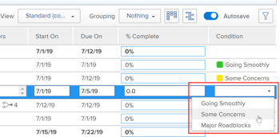

# Change the display order of conditions

>[!IMPORTANT]
>
>You're currently viewing the Adobe Workfront Classic version of this document. Adobe Workfront Classic is no longer supported. All Adobe Workfront Classic functionality, along with this documentation, will be removed in July 2022. Please transition to the the new Adobe Workfront experienceas soon as possible, and switch to the new Adobe Workfront experience version of this document.

You can change the order in which Conditions display in projects, tasks and issues:

* When a user is editing a project

  

* When a user is changing the condition for a task or issue

  

## Access requirements

You must have the following access to perform the steps in this article: 

<table cellspacing="0"> 
 <col> 
 <col> 
 <tbody> 
  <tr> 
   <td role="rowheader">Adobe Workfront plan</td> 
   <td> 
Any
 </td> 
  </tr> 
  <tr> 
   <td role="rowheader">Adobe Workfront license</td> 
   <td> 
Plan 
 </td> 
  </tr> 
  <tr> 
   <td role="rowheader">Access level configurations</td> 
   <td> 
You must be a Workfront administrator. For more information, see <a href="../../../administration-and-setup/add-users/configure-and-grant-access/grant-a-user-full-administrative-access.md" class="MCXref xref">Grant a user full administrative access</a>.
 
Note: If you still don't have access, ask your Workfront administrator if they set additional restrictions in your access level. For information on how a Workfront administrator can modify your access level, see <a href="../../../administration-and-setup/add-users/configure-and-grant-access/create-modify-access-levels.md" class="MCXref xref">Create or modify custom access levels</a>.
 </td> 
  </tr> 
 </tbody> 
</table>

## Change the display order of conditions

1. Click **Setup** near the upper-right corner of Adobe Workfront on the Global Navigation Bar.
1. Click **Project Preferences** > **Conditions**.  

1. Select the **Projects**,**Tasks**, or **Issues** tab.

1. Drag  Conditions to change their order.

   The new order saves automatically.

For more information about customizing Conditions, see [Custom conditions](../../../administration-and-setup/customize-workfront/create-manage-custom-conditions/custom-conditions.md).
