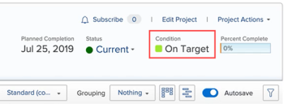

# Set a custom condition as the default for projects

>[!IMPORTANT]
>
>You're currently viewing the Adobe Workfront Classic version of this document. Adobe Workfront Classic is no longer supported. All Adobe Workfront Classic functionality, along with this documentation, will be removed in July 2022. Please transition to the the new Adobe Workfront experienceas soon as possible, and switch to the new Adobe Workfront experience version of this document.

If the Condition Type of a project is set to Progress Status instead of Manual, Adobe Workfront automatically displays one of three built-in default conditions on the project (On Target, At Risk, or In Trouble) as it progresses, as explained in [Overview of Project Condition and Condition Type](../../../manage-work/projects/manage-projects/project-condition-and-condition-type.md).

You can set your custom conditions as default conditions instead of using these three built-in default conditions. For example, you could change the On Target default condition to display as Tracking Well in all projects.

## Access requirements

You must have the following access to perform the steps in this article: 

<table> 
 <col> 
 <col> 
 <tbody> 
  <tr> 
   <td role="rowheader">Adobe Workfront plan</td> 
   <td> 
Any
 </td> 
  </tr> 
  <tr> 
   <td role="rowheader">Adobe Workfront license</td> 
   <td> 
Plan 
 </td> 
  </tr> 
  <tr> 
   <td role="rowheader">Access level configurations</td> 
   <td> 
You must be a Workfront administrator. For more information, see <a href="../../../administration-and-setup/add-users/configure-and-grant-access/grant-a-user-full-administrative-access.md" class="MCXref xref">Grant a user full administrative access</a>.
 
Note: If you still don't have access, ask your Workfront administrator if they set additional restrictions in your access level. For information on how a Workfront administrator can modify your access level, see <a href="../../../administration-and-setup/add-users/configure-and-grant-access/create-modify-access-levels.md" class="MCXref xref">Create or modify custom access levels</a>.
 </td> 
  </tr> 
 </tbody> 
</table>

## Set a custom condition as a default condition for all projects:

1. Click **Setup** near the upper-right corner of Adobe Workfront on the Global Navigation Bar.
1. Click **Project Preferences** > **Conditions**.  

1. Click the **Project** tab. 
1. Click **Set Default Conditions**. 
1. In the drop-down menu next to the default condition you want to change, click the custom condition you want to use instead. 
1. Repeat the previous step for any other default condition you want to change.
1. Click **Save**.

For information about setting a custom condition as a default condition for tasks and issues, see [Set a custom condition as the default for tasks and issues](../../../administration-and-setup/customize-workfront/create-manage-custom-conditions/set-custom-condition-default-tasks-issues.md).

For information about setting up a project so that users can update it's condition manually, see [Update Condition for tasks and issues](../../../manage-work/projects/updating-work-in-a-project/update-condition-for-tasks-and-issues.md).

For information about custom conditions, see [Custom conditions](../../../administration-and-setup/customize-workfront/create-manage-custom-conditions/custom-conditions.md).
